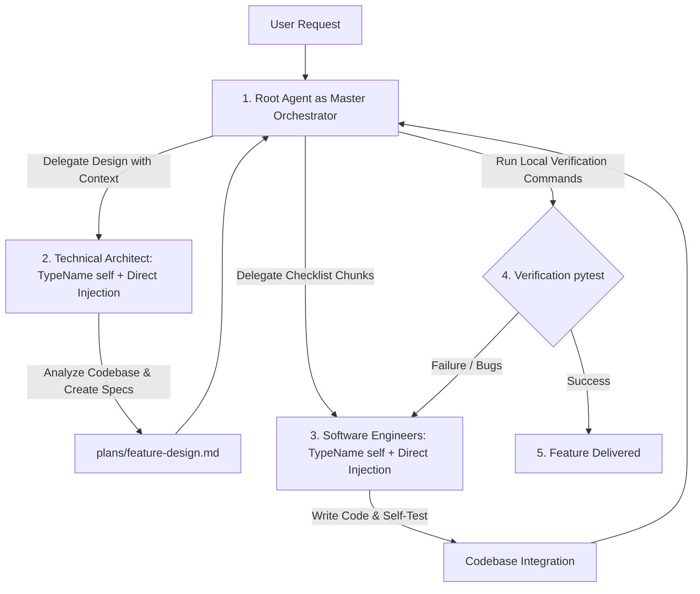

# Multi-Agent Development Workflow (Spec-Driven SDLC)

This project strictly utilizes a **Spec-Driven Software Development Life Cycle (SDLC)**.

The Orchestrator coordinates the lifecycle, validates handovers, runs verification tests, and delegates specialized sub-tasks using direct injection proxy method configured for the appropriate roles (Architect and Engineer).

> [!IMPORTANT]
> CRITICAL ORCHESTRATION RULE:
> When orchestrating custom subagents you MUST use the Direct Injection Proxy Method:
> 1. Read the custom agent's exact markdown instruction file from the workspace (e.g., `.agents/agents/{agent_name}/agent.md`).
> 2. If workspace not defined, read the custom agent's exact markdown instruction file from the global configuration (e.g., `~/.gemini/config/agents/{agent_name}/agent.md`).
> 3. **ALWAYS set `TypeName: "self"`** when calling `invoke_subagent` (e.g., for Technical Architect and Software Engineer). Using `TypeName: "self"` ensures the subagent inherits the full parent agent capabilities—including write tools (`replace_file_content`, `write_to_file`) and command execution tools (`run_command`)—enabling subagents to create files, write code, and run test suites directly without delegating edits back to the parent.
> 4. Set the `Role` parameter to the descriptive role name (e.g. `Role: "Technical Architect"` or `Role: "Software Engineer"`).
> 5. Inject the entire verbatim contents of the custom agent's markdown file into the `Prompt` argument, appended with the user's specific task instructions.

Every AI-driven feature development or complex code change MUST follow this orchestrated flow:

### 1. Role-Based Delegation Rules

1.  **The Master Orchestrator (Primary Thread Agent):** Directly executes the orchestration logic from the system context. It manages requirements handoff, validates the output quality of other subagents, coordinates parallel engineering streams, runs testing commands, and reports final delivery. It does not spawn a separate `orchestrator` subagent to avoid double-orchestration overhead.
2.  **The Technical Architect:** Conducted by invoking a background subagent with `TypeName: "self"` using direct injection proxy method assigned the Technical Architect role (`Role: "Technical Architect"`).
    *   **STRICT RULE:** You **MUST** invoke a background subagent with `TypeName: "self"` using direct injection proxy method in the Technical Architect role to design any technical blueprint, API signatures, and a step-by-step checklist inside `plans/<feature-name>-design.md` **before** writing any implementation code. Jumping straight to writing code is prohibited.
3.  **The Software Engineer:** Conducted by invoking background subagent(s) with `TypeName: "self"` using direct injection proxy method assigned the Software Engineer role (`Role: "Software Engineer"`). You can run up to a maximum of 3 Software Engineer subagents in parallel at once.
    *   **STRICT RULE:** You **MUST** invoke background subagent(s) with `TypeName: "self"` using direct injection proxy method in the Software Engineer role to execute the implementation steps. Setting `TypeName: "self"` equips the engineer with file writing and test execution tools so it can write code and self-test autonomously. The engineers must strictly adhere to the architect-designed specification and must never diverge or invent new architecture patterns without explicit authorization.

### 2. SDLC Execution Steps

1.  **Design Phase:** The Orchestrator spawns a background subagent under the Technical Architect role, providing the requirement context. The Architect outputs a highly detailed spec document in `/plans` including a Todo Checklist, Mermaid diagrams, API signatures, and step-by-step implementation instructions.
2.  **Quality Check & Chunking:** The Orchestrator reviews the Architect's spec, divides the checklist into independent, non-overlapping tasks, and allocates them to the Engineer subagents.
3.  **Implementation Phase:** Concurrent implementation is handled by spawning up to **3 Software Engineer** subagents. Each engineer receives precise step allocations and target files to avoid merge conflicts.
4.  **Self-Testing Phase:** Each Engineer must run automated tests (such as `PYTHONPATH=. uv run pytest tests/` or similar) to verify their modifications locally before notifying the Orchestrator.
5.  **Verification & Final Handover:** The Orchestrator integrates the changes and executes the final verification command. If any failures are encountered, the relevant error trace is immediately sent back to the respective Engineer subagent for rapid iteration and remediation. Once all checklist items are checked off and tests pass, the Orchestrator presents the completed work to the user.
