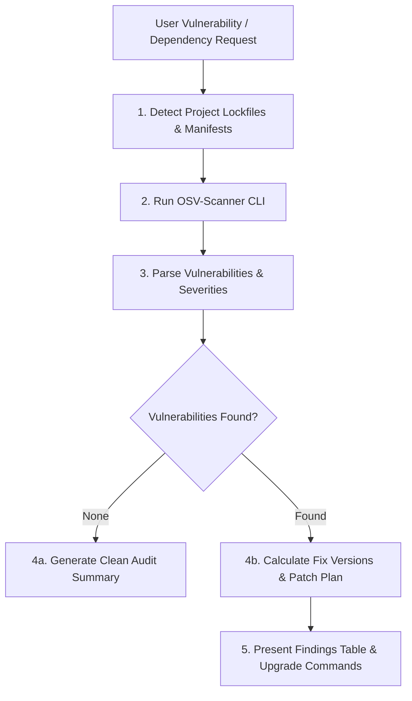

# Google OSV-Scanner Skill

This skill enables Antigravity (`agy`) agents to run, parse, remediate, and automate security vulnerability scans using Google's **[OSV-Scanner](https://github.com/google/osv-scanner)** and the Open Source Vulnerability (OSV) database.

---

## 1. Overview & Capabilities

Google OSV-Scanner is the official CLI tool that pairs open source project dependencies with the distributed [OSV.dev](https://osv.dev) database.

### Key Capabilities:
- **Lockfile & Manifest Scanning:** Inspects Python (`uv.lock`, `poetry.lock`, `requirements.txt`, `Pipfile.lock`), Node.js (`package-lock.json`, `pnpm-lock.yaml`, `yarn.lock`), Go (`go.mod`, `go.sum`), Rust (`Cargo.lock`), Java (`pom.xml`, `build.gradle`), and many others.
- **SBOM Scanning:** Supports SPDX and CycloneDX SBOM formats.
- **Guided Remediation:** Automatically calculates minimum non-vulnerable package version upgrades.
- **Granular Ignored Findings:** Configurable via `osv-scanner.toml` with audit rationale and expiry timestamps.
- **Multiple Output Formats:** `markdown`, `table`, `json`, `sarif`, `html`, `spdx`, `cyclonedx`.

---

## 2. Installation & Verification

When executing scans in an environment where `osv-scanner` is not yet installed:

### Linux (x86_64 / amd64):
```bash
curl -fsSL https://github.com/google/osv-scanner/releases/latest/download/osv-scanner_linux_amd64 -o /usr/local/bin/osv-scanner
chmod +x /usr/local/bin/osv-scanner
osv-scanner --version
```

### macOS (Homebrew or binary):
```bash
brew install osv-scanner
# OR manual binary:
curl -fsSL https://github.com/google/osv-scanner/releases/latest/download/osv-scanner_darwin_arm64 -o /usr/local/bin/osv-scanner
chmod +x /usr/local/bin/osv-scanner
```

---

## 3. Workflow for Agents

When a user requests a dependency scan, security audit, or remediation:



### Step 1: Execute Vulnerability Scan
Run recursive scan and capture output:
```bash
# Markdown output for reporting
osv-scanner scan -r . --format markdown --output-file reports/osv-report.md

# JSON output for structured parsing
osv-scanner scan -r . --format json --output-file reports/osv-report.json

# SARIF output for GitHub Code Scanning
osv-scanner scan -r . --format sarif --output-file reports/osv-report.sarif
```

### Step 2: Analyze & Categorize Findings
When reviewing scan output:
1. Extract package name, installed version, advisory ID (CVE / GHSA / PYSEC / GO), and CVSS severity score.
2. Group findings by Severity: **CRITICAL**, **HIGH**, **MEDIUM**, **LOW**.
3. Identify direct dependencies vs transitive/sub-dependencies.

### Step 3: Formulate Remediation Plan
- For direct dependencies: Determine the fixed version specified in the OSV advisory.
- For Python projects using `uv`: Run `uv add "<package>>=<fixed_version>"` or `uv lock --upgrade-package <package>`.
- For Node projects: Run `npm install <package>@<fixed_version>` or `npm audit fix`.
- If a vulnerability is a false positive or unfixable upstream, create/update `osv-scanner.toml` with explicit justification and an expiry date.

---

## 4. Configuration Reference (`osv-scanner.toml`)

Place `osv-scanner.toml` in repository root or subdirectories to manage ignored vulnerabilities:

```toml
# osv-scanner.toml
[[IgnoredVulns]]
id = "GHSA-1234-5678-90ab"
reason = "Vulnerable codepath is not invoked in production runtime."
until = "2026-12-31"

[[PackageOverrides]]
name = "internal-private-pkg"
ignore = true
```

---

## 5. Reference Documentation

For detailed commands, ecosystem nuances, and configuration schemas, refer to:
- **CLI Reference**: `resources/cli-reference.md`
- **Ecosystems Guide**: `resources/ecosystems-guide.md`
- **Configuration Template**: `resources/osv-config-template.toml`
- **CI/CD Integration Example**: `examples/ci-workflow.yml`
- **Remediation Walkthrough**: `examples/remediation-example.md`
