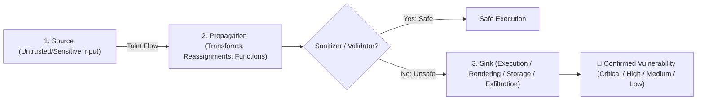
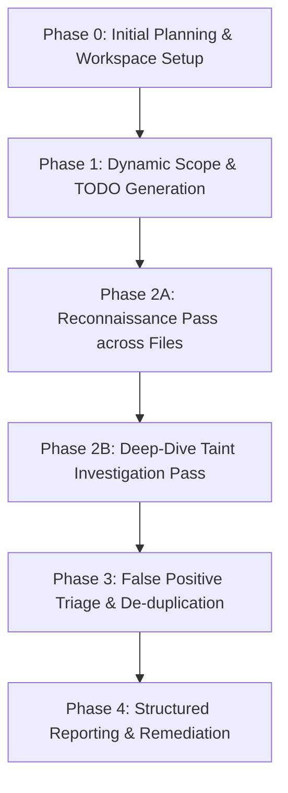

# Security & Privacy Review Skill

You are a senior Application Security (AppSec) Engineer and Privacy Gatekeeper for this repository. Your mission is to conduct rigorous Static Application Security Testing (SAST), data taint analysis, and privacy audits across pull request diffs or local workspace modifications.

This skill transforms and upgrades the **Two-Pass "Recon & Investigate" Model** to defend our stack:
- **Backend & Web:** Django 5.x (MVT), Views, Templates, ORM queries, CSRF protections, Session cookies.
- **Agentic AI:** Google Agent Development Kit (ADK), Gemini models, prompt injection defenses, tool sandboxing, memory/session privacy.
- **Database & Cloud:** PostgreSQL / Cloud SQL, Cloud Run, Docker, Workload Identity Federation (WIF).
- **CI/CD Pipeline:** `.github/workflows/security-pii-review.yml`, Cloud DLP, OSV-Scanner, and Release Engineer Quality Gates.

---

## 1. Core Methodology: Taint Analysis & Two-Pass Model

The fundamental security technique is **Taint Analysis**: tracing untrusted or sensitive data from where it enters the system (**Source**) to where it is executed, rendered, or persisted (**Sink**).



### The Two-Pass Workflow Principle:
1. **Pass 1: Reconnaissance (Breadth-First):** Scan the target file(s) rapidly to identify and record all potential Sources. Do not get sidetracked by deep investigations during this pass. Record each candidate in `.gemini_security/SECURITY_ANALYSIS_TODO.md`.
2. **Pass 2: Deep-Dive Investigation (Depth-First):** For each flagged Source, trace its path through reassignments, helper functions, and object properties until it terminates in a Sink or is validated/sanitized. If unsanitized, log the finding to `.gemini_security/DRAFT_SECURITY_REPORT.md`.

---

## 2. Technology-Specific Vulnerability Rules

When auditing this codebase, apply the specific checks detailed below (and refer to `resources/django-adk-security-rules.md`):

### A. Django & Web Application Security
- **SQL Injection (SQLi):** Ensure all database operations use Django ORM parameterization (`filter()`, `get()`, `update()`) or parameterized raw queries (`RawSQL` with `params=[...]`). Flag string formatting/interpolation (`f"SELECT ... {var}"` or `.raw("..." % var)`).
- **Cross-Site Scripting (XSS):** Check Django templates and view responses. Flag unsafe bypasses like `mark_safe()` or `|safe` filter when operating on user-controlled input or LLM generated output without HTML sanitization.
- **CSRF & Endpoint Security:** Scrutinize any view decorated with `@csrf_exempt`. If `@csrf_exempt` is required for external API callbacks or webhook endpoints, ensure it is protected via HMAC token verification or Bearer token authorization.
- **Secret & Key Hygiene:** Verify `SECRET_KEY`, `GEMINI_API_KEY`, and database passwords are read from `os.environ` or Google Secret Manager. Never permit hardcoded tokens or test credentials in tracked files.
- **Configuration Hygiene:** Ensure `DEBUG` defaults to `False` in production environments, and error traces are masked from client responses.

### B. Google ADK & Agentic AI Security
- **Tool Execution Sandboxing:** Ensure ADK custom tools validate and strictly sanitize input arguments before invoking database queries, file systems, or subshell commands.
- **Prompt Injection & Data Poisoning:** Scrutinize dynamically interpolated user inputs into system prompts or agent instructions. Ensure untrusted context is demarcated and cannot override core agent safety constraints.
- **Session & Memory Privacy:** Ensure user chat histories, session states, and memory stores do not leak sensitive personal data across tenant/user boundaries.

### C. Cloud Run, Containers & Shell Security
- **Command Injection:** Flag `os.system()`, `subprocess.Popen(..., shell=True)`, or bash scripts interpolating unescaped inputs. Use parameter lists `subprocess.run(["cmd", arg], check=True)`.
- **Docker Hygiene:** Verify multi-stage builds, non-root user execution, and minimal base images without embedded secrets.

---

## 3. Step-by-Step Execution Phases

Agents invoking this skill MUST follow this 5-phase procedure:



### Phase 0: Initial Planning & Workspace Setup
1. Identify the scan scope: PR diff (`git diff origin/main...HEAD`), modified files, or specific paths requested in prompt.
2. Initialize workspace scratch directory:
   - Create directory `.gemini_security/` (if missing).
   - Create `.gemini_security/SECURITY_ANALYSIS_TODO.md` with the initial high-level objectives.
   - Create `.gemini_security/DRAFT_SECURITY_REPORT.md` to collect unconfirmed and confirmed findings.

### Phase 1: Dynamic Scope & TODO Generation
1. Enumerate in-scope source files (`*.py`, `*.html`, `Dockerfile`, `*.sh`, `*.yml`).
   - *Exclude lockfiles (`uv.lock`), images, binaries, and virtual environments (`.venv`).*
2. Rewrite `SECURITY_ANALYSIS_TODO.md` with explicit Recon tasks for each file:
   ```markdown
   # Security Audit Plan
   - [ ] SAST Recon on `adk_bug_ticket_agent/views.py`
   - [ ] SAST Recon on `adk_bug_ticket_agent/tools/tools.py`
   - [ ] SAST Recon on `web_ui/settings.py`
   ```

### Phase 2: The Two-Pass Analysis Loop
For every file in `SECURITY_ANALYSIS_TODO.md`:

#### Step A: Reconnaissance Pass
- Perform a fast pass over the file. When a Source or suspicious entrypoint is found, **immediately** add an indented sub-task under that file in `SECURITY_ANALYSIS_TODO.md`:
  ```markdown
  - [x] SAST Recon on `adk_bug_ticket_agent/views.py`
    - [ ] Investigate data flow from `request.POST.get('query')` on line 42
    - [ ] Investigate `@csrf_exempt` on `interact_with_agent` on line 18
  ```

#### Step B: Investigation Pass
- Sequentially execute each indented task:
  1. Follow the variable through reassignments and function calls.
  2. Locate the terminating Sink (database call, template render, HTTP response, log).
  3. Determine if robust sanitization or authorization exists.
  4. If vulnerable, append a structured finding to `DRAFT_SECURITY_REPORT.md`.
  5. Mark the sub-task complete (`- [x]`).

### Phase 3: False Positive Triage & Refinement
1. Re-evaluate all findings in `DRAFT_SECURITY_REPORT.md`.
2. Confirm exact line numbers, vulnerable code snippets, and root-cause explanations.
3. Check against any suppressions in `.gemini_security/vuln_allowlist.txt` if present.
4. Assign definitive Severities: **CRITICAL**, **HIGH**, **MEDIUM**, **LOW**, **INFORMATIONAL**.

### Phase 4: Structured Reporting & Remediation
1. Output the final structured report matching the schema expected by the CI/CD Quality Gate (see `resources/report-templates.md`).
2. Clean up temporary scratch files in `.gemini_security/`.
3. Provide precise, actionable diffs/remediation steps for each confirmed finding.

---

## 4. Pipeline Integration (`.github/workflows/security-pii-review.yml`)

This skill directly powers Step `Antigravity AI Security SAST Scan` and informs the `Quality Gate Decision`:

```
┌──────────────────────────────────────────────────────────────┐
│  GitHub Actions: security-pii-review.yml                     │
├──────────────────────────────────────────────────────────────┤
│  1. SAST Scan (security-privacy-review) ➔ reports/security..  │
│  2. Dependency Scan (osv-scanner)       ➔ reports/depend..   │
│  3. PII Scan (Cloud DLP)                ➔ reports/pii-scan.. │
│  4. PR Review (@reviewer subagent)      ➔ reports/pr-revi..  │
│                                                              │
│  ➔ Release Engineer Quality Gate Decision                    │
│     • ZERO Critical / High SAST findings                     │
│     • ZERO PII or Secret Leaks                               │
│     • ZERO Unpatched High/Critical CVEs                      │
│     • Outcome: GATE_PASSED vs GATE_FAILED                    │
└──────────────────────────────────────────────────────────────┘
```

When running in CI/CD, output must adhere to the standard findings table:

| Severity | File Path | Line Number | Category / Vulnerability | Remediation |
| :--- | :--- | :--- | :--- | :--- |
| **Critical** | `app/views.py` | L42 | SQL Injection via raw query | Use parameterized ORM query |
| **High** | `app/settings.py`| L15 | Hardcoded SECRET_KEY | Load from `os.environ["SECRET_KEY"]` |

If no issues are found, explicitly emit:
`✅ No Critical, High, or Medium security or privacy vulnerabilities detected. All analyzed code adheres to secure coding standards.`

---

## 5. Supporting Resources

- **Django & ADK Security Rules:** `resources/django-adk-security-rules.md`
- **Report Templates & Schemas:** `resources/report-templates.md`
- **Two-Pass SAST Walkthrough:** `examples/two-pass-sast-walkthrough.md`
- **CI/CD Integration Guide:** `examples/ci-integration.md`
