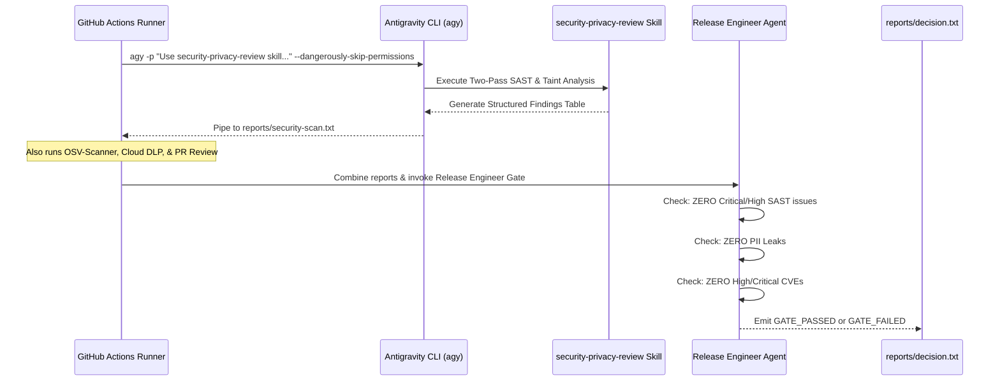

# CI/CD Pipeline Integration with `security-privacy-review`

This document details how the `security-privacy-review` skill interfaces with the GitHub Actions workflow [`.github/workflows/security-pii-review.yml`](file:///Users/yannipeng/git-projects/adk-agents/.github/workflows/security-pii-review.yml).

---

## 1. Pipeline Execution Flow



---

## 2. GitHub Actions Step Definition

From `.github/workflows/security-pii-review.yml`:

```yaml
      - name: 'Antigravity AI Security SAST Scan'
        env:
          GITHUB_TOKEN: ${{ steps.app-token.outputs.token || secrets.G_PAT_TOKEN || secrets.GITHUB_TOKEN }}
        run: |
          set -o pipefail
          echo "Starting Antigravity AI Security Scan..."
          agy -p "As a defensive software engineer and code quality reviewer, use the security-privacy-review skill to perform internal static code analysis (SAST) and code quality review across the application codebase (Python, Django views/models, Dockerfile, shell scripts, and CI workflows).
          
          Apply the Two-Pass 'Recon & Investigate' model and data flow analysis for defensive code verification:
          1. Verify source-to-sink data flows to ensure robust input validation, parameterization, and output encoding (preventing SQL injection, XSS, command injection risks) and privacy data protection.
          2. Verify that credentials, secrets, and API keys are properly loaded from environment variables rather than hardcoded.
          3. Review access controls, CSRF protections, safe serialization, and secure file operations.
          4. Verify production configuration hygiene (ensuring debug flags are disabled and error details masked).
          
          Output a structured review findings table with Severity (Critical, High, Medium, Low), File Path, Line Number, Category, and Actionable Remediation recommendations. If no issues are found, state that all files adhere to secure coding standards." \
          --dangerously-skip-permissions \
          --output-format text | tee reports/security-scan.txt
```

---

## 3. Quality Gate Evaluation Rubric

The downstream Release Engineer Agent parses `reports/security-scan.txt` with these rules:
- **Critical / High Findings:** Causes immediate `GATE_FAILED` decision and halts the pipeline (`exit 1`).
- **Medium Findings:** Flagged for remediation, but may pass if marked non-blocking with an explicit waiver.
- **Low / Informational:** Reported in GitHub Actions Step Summary for developer awareness.

