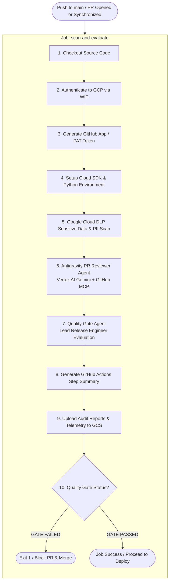
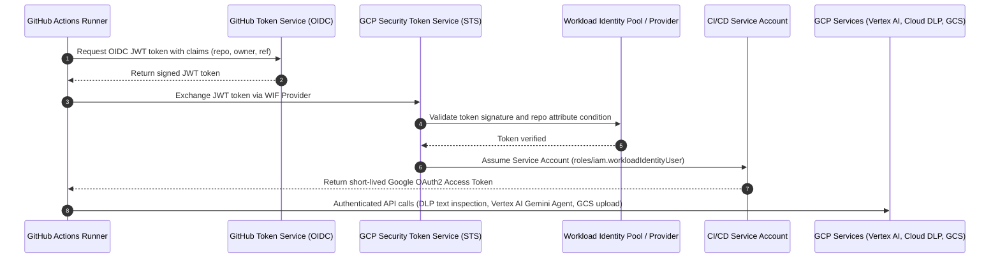
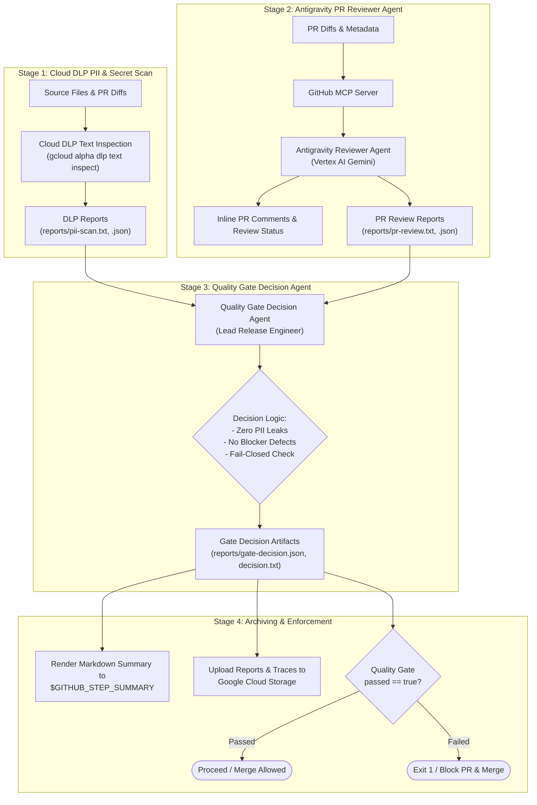

# Security-First Agentic CI/CD with Google Antigravity, Cloud DLP & Workload Identity Federation

## 1. Overview

This directory houses the autonomous **Agentic CI/CD Pipeline** for the repository. It integrates the **Google Antigravity Python SDK**, **Vertex AI (Gemini 3.7)**, **Google Cloud DLP (Data Loss Prevention)**, and **Keyless Workload Identity Federation (WIF)** to automate code review, enforce security & compliance policies, and gate production deployments.

Every pull request and push to `main` undergoes automated vulnerability inspection, PII/secret scanning, architectural review, and release gate decision-making before code can be merged or deployed.

---

## 2. End-to-End Pipeline Architecture



---

## 3. Keyless Authentication via Workload Identity Federation (WIF)

The pipeline eliminates long-lived Service Account JSON keys by exchanging short-lived GitHub OIDC tokens for Google Cloud credentials via **Workload Identity Federation**:



---

## 4. Pipeline Stages & Business Logic



### Stage 1: Cloud DLP Sensitive Data & PII Scan
* **Command:** `gcloud alpha dlp text inspect`
* **Target InfoTypes:** `EMAIL_ADDRESS`, `PHONE_NUMBER`, `LOCATION`, `CREDIT_CARD_NUMBER`, `AUTH_TOKEN`, `API_KEY`.
* **Scope:** Scans all source, configuration, and documentation files (`.tf`, `.yml`, `.yaml`, `.py`, `.sh`, `.json`, `.toml`, `.html`, `.sql`, `.md`) under 500 KB while ignoring binary assets, lockfiles, and virtual environments.
* **Outputs:** 
  * `reports/pii-scan.txt` (Human-readable finding logs)
  * `reports/pii-scan.json` (Structured JSON findings array)

### Stage 2: Antigravity PR Reviewer Agent ([`pr_reviewer_agent.py`](scripts/pr_reviewer_agent.py))
* **Model & Engine:** `google.antigravity.Agent` configured via `LLM_Model` environment variable (defaults to `gemini-3.7-flash`) on Vertex AI.
* **GitHub Integration:** Connected via GitHub MCP (`ghcr.io/github/github-mcp-server:v0.27.0`) for inspecting PR diffs, metadata, and files.
* **Review Checklist & Guardrails:**
  1. **Logic & Correctness:** Boundary conditions, off-by-one errors, and control flow.
  2. **REST API Design & CRUD Best Practices:** Resource-oriented URIs (plural nouns, versioning), semantic HTTP verbs (`GET` idempotent reads, `POST` creation returning `201`, `PUT` replacement, `PATCH` partial updates, `DELETE` returning `204`), accurate HTTP status codes, collection pagination (`limit`/`offset`/`cursor`), and standardized error envelopes (RFC 7807).
  3. **Runtime Performance & Big O Complexity:** Algorithmic bottlenecks, $O(N^2)$ inner loops, linear lookups where sets/dicts provide $O(1)$, repetitive regex compilations, and N+1 query problems.
  4. **Memory Management & Scalability:** Unbounded caches, missing TTL/maxsize, streaming vs full memory buffering on large payloads.
  5. **Loop & Recursion Safety:** Guaranteed loop termination, recursion base cases, and stack overflow prevention.
  6. **Design Patterns & Architecture (SOLID):** Design patterns (Strategy, Factory, Repository, Dependency Injection), loose coupling, and SOLID compliance.
  7. **Cloud DLP Correlation:** Cross-references Cloud DLP findings and flags secrets/PII leaks as `BLOCKER` with `pii_leak: true`.
  8. **Type Safety & Error Resilience:** Null pointer safety, resource leak cleanup (`with` context managers), and retry timeouts.
* **Output & Actions:**
  * Submits inline review comments on modified diff lines.
  * Formats top-level PR review summary.
  * For clean PRs with zero defects, posts an approving review appending a personalized summary highlighting implementation strengths.
  * Writes `reports/pr-review.json` and `reports/pr-review.txt`.

### Stage 3: Quality Gate Decision Agent ([`quality_gate_agent.py`](scripts/quality_gate_agent.py))
* **Role:** Lead Release Engineer & Security Gatekeeper.
* **Input Sources:** `reports/pii-scan.txt` and `reports/pr-review.txt`.
* **Decision Rules:**
  * **Fail-Closed Principle:** Missing or unreadable DLP reports or missing PR reviews on active PRs trigger an immediate `GATE_FAILED`.
  * **Zero Tolerance for Leaks:** Any detected PII or credential findings from Cloud DLP cause `passed = False`.
  * **No Blocker Defects:** Any `REQUEST_CHANGES` or `[BLOCKER]` review status causes `passed = False`.
  * **Pass Criteria:** `passed = True` only when zero PII findings exist and PR review status is `APPROVE`.
* **Outputs:**
  * `reports/gate-decision.json` (`QualityGateDecision` Pydantic model)
  * `reports/decision.txt` (Deterministic text starting with `GATE_PASSED` or `GATE_FAILED`)

### Stage 4: Artifact Archiving & Enforcement
* **Job Summary:** Renders markdown decision summary directly into `$GITHUB_STEP_SUMMARY`.
* **Audit Archival:** Uploads all artifacts under `reports/` and agent telemetry traces to Google Cloud Storage (`gs://${GOOGLE_CLOUD_PROJECT}-scan-reports/${RUN_ID}_${RUN_ATTEMPT}`).
* **Quality Gate Enforcement:** Reads `reports/gate-decision.json`. If `passed != True`, halts the pipeline with `exit 1` to block merge and deployment.

---

## 5. Agent Tokenomics, Budget Limits & Observability

To prevent unexpected API spend and protect against runaway execution loops during multi-turn GitHub MCP interactions, the PR Reviewer Agent enforces proactive token budgets, invocation dials, and real-time cost telemetry.

### 5.1 Pricing Rate Card (`gemini-3.7-flash` & `gemini-3.8-flash`)

The cost calculation engine in [`helper.py`](scripts/helper.py) utilizes Google Cloud Vertex AI rate cards for Gemini Flash models:

| Metric Type | Rate per Million Tokens | Cost per Token | Description |
| :--- | :--- | :--- | :--- |
| **Uncached Input Prompt** | **$0.75 / 1M** | `$0.00000075` | Initial prompt and novel tokens sent to the model |
| **Cached Input Prompt** | **$0.075 / 1M** | `$0.000000075` | Context-cached system prompt and multi-turn history (90% discount) |
| **Candidate Output** | **$3.75 / 1M** | `$0.00000375` | Generated text and review findings |
| **Reasoning / Thinking** | **$3.75 / 1M** | `$0.00000375` | Extended internal reasoning tokens (`thoughts_token_count`) |

---

### 5.2 Session Budget Controls (`BudgetConfig`)

Session limits are enforced directly at the Google Antigravity SDK harness layer via `types.BudgetConfig`:

| Configuration Dial | Default Value | Environment Variable | Purpose |
| :--- | :--- | :--- | :--- |
| `max_total_tokens` | **1,100,000** | `MAX_TOTAL_TOKENS` | Caps cumulative net token consumption (`net_input + output`) |
| `max_input_tokens` | **800,000** | `MAX_INPUT_TOKENS` | Caps cumulative net uncached prompt tokens |
| `max_output_tokens` | **200,000** | `MAX_OUTPUT_TOKENS` | Caps cumulative generated tokens (candidates + thinking) |
| `max_model_calls` | **100** | `MAX_MODEL_CALLS` | Caps generator round-trips with LLM (guards MCP loops) |
| `max_tool_calls` | **50** | `MAX_TOOL_CALLS` | Caps total tool executions across GitHub MCP |
| `max_spend_usd` | `None` (Unset) | `MAX_SPEND_USD` | Optional hard dollar cap (e.g. `0.25`, `0.50`) |

#### Dynamic Dollar Cap Derivation
When `MAX_SPEND_USD` is defined in repository variables or workflow secrets, the system calculates a worst-case token ceiling:
`spend_derived_tokens = floor((MAX_SPEND_USD / 3.75) * 1,000,000)`
and constrains `max_total_tokens = min(max_total_tokens, spend_derived_tokens)`.

---

### 5.3 Cost Scenarios & Upper Bounds

Because `MAX_INPUT_TOKENS` is capped at 800,000 and `MAX_OUTPUT_TOKENS` is capped at 200,000, their sum ($1{,}000{,}000$) fits comfortably inside the 1.1M total token ceiling:

| Scenario | Input Tokens Breakdown | Output Tokens | Total Tokens | Max Cost / Run |
| :--- | :--- | :--- | :--- | :--- |
| **Absolute Worst-Case Ceiling**<br/>*(0% Cache Hits — 100% Uncached)* | 800,000 uncached @ $0.75/1M ($0.60) | 200,000 @ $3.75/1M ($0.75) | 1,000,000 | **$1.35 USD** |
| **Typical Context Caching**<br/>*(~85% Cached Prompt)* | 680,000 cached ($0.051)<br/>+ 120,000 uncached ($0.090) | 200,000 @ $3.75/1M ($0.75) | 1,000,000 | **~$0.89 USD** |
| **High Context Caching**<br/>*(~95% Cached Prompt)* | 760,000 cached ($0.057)<br/>+ 40,000 uncached ($0.030) | 200,000 @ $3.75/1M ($0.75) | 1,000,000 | **~$0.84 USD** |
| **Routine Clean / Moderate PR**<br/>*(Typical 3–6 MCP turns)* | ~30,000 – 120,000 cached<br/>+ ~5,000 uncached | ~1,000 – 4,000 candidates<br/>+ ~1,500 thinking | ~35,000 – 130,000 | **$0.01 – $0.05 USD** |

> [!NOTE]
> Even if an extensive review runs for all 100 model calls and exhausts both the 800k input and 200k output ceilings, the maximum possible cost per run cannot exceed **$1.35 USD**. Under normal multi-turn context caching, the cost is typically under **$0.90 USD**.

---

### 5.4 Multi-Turn Context Caching & Zero-Clamping

During multi-turn agent execution with GitHub MCP tools:
1. **Repeated Cache Hits:** Gemini automatically caches the conversation prefix once it exceeds 32k tokens. Each subsequent tool turn re-reads the conversation history from cache at the 90% discounted rate ($0.075/1M).
2. **Cumulative Cache Metric:** `cached_tokens` reported in session telemetry represents the **sum of cache reads across all turns**. In long sessions, this cumulative number can surpass the base prompt token count.
3. **Net Input Clamping:** Net novel input is calculated using `max(0, prompt_tokens - cached_tokens)` to ensure accurate pricing and prevent negative token counts.

---

### 5.5 Stop Reason Detection & Graceful Fallback (Decision D-13)

When any budget dial is hit, the Google Antigravity SDK halts generation with a dedicated `stop_reason`:
* `MAX_MODEL_CALLS_EXCEEDED`: Hit generator turn ceiling.
* `MAX_TOOL_CALLS_EXCEEDED`: Hit MCP tool execution ceiling.
* `MAX_TOTAL_TOKENS_EXCEEDED`: Hit cumulative total token ceiling.
* `MAX_INPUT_TOKENS_EXCEEDED`: Hit input prompt ceiling.
* `MAX_OUTPUT_TOKENS_EXCEEDED`: Hit candidate/thinking token ceiling.

When a budget halt occurs, [`pr_reviewer_agent.py`](scripts/pr_reviewer_agent.py):
1. Detects `budget_halted = True`.
2. Bypasses `response.structured_output()` to prevent JSON decode exceptions on truncated responses.
3. Generates a graceful fallback review with `ReviewStatus.COMMENT` notifying the PR author that the review was halted early due to budget constraints.
4. Records full token telemetry and submits the review to GitHub.

---

### 5.6 Telemetry & Audit Artifacts (Decision D-14)

Every review run writes structured telemetry to `reports/token-usage.json`:
```json
{
  "timestamp": "2026-09-14T17:25:31Z",
  "model": "gemini-3.7-flash",
  "stop_reason": "COMPLETED",
  "prompt_tokens": 216261,
  "cached_tokens": 251426,
  "candidate_tokens": 3721,
  "thought_tokens": 1457,
  "total_tokens": 221439,
  "net_input_tokens": 0,
  "total_cost_usd": 0.038274,
  "budget_limits": {
    "max_total_tokens": 1100000,
    "max_input_tokens": 800000,
    "max_output_tokens": 200000,
    "max_model_calls": 100,
    "max_tool_calls": 50,
    "max_spend_usd": null
  }
}
```

The GitHub Actions workflow parses this file and publishes the **Token Usage & Estimated Spend** table directly into the GitHub Job Summary.

---

## 6. Repository Directory Layout

```
.github/
├── README.md                  # This architecture guide & documentation
├── workflows/
│   └── source-code-pii-review.yml # GitHub Actions workflow pipeline definition
├── scripts/
│   ├── pr_reviewer_agent.py   # Antigravity PR Code Reviewer Agent runner
│   ├── quality_gate_agent.py  # Antigravity Quality Gate Decision Agent runner
│   └── tests/                 # Unit tests for agent scripts
│       ├── test_pr_reviewer_agent.py
│       └── test_quality_gate_agent.py
├── tests/                     # Acceptance test suite for CI/CD workflow
│   ├── test_pr_reviewer_acceptance.py
│   ├── test_quality_gate_acceptance.py
│   └── test_workflow_acceptance.py
└── terraform/                 # Infrastructure-as-Code for WIF & IAM
    ├── main.tf                # WIF pool, provider, IAM bindings, GCS bucket, APIs
    ├── variables.tf           # Configuration variables & validation rules
    └── outputs.tf             # Provider identifiers, bucket name, service account
```

---

## 7. Infrastructure as Code: Terraform Setup & Deployment

The [`terraform/`](terraform/) directory provisions the Google Cloud infrastructure required for the GitHub Actions pipeline.

### Provisioned GCP Resources
1. **Workload Identity Pool & Provider** (`module.gh_oidc`): Configures OIDC attribute mapping and locks access to authorized GitHub repository owners.
2. **Google Cloud APIs**: Enables `aiplatform.googleapis.com`, `dlp.googleapis.com`, `storage.googleapis.com`, `iamcredentials.googleapis.com`, `sts.googleapis.com`, `run.googleapis.com`, `cloudbuild.googleapis.com`, and `artifactregistry.googleapis.com`.
3. **IAM Workload Identity Bindings**: Grants `roles/iam.workloadIdentityUser` on the Service Account strictly to the specified GitHub repository.
4. **Audit Storage Bucket**: Creates `${project_id}-scan-reports` with uniform bucket-level access.
5. **Project IAM Roles for CI/CD Service Account**:
   * `roles/aiplatform.user` (Vertex AI Gemini execution)
   * `roles/dlp.user` (Cloud DLP text inspection)
   * `roles/storage.objectAdmin` (Report and telemetry upload)
   * `roles/run.admin` (Optional Cloud Run deployments)
   * `roles/cloudbuild.builds.editor` (Cloud Build submission)
   * `roles/iam.serviceAccountUser` (Service account impersonation)

### How to Run Terraform

#### Step 1: Authenticate to Google Cloud
```bash
gcloud auth login
gcloud auth application-default login
gcloud config set project YOUR_GCP_PROJECT_ID
```

#### Step 2: Initialize Terraform
```bash
cd .github/terraform
terraform init
```

#### Step 3: Review the Execution Plan
```bash
terraform plan \
  -var="project_id=YOUR_GCP_PROJECT_ID" \
  -var="project_number=YOUR_GCP_PROJECT_NUMBER" \
  -var="service_account_email=YOUR_SERVICE_ACCOUNT_EMAIL" \
  -var='repository_owners=["YOUR_GITHUB_USER_OR_ORG"]' \
  -var='repositories=["YOUR_GITHUB_USER_OR_ORG/YOUR_REPO_NAME"]'
```

#### Step 4: Apply the Configuration
```bash
terraform apply -auto-approve \
  -var="project_id=YOUR_GCP_PROJECT_ID" \
  -var="project_number=YOUR_GCP_PROJECT_NUMBER" \
  -var="service_account_email=YOUR_SERVICE_ACCOUNT_EMAIL" \
  -var='repository_owners=["YOUR_GITHUB_USER_OR_ORG"]' \
  -var='repositories=["YOUR_GITHUB_USER_OR_ORG/YOUR_REPO_NAME"]'
```

#### Step 5: Configure GitHub Repository Secrets & Variables
After running Terraform, configure the following secrets/variables in **GitHub Repository Settings -> Secrets and variables -> Actions**:

| Name | Type | Description |
| :--- | :--- | :--- |
| `GOOGLE_CLOUD_PROJECT` | Secret / Variable | Your GCP Project ID (e.g. `coder-agent-506717`) |
| `GOOGLE_CLOUD_PROJECT_NUMBER` | Secret / Variable | Your GCP Project Number (e.g. `778303430692`) |
| `GOOGLE_CLOUD_LOCATION` | Secret / Variable | Vertex AI location (default: `us-central1`) |
| `APP_ID` | Secret (Optional) | GitHub App ID for authenticated PR reviews |
| `APP_PRIVATE_KEY` | Secret (Optional) | GitHub App Private Key for token generation |
| `G_PAT_TOKEN` | Secret (Optional) | GitHub Personal Access Token (fallback for PR comments) |
| `MAX_TOTAL_TOKENS` | Variable (Optional) | Cumulative net token ceiling (default: `1100000`) |
| `MAX_INPUT_TOKENS` | Variable (Optional) | Cumulative net prompt token ceiling (default: `800000`) |
| `MAX_OUTPUT_TOKENS` | Variable (Optional) | Cumulative generated candidate & thought ceiling (default: `200000`) |
| `MAX_MODEL_CALLS` | Variable (Optional) | Maximum LLM model round-trips (default: `100`) |
| `MAX_TOOL_CALLS` | Variable (Optional) | Maximum MCP tool execution turns (default: `50`) |
| `MAX_SPEND_USD` | Variable (Optional) | Hard spend cap in USD (e.g. `0.25`, `0.50`, default: unset) |

---

## 8. Local Testing & Verification

You can execute the test suites locally using `uv`:

### Run Unit Tests (Agent Modules)
```bash
uv run pytest .github/scripts/tests/ -v
```

### Run Acceptance Tests (Workflow & Gate Evaluation)
```bash
uv run pytest .github/tests/ -v
```

### Run Standalone Local Dry-Run of Quality Gate
```bash
# Create dummy scan files
mkdir -p reports
echo "✅ No sensitive data or PII detected by Cloud DLP." > reports/pii-scan.txt
echo "No defects found. Code looks clean." > reports/pr-review.txt

# Run gate evaluation
python .github/scripts/quality_gate_agent.py
cat reports/decision.txt
```

---

## 9. Autonomous Agent Evaluation & Quality Gate Metrics

The agentic CI/CD pipeline includes an automated evaluation harness (`.github/workflows/inference-evaluation.yml` and [`.github/scripts/tests/eval/eval_runner.py`](scripts/tests/eval/eval_runner.py)) that validates model behavior against a suite of golden test cases before production deployment.

### 9.1 Overall Evaluation Metrics & Threshold Gates

The evaluation suite tracks six core metrics across test cases spanning the PR Reviewer Agent and Quality Gate Agent:

| Metric | Target | Actual Result | Status |
| :--- | :---: | :---: | :---: |
| **Overall Pass Rate** | `100.0%` *(Default: `85.0%`)* | `88.9%` (8/9) | ❌ FAIL *(at 100%)* / ✅ PASS *(at 85%)* |
| **Schema Conformance** | `100.0%` *(Default: `85.0%`)* | `88.9%` | ❌ FAIL *(at 100%)* / ✅ PASS *(at 85%)* |
| **Vulnerability Recall** | `100.0%` *(Default: `85.0%`)* | `85.7%` | ❌ FAIL *(at 100%)* / ✅ PASS *(at 85%)* |
| **Clean False Positive Rate** | `< 5.0%` | `0.0%` | ✅ PASS |
| **Total Evaluated Cost** | `< $0.50` | `$0.000000` | ✅ PASS |
| **Average Latency** | `< 30.0s` | `6.94s` | ✅ PASS |

---

### 9.2 Metric Breakdown & Definitions

#### 1. Overall Pass Rate
* **Definition**: The proportion of all evaluated test cases that satisfy every required assertion, including deterministic output validation, severity categorization, and status matching.
* **Mathematical Formula**:
  $$\text{Overall Pass Rate} = \frac{\text{Passed Test Cases}}{\text{Total Test Cases}} = \frac{8}{9} = 88.89\% \approx 88.9\%$$
* **Significance**: Serves as the primary indicator of agent correctness across both happy paths and adversarial defect scenarios. If an agent misidentifies an architectural flaw or fails an assertion, the overall pass rate reflects the regression.
* **Gate Configuration**: Configurable via `--pass-rate-threshold` CLI flag or `EVAL_PASS_RATE_THRESHOLD` environment variable (defaults to `0.85` / `85.0%`).

#### 2. Schema Conformance
* **Definition**: The percentage of agent inference outputs that strictly conform to the expected Pydantic data schemas (`PRReviewReport` for code reviews, `QualityGateDecision` for release decisions) without JSON decoding or structure validation errors.
* **Mathematical Formula**:
  $$\text{Schema Conformance} = \frac{\text{Valid Schema Cases}}{\text{Total Evaluated Cases}} = \frac{8}{9} = 88.89\% \approx 88.9\%$$
* **Significance**: Assures structural reliability. Downstream CI/CD stages (such as GitHub comment posting and gate enforcement) rely on well-formed JSON models. Note that in fallback JUnit XML parsing, semantic assertion failures were previously conflated with schema errors, which is now decoupled in `eval_runner.py` by inspecting failure stack traces for `ValidationError` / `JSONDecodeError`.
* **Gate Configuration**: Configurable via `--schema-threshold` CLI flag or `EVAL_SCHEMA_THRESHOLD` environment variable (defaults to `0.85` / `85.0%`).

#### 3. Vulnerability Recall
* **Definition**: The percentage of known defects, vulnerabilities, credential leaks, and policy blockers correctly identified and flagged by the agents across all defect-bearing test cases.
* **Mathematical Formula**:
  $$\text{Vulnerability Recall} = \frac{\sum \text{Detected Known Blockers}}{\text{Total Defect Test Cases}} = \frac{6}{7} = 85.71\% \approx 85.7\%$$
  *(In the 9-case evaluation suite, 2 cases are clean baselines and 7 cases contain true defects. Detecting 6 out of 7 blockers yields 85.7% recall).*
* **Significance**: High recall is vital for security-first CI/CD pipelines to guarantee that vulnerabilities (e.g. AWS secret leaks, PII exposures, architectural anti-patterns) are not missed or approved.
* **Gate Configuration**: Configurable via `--recall-threshold` CLI flag or `EVAL_RECALL_THRESHOLD` environment variable (defaults to `0.85` / `85.0%`).

#### 4. Clean False Positive Rate (FPR)
* **Definition**: The rate at which clean, defect-free test cases are mistakenly flagged as containing blocker vulnerabilities or have approvals incorrectly withheld.
* **Mathematical Formula**:
  $$\text{Clean False Positive Rate} = \frac{\text{Clean Cases Inappropriately Blocked}}{\text{Total Clean Test Cases}} = \frac{0}{2} = 0.0\%$$
* **Significance**: Measures friction introduced into developer workflows. An agent that rejects clean PRs creates false alarms and blocks developer velocity. The target requires FPR to stay below `5.0%`.
* **Gate Configuration**: Configurable via `--fpr-threshold` CLI flag or `EVAL_FPR_THRESHOLD` environment variable (defaults to `0.05` / `5.0%`).

#### 5. Total Evaluated Cost
* **Definition**: The total API spend in USD incurred across all model inference calls in the evaluation run, calculated using Vertex AI rate cards for prompt, cached, and candidate/thinking tokens.
* **Mathematical Formula**:
  $$\text{Total Cost} = \sum_{\text{cases}} \left( \frac{\text{Input Tokens} \times \$0.75}{10^6} + \frac{\text{Cached Tokens} \times \$0.075}{10^6} + \frac{\text{Output Tokens} \times \$3.75}{10^6} \right)$$
* **Significance**: Ensures CI/CD evaluation remains cost-effective and flags unexpected token bloat or unbounded context expansion. Offline / mock evaluations incur `$0.000000`, well below the `< $0.50` gate target.

#### 6. Average Latency
* **Definition**: The mean wall-clock duration in seconds required for the agent to analyze inputs, execute MCP tool loops, and produce the structured output.
* **Mathematical Formula**:
  $$\text{Average Latency} = \frac{\sum_{i=1}^{N} \text{Duration}_i}{N} = \frac{62.5\text{s}}{9} = 6.94\text{s}$$
* **Significance**: Guarantees that automated agent reviews provide timely feedback in developer CI workflows without causing runner timeouts. The target gate requires average latency to remain under `30.0s`.

---

### 9.3 Evaluation Execution & Gate Enforcement

The evaluation runner can be triggered manually or within CI:

```bash
# Generate evaluation summary reports (JSON & Markdown)
python .github/scripts/tests/eval/eval_runner.py --generate-summary --output-dir reports

# Enforce quality gate threshold with default 85% target
python .github/scripts/tests/eval/eval_runner.py --fail-on-threshold-breach --output-dir reports

# Override thresholds via CLI arguments if stricter gating is required
python .github/scripts/tests/eval/eval_runner.py \
  --pass-rate-threshold 0.85 \
  --schema-threshold 0.85 \
  --recall-threshold 0.85 \
  --fpr-threshold 0.05 \
  --fail-on-threshold-breach \
  --output-dir reports
```


