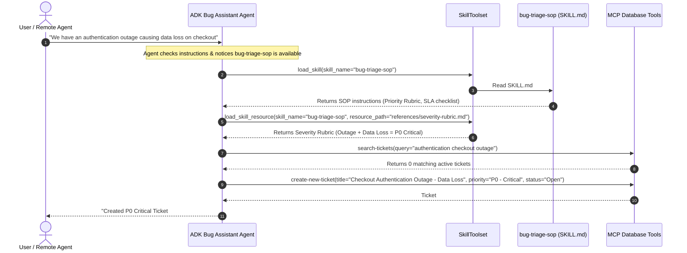

# Feature Implementation Plan: adk-skills

## 📋 Todo Checklist
- [ ] Create domain skill folder `adk_bug_ticket_agent/skills/bug-triage-sop/` with `SKILL.md` and reference documents (`references/sla-matrix.md`, `references/severity-rubric.md`)
- [ ] Add skill loader and lazy-initialized `SkillToolset` in `adk_bug_ticket_agent/agent.py` within `ServiceManager`
- [ ] Update `adk_bug_ticket_agent/system_prompt.py` to incorporate `DEFAULT_SKILL_SYSTEM_INSTRUCTION` for dynamic skill discovery and loading
- [ ] Register `skill_toolset` in `Agent` instances across all execution modes (`GEMINI`, `VERTEXAI`, `GKE`) in `adk_bug_ticket_agent/agent.py`
- [ ] Refactor A2A `AgentCard` and `AgentSkill` declarations in `adk_bug_ticket_agent/agent.py` to follow A2A protocol best practices and support explicit card injection into `to_a2a()`
- [ ] Write comprehensive unit tests in `tests/test_adk_skills.py` validating skill loading, `SkillToolset` tool execution, and A2A `AgentCard` generation
- [ ] Execute automated test verification using `uv run pytest tests/test_adk_skills.py`

---

## 🔍 Analysis & Investigation

### Codebase Structure
| File / Path | Responsibility | Current Status |
| :--- | :--- | :--- |
| `adk_bug_ticket_agent/agent.py` | Defines agent lifecycle, `ServiceManager`, `Agent` tool configuration, and A2A Starlette server setup. | Currently instantiates tools directly (`tools=[load_memory, get_current_date, search_tool, *get_toolbox_tools()]`) without dynamic skills. Lines 197–215 define a basic `AgentSkill` and `AgentCard`, but they are decoupled from dynamic runtime skills and use commented-out `to_a2a()`. |
| `adk_bug_ticket_agent/system_prompt.py` | Contains the system instruction (`agent_instruction`) guiding the agent's triage process and tool usage. | Lists available tools statically, but does not instruct the agent on progressive disclosure or how to invoke `load_skill` / `load_skill_resource`. |
| `adk_bug_ticket_agent/tools/tools.py` | Contains custom function tools (`get_current_date`), agent tools (`search_tool`), and MCP Toolbox database wrappers. | Independent tool definitions. No skill packaging currently exists. |
| `adk_bug_ticket_agent/skills/` | Directory for file-based ADK skill packages. | Does not exist yet. Needs to be created with modular domain skills. |
| `tests/test_adk_skills.py` | Test suite verifying skill loading, execution, and A2A card compatibility. | Does not exist yet. Needs to be created. |

### Current Architecture
In the current implementation:
1. **Tool Ingestion**: Tools are loaded statically at initialization time in `ServiceManager._init_agent()`:
   ```python
   tools=[load_memory, get_current_date, search_tool, *get_toolbox_tools()]
   ```
2. **Instruction Clutter**: All behavioral rules, triage guidelines, and tool listings are forced into a monolithic string in `system_prompt.py`. As more bug categories, triage guidelines, SLA rules, and platform-specific procedures are added, the system prompt quickly suffers from context bloat, increased inference cost, and attention drift.
3. **A2A Capability Exposure**: Lines 198–215 define an `AgentSkill` and `AgentCard` with hardcoded metadata for external A2A communication, but lines 226–237 instantiate `DefaultRequestHandler` manually rather than utilizing the full ADK `to_a2a()` capability pattern. Furthermore, if `AgentCardBuilder` is run automatically, it converts all internal canonical tools (`get_current_date`, `load_memory`) into card skills, which pollutes the external discovery contract with low-level internal mechanics.

### Dependencies & Integration Points
- **`google.adk.skills`**: ADK's core skills module providing `Skill`, `Frontmatter`, `Resources`, and `load_skill_from_dir()`.
- **`google.adk.tools.skill_toolset`**: Provides `SkillToolset`, `DEFAULT_SKILL_SYSTEM_INSTRUCTION`, `ListSkillsTool`, `LoadSkillTool`, `LoadSkillResourceTool`, and `RunSkillScriptTool`.
- **`a2a.types`**: Provides `AgentCard`, `AgentSkill`, and `AgentCapabilities` for the A2A communication standard.
- **`google.adk.a2a.utils.agent_card_builder`**: Generates or validates `AgentCard` objects from ADK agents.
- **`google.adk.a2a.utils.agent_to_a2a`**: Provides `to_a2a()` helper for building Starlette/A2A server instances with explicit `agent_card` parameter support.

### Considerations & Challenges
1. **Two Distinct Skill Concepts in ADK**:
   - **Internal Execution Skills (`SkillToolset` + `models.Skill`)**: Used by the agent *internally* during runtime reasoning. Enables progressive disclosure: the LLM dynamically inspects `list_skills`, fetches `load_skill` instructions, and reads reference files (`load_skill_resource`) only when tackling specialized tasks.
   - **External Protocol Skills (`a2a.types.AgentSkill` + `AgentCard`)**: Published *externally* over the A2A RPC endpoint for discovery by peer agents or a master orchestrator.
   - *Best Practice*: Both concepts must be cleanly separated and harmonized. The agent runtime utilizes `SkillToolset` for domain procedures, while the A2A server exposes curated, high-level `AgentSkill` descriptors on its `AgentCard` rather than exposing raw internal utility tools.
2. **Naming Constraints in ADK Skills**:
   - `models.Frontmatter.name` strictly requires **lowercase kebab-case** (regex: `^[a-z0-9]+(-[a-z0-9]+)*$`). Using underscores (e.g. `bug_triage_sop`) raises a `pydantic_core.ValidationError`. Names must be formatted like `bug-triage-sop`.
3. **Vertex AI & Serialization Constraints**:
   - Skill directories and `SkillToolset` must be lazily instantiated inside `ServiceManager` rather than at the top-level module scope to avoid unpicklable objects during Cloud Run / Vertex AI deployments.
   - Skills should prioritize Markdown/text references (`references/`) over code scripts unless a sandboxed executor is explicitly needed.
4. **Django Separation**:
   - As mandated by project rules, Django models and ORM imports must not be introduced into `agent.py` or skill files.

---

## 📐 Technical Specification & Design

### Component Architecture
```
+--------------------------------------------------------------------------------------------------+
|                                    A2A Remote Orchestrators / Clients                            |
|                               (Discovers via AgentCard on /a2a endpoint)                         |
+-------------------------------------------------+------------------------------------------------+
                                                  | JSON-RPC 2.0 (A2A Protocol)
                                                  v
+--------------------------------------------------------------------------------------------------+
|                                  A2A Layer (AgentCard & AgentSkill)                              |
|  - AgentCard: IT Bug Assistant Agent (v1.0.0)                                                    |
|  - AgentSkill 1: bug-triage-assistant (tags: ["bug-tracking", "triage", "itsm"])                |
|  - AgentSkill 2: ticket-lifecycle-management (tags: ["ticket-lifecycle", "sla-escalation"])      |
+-------------------------------------------------+------------------------------------------------+
                                                  |
                                                  v
+--------------------------------------------------------------------------------------------------+
|                                      ADK Agent Runtime Layer                                     |
|  - Model: gemini-3.8-flash                                                                       |
|  - Instruction: Base Triage Instruction + DEFAULT_SKILL_SYSTEM_INSTRUCTION                       |
|  - Tools:                                                                                        |
|      + Database MCP Tools (search-tickets, create-new-ticket, etc.)                             |
|      + Memory & Date Tools (load_memory, get_current_date)                                       |
|      + Web Search Tool (search_tool)                                                             |
|      + SkillToolset (Dynamic Runtime Skills):                                                    |
|          * list_skills()                                                                         |
|          * load_skill(skill_name)                                                                |
|          * load_skill_resource(skill_name, resource_path)                                        |
+-------------------------------------------------+------------------------------------------------+
                                                  | Reads on-demand
                                                  v
+--------------------------------------------------------------------------------------------------+
|                                    Skill Packages Directory                                      |
|  adk_bug_ticket_agent/skills/bug-triage-sop/                                                     |
|    ├── SKILL.md                 <- Frontmatter (name, desc, tags) + Step-by-step Triage SOP      |
|    └── references/                                                                               |
|        ├── sla-matrix.md        <- P0 to P3 response & resolution time tables                    |
|        └── severity-rubric.md   <- Criteria for classifying crashes, security, UI bugs          |
+--------------------------------------------------------------------------------------------------+
```

### Sequence Flow Diagram


### Schemas & Models

#### 1. Skill Frontmatter and Structure (`adk_bug_ticket_agent/skills/bug-triage-sop/SKILL.md`)
```markdown
---
name: bug-triage-sop
description: Standard Operating Procedure for triaging bug tickets, classifying severity (P0-P3), verifying SLAs, and handling duplicate issues.
metadata:
  category: itsm
  version: 1.0.0
---

# Bug Triage Standard Operating Procedure

When a user reports a bug or requests a ticket to be created/updated, execute the following procedure:

1. **Information Extraction**:
   - Extract Title, Description, Component, and Impact.
   - If reproduction steps or error logs are missing, ask clarifying questions unless it is an ongoing emergency.

2. **Severity Classification**:
   - Consult `references/severity-rubric.md` via `load_skill_resource` to assign the proper priority:
     - `P0 - Critical`: Total service outage, data loss, or critical security exploit.
     - `P1 - High`: Major feature impaired with no reasonable workaround.
     - `P2 - Medium`: Partial impairment or edge-case failure with available workaround.
     - `P3 - Low`: Cosmetic, typo, or minor enhancement.

3. **Duplicate Detection**:
   - Always run `search-tickets` with keywords before creating a new ticket.
   - If similarity distance <= 0.3, reference the existing ticket ID and ask if this is an update.

4. **SLA Verification**:
   - Check `references/sla-matrix.md` to inform the user of the initial response target for the assigned priority.
```

#### 2. Skill References (`adk_bug_ticket_agent/skills/bug-triage-sop/references/severity-rubric.md`)
```markdown
# Severity Rubric

| Priority | Level | Impact Criteria | Examples |
| :--- | :--- | :--- | :--- |
| **P0** | Critical | Widespread outage, database corruption, active security breach | Payment gateway down, login service 500 error |
| **P1** | High | Core business flow blocked, no viable workaround | Search returns empty for all users, report export fails |
| **P2** | Medium | Non-core feature broken, or workaround exists | Dark mode toggle broken, secondary filter not sorting |
| **P3** | Low | Minor UI glitch, typographical error, non-blocking bug | Button misaligned by 2px, misspelled label |
```

#### 3. Skill References (`adk_bug_ticket_agent/skills/bug-triage-sop/references/sla-matrix.md`)
```markdown
# SLA Response & Resolution Matrix

| Priority | Initial Response SLA | Target Resolution SLA | Escalation Target |
| :--- | :--- | :--- | :--- |
| **P0 - Critical** | 15 Minutes | 4 Hours | VP of Engineering & On-call Lead |
| **P1 - High** | 1 Hour | 24 Hours | Engineering Team Lead |
| **P2 - Medium** | 4 Hours | 3 Business Days | Assigned Component Owner |
| **P3 - Low** | 24 Hours | Next Sprint Release | Product Backlog |
```

### API & Code Signatures

#### 1. Skill Loader Helper (`adk_bug_ticket_agent/agent.py`)
```python
def load_agent_skills() -> list[models.Skill]:
    """
    Loads all filesystem-based skills from the adk_bug_ticket_agent/skills directory.
    
    Returns:
        list[models.Skill]: Validated ADK Skill instances.
    """
```

#### 2. `ServiceManager` Additions (`adk_bug_ticket_agent/agent.py`)
```python
class ServiceManager:
    def __init__(self):
        # existing inits...
        self._skill_toolset: Optional[SkillToolset] = None

    def _init_skill_toolset(self) -> SkillToolset:
        """Initializes the SkillToolset with local domain skills."""
        ...

    @property
    def skill_toolset(self) -> SkillToolset:
        """Lazy-loads and returns the SkillToolset."""
        ...
```

#### 3. A2A AgentCard Specification (`adk_bug_ticket_agent/agent.py`)
```python
def build_agent_card(agent_url: str) -> AgentCard:
    """
    Constructs the canonical A2A AgentCard declaring high-level capabilities.
    
    Args:
        agent_url: Base URL where the A2A server is hosted.
        
    Returns:
        AgentCard: Complete A2A card containing AgentSkill declarations.
    """
```

---

## 📝 Step-by-Step Implementation Steps

### Step 1: Create Domain Skills Directory Structure and Files
- **Files to create**:
  - `adk_bug_ticket_agent/skills/bug-triage-sop/SKILL.md`
  - `adk_bug_ticket_agent/skills/bug-triage-sop/references/severity-rubric.md`
  - `adk_bug_ticket_agent/skills/bug-triage-sop/references/sla-matrix.md`
- **Changes needed**:
  1. Author `SKILL.md` with standard YAML frontmatter (`name: bug-triage-sop`, `description: ...`) and procedural steps.
  2. Populate `references/severity-rubric.md` with the P0–P3 classification rubric.
  3. Populate `references/sla-matrix.md` with response and resolution target tables.
- **Implementation Notes**:
  - The `name` field in frontmatter MUST strictly use lowercase kebab-case (`bug-triage-sop`).
- **Status**: `- [ ]`

### Step 2: Update System Prompt with Skill Execution Guidance
- **Files to modify**:
  - `adk_bug_ticket_agent/system_prompt.py`
- **Changes needed**:
  1. Import `DEFAULT_SKILL_SYSTEM_INSTRUCTION` from `google.adk.tools.skill_toolset`.
  2. Append `DEFAULT_SKILL_SYSTEM_INSTRUCTION` to `agent_instruction`.
  3. Add a section under `Core Process` noting that when classifying or handling ticket priority and lifecycle, the agent should invoke the `bug-triage-sop` skill.
- **Implementation Notes**:
  - `DEFAULT_SKILL_SYSTEM_INSTRUCTION` teaches the model the rules of `load_skill` and `load_skill_resource`.
- **Status**: `- [ ]`

### Step 3: Implement Skill Loader and Integrate `SkillToolset` into `agent.py`
- **Files to modify**:
  - `adk_bug_ticket_agent/agent.py`
- **Changes needed**:
  1. Add imports:
     ```python
     from pathlib import Path
     from google.adk.skills import load_skill_from_dir, models
     from google.adk.tools.skill_toolset import SkillToolset
     ```
  2. Implement `load_agent_skills()` to dynamically discover all skill directories inside `adk_bug_ticket_agent/skills/` containing `SKILL.md`.
  3. Add `_init_skill_toolset()` and the `skill_toolset` lazy property to `ServiceManager`.
  4. In `_init_agent()`, `_init_vertexai_agent()`, and `_init_gke_ai_agent()`, include `self.skill_toolset` in the `tools` list:
     ```python
     tools=[load_memory, get_current_date, search_tool, *get_toolbox_tools(), self.skill_toolset]
     ```
- **Implementation Notes**:
  - Keeping `SkillToolset` inside `ServiceManager` preserves the lazy-loading singleton pattern and avoids unpicklable objects at import time.
- **Status**: `- [ ]`

### Step 4: Refactor A2A `AgentCard` and `AgentSkill` Declarations
- **Files to modify**:
  - `adk_bug_ticket_agent/agent.py`
- **Changes needed**:
  1. Define a helper `build_agent_card(agent_url: str) -> AgentCard` encapsulating the creation of `AgentCapabilities`, `AgentSkill` objects, and `AgentCard`.
  2. Define specific skills on the card:
     - `bug-triage-assistant`: For triage, priority scoring, duplicate detection, and ticket creation.
     - `ticket-management`: For retrieving, updating status, and filtering tickets.
  3. Ensure `AgentCard` uses `skills=[triage_skill, management_skill]`.
  4. When initializing `to_a2a(...)` or `A2AStarletteApplication(...)`, pass the pre-built `agent_card` explicitly so ADK does not pollute the card with low-level tool functions (`get_current_date`, `list_skills`, `load_skill`).
- **Implementation Notes**:
  - Follow A2A best practice: remote agents should see business-level skills, while the agent's internal reasoning loop uses `SkillToolset` tools.
- **Status**: `- [ ]`

### Step 5: Author Unit and Integration Tests for Skills
- **Files to create**:
  - `tests/test_adk_skills.py`
- **Changes needed**:
  1. Test that `load_agent_skills()` finds and parses `bug-triage-sop`.
  2. Test that `SkillToolset` exposes `list_skills`, `load_skill`, and `load_skill_resource`.
  3. Test that calling `load_skill(skill_name="bug-triage-sop")` returns the instructions and frontmatter.
  4. Test that `load_skill_resource(skill_name="bug-triage-sop", resource_path="references/severity-rubric.md")` returns the rubric content.
  5. Test that `build_agent_card()` produces a valid `AgentCard` with the expected `AgentSkill` list.
- **Implementation Notes**:
  - Tests can be run locally with `uv run pytest tests/test_adk_skills.py` without requiring a live PostgreSQL or MCP Toolbox instance.
- **Status**: `- [ ]`

---

## 🧪 Verification & Testing Strategy

### Unit/Integration Tests
1. **Skill Discovery and Frontmatter Validation**:
   - Verify `bug-triage-sop` is loaded without Pydantic validation errors.
   - Assert `skill.frontmatter.name == "bug-triage-sop"`.
2. **SkillToolset Execution**:
   - Execute `load_skill` tool and assert the return dictionary contains `"skill_name": "bug-triage-sop"`.
   - Execute `load_skill_resource` tool for `references/severity-rubric.md` and assert it contains `"P0 - Critical"`.
3. **Agent Initialization**:
   - Instantiate `_service_manager.root_agent` and verify `self.skill_toolset` is present in `root_agent.tools`.
4. **A2A AgentCard Compliance**:
   - Validate that `agent_card.skills` has 2 skills with valid IDs, tags, and examples.

### Verification Commands
```bash
# 1. Run the dedicated skills test suite
uv run pytest tests/test_adk_skills.py -v

# 2. Full test suite execution
uv run pytest tests/ -v

# 3. Dry-run agent initialization
uv run python -c "from adk_bug_ticket_agent.agent import get_agent, agent_card; agent = get_agent(); print('Agent Tools:', len(agent.tools)); print('Card Skills:', [s.name for s in agent_card.skills])"
```

### Expected Results
- All tests in `tests/test_adk_skills.py` pass with status code 0.
- `Agent Tools` output confirms tools count includes `SkillToolset`.
- `Card Skills` displays `['Bug Triage Assistant', 'Ticket Lifecycle Management']`.

---

## 🎯 Success Criteria
1. **Separation of Concerns**: Internal execution skills (`SkillToolset`) and external protocol skills (`AgentSkill`/`AgentCard`) are cleanly defined and follow ADK best practices.
2. **Progressive Disclosure**: Domain triage rules and SLA references are encapsulated in `adk_bug_ticket_agent/skills/bug-triage-sop/` rather than bloating the base system prompt.
3. **A2A Best Practices**: `AgentCard` explicitly publishes semantic domain skills and avoids generic tool pollution.
4. **Full Test Coverage**: Automated pytest tests pass cleanly verifying skill parsing, resource fetching, and agent integration.
