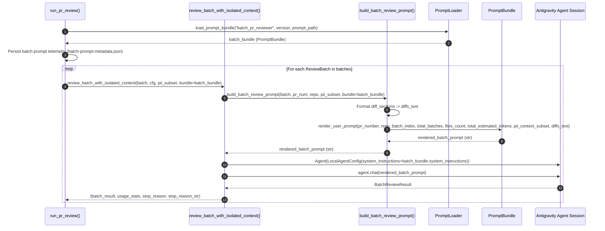

# Feature Implementation Plan: Externalize Batch Review Prompt Template

## 📋 Todo Checklist
- [x] Task 1: Create directory `.github/prompts/batch_pr_reviewer/` and author `v1.0.0.md` with YAML frontmatter, `## System Instructions`, and `## User Prompt`
- [x] Task 2: Register `"batch_pr_reviewer"` in `BUILTIN_PROMPTS` within `.github/scripts/prompt_loader.py` with embedded fallback template and required variables
- [x] Task 3: Update `.github/scripts/helper.py` (`resolve_env_config`) to support `BATCH_PR_REVIEW_PROMPT_VERSION` and `BATCH_PR_REVIEW_PROMPT_PATH` configuration parameters
- [x] Task 4: Refactor `build_batch_review_prompt` in `.github/scripts/pr_reviewer_agent.py` to use `PromptLoader` and support version, prompt_path, and preloaded bundle arguments while preserving full backward compatibility
- [x] Task 5: Expose `BATCH_SYSTEM_INSTRUCTIONS` constant in `.github/scripts/pr_reviewer_agent.py` and update `__all__`
- [x] Task 6: Update `review_batch_with_isolated_context` and `run_pr_review` in `.github/scripts/pr_reviewer_agent.py` to pass batch prompt bundles and persist batch prompt telemetry
- [x] Task 7: Update `.github/prompts/README.md` and `.github/scripts/generate_job_summary.py` to document and display batch prompt template audit metadata
- [x] Task 8: Implement comprehensive unit and contract tests in `.github/scripts/tests/test_prompt_loader.py` and `.github/scripts/tests/test_pr_reviewer_agent.py`
- [x] Task 9: Execute full test suite (`uv run pytest .github/scripts/tests/ -v`) to confirm zero regressions across all 154+ tests

---

## 🔍 Analysis & Investigation

### Codebase Structure
The following table details the files governing the PR review lifecycle, prompt loading engine, and test suites:

| File Path | Current Responsibility | Proposed Changes |
| :--- | :--- | :--- |
| [`.github/prompts/batch_pr_reviewer/v1.0.0.md`](file://.github/prompts/batch_pr_reviewer/v1.0.0.md) *(New)* | None. | Externalized, semantic-versioned Markdown prompt template with YAML frontmatter, `## System Instructions`, and `## User Prompt`. |
| [`.github/scripts/prompt_loader.py`](file://.github/scripts/prompt_loader.py) | Manages loading, validation, and rendering of versioned prompt templates via `PromptLoader`. Houses `BUILTIN_PROMPTS` fail-safe dictionary. | Add `"batch_pr_reviewer"` to `BUILTIN_PROMPTS` with embedded fallback instructions and required variables matching the batch schema. |
| [`.github/scripts/pr_reviewer_agent.py`](file://.github/scripts/pr_reviewer_agent.py) | Defines `build_batch_review_prompt` (lines 179-210) with hardcoded f-string prompt, `review_batch_with_isolated_context` (lines 213-247), and `run_pr_review` (lines 441-630). | Refactor `build_batch_review_prompt` to load and render `batch_pr_reviewer` template via `PromptLoader`. Add `BATCH_SYSTEM_INSTRUCTIONS` module constant. Support passing `bundle`, `version`, and `prompt_path`. Record batch prompt telemetry. |
| [`.github/scripts/helper.py`](file://.github/scripts/helper.py) | Environment resolution (`resolve_env_config`), file triage, batch partitioning, and reporting. | Add `batch_pr_review_prompt_version` and `batch_pr_review_prompt_path` resolution from environment and kwargs with default fallbacks. |
| [`.github/prompts/README.md`](file://.github/prompts/README.md) | Documentation of prompt template directory structure and variable substitution conventions. | Document `batch_pr_reviewer/` template, frontmatter schema, and the 8 required variables. |
| [`.github/scripts/generate_job_summary.py`](file://.github/scripts/generate_job_summary.py) | Renders GitHub Actions Job Summary including prompt audit table. | Add `Batch PR Reviewer Agent` telemetry lookup in `generate_prompt_audit_section`. |
| [`.github/scripts/tests/test_pr_reviewer_agent.py`](file://.github/scripts/tests/test_pr_reviewer_agent.py) | PR reviewer agent test suite, including `test_build_batch_review_prompt_and_pii_subset` (line 1545). | Verify existing tests continue to pass with positional signature and add tests for optional parameters. |
| [`.github/scripts/tests/test_prompt_loader.py`](file://.github/scripts/tests/test_prompt_loader.py) | Contract tests for `PromptLoader`. | Add tests verifying `batch_pr_reviewer` file loading, frontmatter parsing, variable validation, literal brace preservation, and built-in fallback. |

### Current Architecture vs. Proposed Architecture

#### Current Architecture
In the current implementation:
1. `build_pr_review_prompt()` (lines 425-439) in `pr_reviewer_agent.py` was refactored under Decision D-19 to load `.github/prompts/pr_reviewer/v1.0.0.md` via `load_prompt_bundle("pr_reviewer", ...)`.
2. However, when context compaction and batching was introduced (Decision D-17), `build_batch_review_prompt()` (lines 179-210) was implemented using a hardcoded Python multiline f-string directly inside `pr_reviewer_agent.py`.
3. As a result, prompt modifications for batch reviews require Python code changes rather than template editing, prompt version pinning cannot be applied to batch runs, and audit telemetry records only the monolithic `pr_reviewer` metadata.

#### Proposed Architecture
Externalize the batch review prompt into `.github/prompts/batch_pr_reviewer/v1.0.0.md` and load it through `PromptLoader`:
1. **Template Separation:** Store system guidance and user execution prompts in Markdown files with YAML frontmatter.
2. **Template Validation:** Validate the 8 required variables (`pr_number`, `repo`, `batch_index`, `total_batches`, `files_count`, `total_estimated_tokens`, `pii_context_subset`, `diffs_text`) before prompt execution.
3. **Fail-Safe Resilience:** Provide an embedded fallback in `BUILTIN_PROMPTS` so that if the template file is removed or inaccessible, execution continues safely with `is_fallback: True` flagged in audit telemetry.
4. **Backward Compatibility:** Maintain exact positional parameter order for `build_batch_review_prompt(batch, pr_number, repo, pii_context_subset, ...)` to ensure existing calls and tests execute without change.

### Dependencies & Integration Points
- **Python Standard Library (`string.Template`, `pathlib`, `hashlib`, `re`):** Template placeholder substitution with literal brace protection (`${variable}`).
- **Pydantic (`PromptBundle`, `PromptMetadata`):** Metadata schema validation and serialization.
- **PyYAML (`yaml`):** Frontmatter parsing with automatic fallback to regex parsing in environments where PyYAML is absent.
- **Antigravity SDK (`LocalAgentConfig`, `Agent`):** Ingestion of `system_instructions` and rendered user prompt into isolated batch sessions.

### Considerations & Challenges
1. **Backward Compatibility with Existing Callers:**
   - Existing caller in `test_pr_reviewer_agent.py` (line 1577):
     `build_batch_review_prompt(batch, pr_number="101", repo="org/repo", pii_context_subset=pii_subset)`
   - The refactored signature must maintain `batch`, `pr_number`, `repo`, and `pii_context_subset` as the first four parameters, adding optional keyword-only or defaulted arguments (`version`, `prompt_path`, `bundle`).
2. **Bundle Type Disambiguation:**
   - In `run_pr_review()`, line 504 loads `bundle = load_prompt_bundle("pr_reviewer", ...)`. If this bundle is passed down to `review_batch_with_isolated_context(..., bundle=bundle)`, `bundle` is configured with `required_variables=["pr_number", "repo", "pii_context"]`. Passing it directly into `build_batch_review_prompt` would raise `ValueError: Missing required prompt variable: 'pii_context'`.
   - Therefore, `build_batch_review_prompt` must inspect `bundle.metadata.name`. If `bundle is None` or `bundle.metadata.name == "pr_reviewer"`, it automatically loads `"batch_pr_reviewer"`. If a caller explicitly provides a bundle whose name is `"batch_pr_reviewer"` (or a custom bundle configured for batch review), that bundle is utilized directly.
3. **Preservation of Raw Diff Content:**
   - Diffs may contain literal `$`, `{`, `}`, and Python syntax. `string.Template.safe_substitute()` handles `$`-prefixed variables while leaving literal `{...}` untouched. Diffs containing isolated dollar signs (e.g. jQuery `$()` or shell variables `$VAR`) must be handled without `KeyError`.

### 🔄 Dual Template Usage: `batch_pr_reviewer` vs. `pr_reviewer`

Both `.github/prompts/batch_pr_reviewer/v1.0.0.md` and `.github/prompts/pr_reviewer/v1.0.0.md` are maintained in the repository, serving distinct operational roles:

| Dimension | `batch_pr_reviewer/v1.0.0.md` | `pr_reviewer/v1.0.0.md` |
| :--- | :--- | :--- |
| **Operational Role** | **Active runtime review engine** for partitioned, context-isolated PR reviews (Decision D-17). | **Legacy / backward-compatibility mode** for monolithic unbatched reviews (Decision D-19). |
| **Primary Caller** | [`build_batch_review_prompt()`](file://.github/scripts/pr_reviewer_agent.py) called inside `review_batch_with_isolated_context()`. | [`build_pr_review_prompt()`](file://.github/scripts/pr_reviewer_agent.py) and module-level `SYSTEM_INSTRUCTIONS`. |
| **Input Variables** | 8 variables: `pr_number`, `repo`, `batch_index`, `total_batches`, `files_count`, `total_estimated_tokens`, `pii_context_subset`, `diffs_text`. | 3 variables: `pr_number`, `repo`, `pii_context`. |
| **Diff Delivery** | Pre-compacted file diffs and triage metadata are formatted directly into the prompt body via `${diffs_text}`. | Diff hunks are not passed in prompt; the agent uses GitHub MCP read tools dynamically to inspect diffs across the entire PR. |
| **Telemetry Output** | `reports/telemetry/pr_review_agent/batch-prompt-metadata.json` (also mapped to `reports/telemetry/batch_pr_reviewer_agent/prompt-metadata.json`). | `reports/telemetry/pr_reviewer_agent/prompt-metadata.json`. |
| **System Instructions** | Exported as `BATCH_SYSTEM_INSTRUCTIONS` in `pr_reviewer_agent.py` and passed to isolated batch agent sessions. | Exported as `SYSTEM_INSTRUCTIONS` in `pr_reviewer_agent.py` preserving backward-compatible imports for existing tools/tests. |

---

## 📐 Technical Specification & Design

### Component Architecture

```
                          ┌──────────────────────────────────────────────┐
                          │    .github/prompts/batch_pr_reviewer/        │
                          │                 v1.0.0.md                    │
                          │   - YAML frontmatter (metadata)              │
                          │   - ## System Instructions                   │
                          │   - ## User Prompt (${placeholders})         │
                          └──────────────────────┬───────────────────────┘
                                                 │
                                                 ▼
┌─────────────────────────┐       ┌──────────────────────────────────────┐
│  Environment Controls   │──────▶│      PromptLoader (Singleton)        │
│  BATCH_PR_REVIEW_       │       │  - resolve_version_path()            │
│  PROMPT_VERSION         │       │  - parse_template_content()          │
│  BATCH_PR_REVIEW_       │       │  - get_builtin_fallback()            │
│  PROMPT_PATH            │       └──────────────────┬───────────────────┘
└─────────────────────────┘                          │
                                                     ▼
                                  ┌──────────────────────────────────────┐
                                  │            PromptBundle              │
                                  │  - metadata (PromptMetadata)         │
                                  │  - system_instructions (str)        │
                                  │  - render_user_prompt(**kwargs)      │
                                  └──────────────────┬───────────────────┘
                                                     │
                                                     ▼
                                  ┌──────────────────────────────────────┐
                                  │      build_batch_review_prompt       │
                                  │  1. Format diffs_text from batch     │
                                  │  2. Substitute 8 required variables  │
                                  │  3. Return validated prompt string   │
                                  └──────────────────┬───────────────────┘
                                                     │
                                                     ▼
                                  ┌──────────────────────────────────────┐
                                  │ review_batch_with_isolated_context   │
                                  │  - Agent(LocalAgentConfig)           │
                                  │  - chat(batch_prompt)                │
                                  └──────────────────────────────────────┘
```

### Mermaid Diagram


### Schemas & Models

#### Prompt Template YAML Frontmatter (`.github/prompts/batch_pr_reviewer/v1.0.0.md`)
```yaml
---
name: batch_pr_reviewer
version: "1.0.0"
description: "Batch-isolated PR Reviewer instructions and execution prompt"
author: "DevOps & Security Team"
created_at: "2026-09-16"
model_compatibility:
  - "gemini-3.7-flash"
  - "gemini-3.8-flash"
required_variables:
  - pr_number
  - repo
  - batch_index
  - total_batches
  - files_count
  - total_estimated_tokens
  - pii_context_subset
  - diffs_text
optional_variables:
  - additional_guidelines
changelog:
  - version: "1.0.0"
    date: "2026-09-16"
    summary: "Initial externalized batch review prompt template for isolated context execution."
---
```

#### Built-in Fallback Entry (`.github/scripts/prompt_loader.py`)
```python
BUILTIN_PROMPTS["batch_pr_reviewer"] = {
    "metadata": {
        "name": "batch_pr_reviewer",
        "version": "1.0.0-builtin",
        "description": "Built-in fallback Batch PR Reviewer prompt bundle",
        "author": "Antigravity Fallback System",
        "required_variables": [
            "pr_number",
            "repo",
            "batch_index",
            "total_batches",
            "files_count",
            "total_estimated_tokens",
            "pii_context_subset",
            "diffs_text",
        ],
        "optional_variables": ["additional_guidelines"],
        "is_fallback": True,
    },
    "system_instructions": (
        "You are an expert Principal Software Architect, API Designer, Performance Engineer, and Security Auditor.\n\n"
        "Your objective is to thoroughly review Pull Request diff hunks for the assigned batch, evaluate relevant Cloud DLP security scans, "
        "and produce a structured BatchReviewResult with line-level findings and a concise batch summary.\n\n"
        "### TOOL USAGE POLICY:\n"
        "- You have full access to GitHub MCP tools for inspecting repository files and context.\n"
        "- Ensure your complete analysis and findings are returned in the structured `BatchReviewResult` schema.\n\n"
        "### REVIEW GUIDELINES & CHECKLIST:\n"
        "1. Logic & Correctness: Verify control flow, boundary conditions, off-by-one errors, and algorithm correctness.\n"
        "2. REST API Design & CRUD Best Practices (if adding/modifying endpoints): Resource-oriented URIs, HTTP verbs, status codes, pagination.\n"
        "3. Runtime Performance & Big O Complexity: Evaluate time complexity, eliminate N+1 queries, linear lookups, expensive tight loops.\n"
        "4. Memory Management & Scalability: Guard against unbounded collections, missing cache TTLs, full payload loads.\n"
        "5. Infinite Loops, Recursion & Stack Overflow: Scrutinize while loops, for loops, recursive termination conditions.\n"
        "6. Design Patterns & Architecture (SOLID): Enforce single responsibility, dependency inversion, clean interfaces.\n"
        "7. Engineering Best Practices & Testability: Decouple business logic from transport, promote determinism and mockability.\n"
        "8. Null Pointers & Type Safety: Check for NoneType dereferences, missing guard clauses, unsafe dict indexing.\n"
        "9. Security & PII Leaks: Identify hardcoded credentials, API keys, tokens, or PII. Create BLOCKER finding with pii_leak: true.\n"
        "10. Error Handling & Resilience: Ensure typed exceptions, clean context managers, timeouts on network calls.\n"
        "11. Code Quality & PEP 8: Readable, idiomatic, type-annotated code.\n\n"
        "### SEVERITY CALIBRATION:\n"
        "- BLOCKER: Crashes, uncaught exceptions, infinite loops, security defects, credential/PII leaks (triggers REQUEST_CHANGES).\n"
        "- WARNING: Significant Big O inefficiencies, REST contract violations, unbounded collections, missing timeouts.\n"
        "- SUGGESTION: Design pattern enhancements, maintainability refactors, readability improvements.\n"
        "- INFO: Informational notes and architecture observations."
    ),
    "user_template": (
        "Perform an automated code review on Pull Request #${pr_number} in repository ${repo}.\n"
        "This is Review Batch ${batch_index} of ${total_batches} "
        "(${files_count} files, ~${total_estimated_tokens} tokens).\n\n"
        "### Cloud DLP Sensitive Data & PII Scan Findings (Relevant Subset):\n"
        "${pii_context_subset}\n\n"
        "### Modified Files & Diff Hunks for this Batch:\n"
        "${diffs_text}\n\n"
        "### Review Instructions for this Batch:\n"
        "1. Review the diff hunks strictly within this batch against the review criteria "
        "(logic correctness, REST API CRUD design & HTTP semantics, runtime performance & Big O, "
        "memory management, infinite loops / recursion, SOLID patterns, type safety, security / PII leaks, error handling, PEP 8).\n"
        "2. For any defect found in this batch's diff hunks, provide line-level findings specifying exact `file_path`, `line_number`, `severity` (BLOCKER, WARNING, SUGGESTION, INFO), `title`, `details`, and `suggestion`.\n"
        "3. For any files or lines flagged with sensitive data, credentials, or PII leaks, create a BLOCKER finding with `pii_leak: true`.\n"
        "4. Provide a clear and concise `batch_summary` summarizing the review of this batch.\n"
        "5. Return output strictly conforming to the BatchReviewResult schema."
    ),
}
```

### API & Code Signatures

#### 1. Function Signature: `build_batch_review_prompt` in `.github/scripts/pr_reviewer_agent.py`
```python
def build_batch_review_prompt(
    batch: ReviewBatch,
    pr_number: str,
    repo: str,
    pii_context_subset: str,
    version: Optional[str] = None,
    prompt_path: Optional[str] = None,
    bundle: Optional[PromptBundle] = None,
) -> str:
    """Builds the user prompt for a single ReviewBatch in isolated context using PromptLoader (Decision D-17, D-19).

    Args:
        batch: The ReviewBatch containing the subset of FileDiffItems.
        pr_number: The pull request number string.
        repo: The repository in "owner/repo" format.
        pii_context_subset: Cloud DLP findings relevant to files in this batch.
        version: Optional semantic version string (e.g. "1.0.0", "latest").
        prompt_path: Optional explicit file path to a prompt template.
        bundle: Optional pre-loaded PromptBundle. If None or non-batch bundle,
            loaded automatically via load_prompt_bundle("batch_pr_reviewer").

    Returns:
        Rendered user prompt string ready for agent execution.
    """
```

#### 2. Module Constants in `.github/scripts/pr_reviewer_agent.py`
```python
_DEFAULT_BATCH_BUNDLE = load_prompt_bundle("batch_pr_reviewer")
BATCH_SYSTEM_INSTRUCTIONS = _DEFAULT_BATCH_BUNDLE.system_instructions

__all__ = [
    ...,
    "BATCH_SYSTEM_INSTRUCTIONS",
    "build_batch_review_prompt",
    ...,
]
```

#### 3. Configuration Function Extension in `.github/scripts/helper.py`
```python
def resolve_env_config(
    ...,
    batch_pr_review_prompt_version: Optional[str] = None,
    batch_pr_review_prompt_path: Optional[str] = None,
) -> dict[str, Any]:
    ...
```

---

## 📝 Step-by-Step Implementation Steps

### Step 1: Create Template File `.github/prompts/batch_pr_reviewer/v1.0.0.md`
- **File to create:** `.github/prompts/batch_pr_reviewer/v1.0.0.md`
- **Changes needed:**
  - Create directory `.github/prompts/batch_pr_reviewer/`.
  - Author `v1.0.0.md` containing:
    1. Valid YAML frontmatter with `name: batch_pr_reviewer`, `version: "1.0.0"`, `required_variables` (8 variables).
    2. Section `## System Instructions` containing role guidelines, 11-point review checklist, severity calibration, and inline findings requirements.
    3. Section `## User Prompt` containing the exact parameterized prompt with `${pr_number}`, `${repo}`, `${batch_index}`, `${total_batches}`, `${files_count}`, `${total_estimated_tokens}`, `${pii_context_subset}`, `${diffs_text}`.
- **Implementation Notes:** Ensure placeholders use `${var}` syntax matching Python `string.Template`.
- **Status:** Completed

### Step 2: Register `"batch_pr_reviewer"` in `BUILTIN_PROMPTS` in `.github/scripts/prompt_loader.py`
- **File to modify:** `.github/scripts/prompt_loader.py`
- **Changes needed:**
  - Add entry `"batch_pr_reviewer"` to dictionary `BUILTIN_PROMPTS`.
  - Include full `metadata`, `system_instructions`, and `user_template` string definitions.
- **Implementation Notes:** Ensure `is_fallback: True` is configured in metadata and all 8 required variables are specified.
- **Status:** Completed

### Step 3: Extend `resolve_env_config()` in `.github/scripts/helper.py`
- **File to modify:** `.github/scripts/helper.py`
- **Changes needed:**
  - Add optional parameters `batch_pr_review_prompt_version: Optional[str] = None` and `batch_pr_review_prompt_path: Optional[str] = None` to `resolve_env_config()`.
  - Resolve environment variables `BATCH_PR_REVIEW_PROMPT_VERSION` (defaulting to `resolved_pr_review_prompt_version` or `"1.0.0"`) and `BATCH_PR_REVIEW_PROMPT_PATH`.
  - Add resolved keys `"batch_pr_review_prompt_version"` and `"batch_pr_review_prompt_path"` to the returned dictionary.
- **Implementation Notes:** Maintain default backward compatibility when environment variables are omitted.
- **Status:** Completed

### Step 4: Refactor `build_batch_review_prompt` & Module Constants in `.github/scripts/pr_reviewer_agent.py`
- **File to modify:** `.github/scripts/pr_reviewer_agent.py`
- **Changes needed:**
  - Import `PromptBundle` from `prompt_loader`.
  - Initialize `_DEFAULT_BATCH_BUNDLE = load_prompt_bundle("batch_pr_reviewer")` and `BATCH_SYSTEM_INSTRUCTIONS = _DEFAULT_BATCH_BUNDLE.system_instructions`.
  - Add `"BATCH_SYSTEM_INSTRUCTIONS"` to `__all__`.
  - Update `build_batch_review_prompt`:
    - Accept `(batch, pr_number, repo, pii_context_subset, version=None, prompt_path=None, bundle=None)`.
    - Build `diffs_text` as before.
    - If `bundle is None` or `getattr(getattr(bundle, "metadata", None), "name", None) == "pr_reviewer"`, call `load_prompt_bundle("batch_pr_reviewer", version=version, prompt_path=prompt_path)`.
    - Return `bundle.render_user_prompt(...)`.
  - Update `review_batch_with_isolated_context`:
    - Resolve batch bundle from `bundle` argument if compatible, else load via `load_prompt_bundle("batch_pr_reviewer", version=cfg.get("batch_pr_review_prompt_version"), prompt_path=cfg.get("batch_pr_review_prompt_path"))`.
    - Pass `bundle=batch_bundle` to `build_batch_review_prompt`.
    - Set `agent_config_kwargs["system_instructions"] = batch_bundle.system_instructions`.
  - Update `run_pr_review`:
    - Load `batch_bundle = load_prompt_bundle("batch_pr_reviewer", version=cfg.get("batch_pr_review_prompt_version"), prompt_path=cfg.get("batch_pr_review_prompt_path"))`.
    - Pass `bundle=batch_bundle` to `review_batch_with_isolated_context`.
    - Write audit telemetry for batch prompt to `reports/telemetry/pr_review_agent/batch-prompt-metadata.json`.
- **Implementation Notes:** Ensure calls with only 4 arguments (`batch, pr_number, repo, pii_context_subset`) continue to work transparently.
- **Status:** Completed

### Step 5: Update `.github/prompts/README.md` and `.github/scripts/generate_job_summary.py`
- **Files to modify:**
  - `.github/prompts/README.md`
  - `.github/scripts/generate_job_summary.py`
- **Changes needed:**
  - In `README.md`, add `batch_pr_reviewer/` to directory structure and document required variables.
  - In `generate_job_summary.py`, include `("Batch PR Reviewer Agent", [reports_dir / "telemetry/pr_review_agent/batch-prompt-metadata.json", reports_dir / "telemetry/batch_pr_reviewer_agent/prompt-metadata.json"])` in `agent_configs`.
- **Status:** Completed

### Step 6: Add Tests to `.github/scripts/tests/test_prompt_loader.py` & `.github/scripts/tests/test_pr_reviewer_agent.py`
- **Files to modify:**
  - `.github/scripts/tests/test_prompt_loader.py`
  - `.github/scripts/tests/test_pr_reviewer_agent.py`
- **Changes needed:**
  - In `test_prompt_loader.py`:
    - `test_load_batch_pr_reviewer_bundle_from_file`: Validates loading `v1.0.0.md` from disk, SHA256 checksum, metadata, and variables.
    - `test_render_batch_pr_reviewer_user_prompt`: Validates rendering with all 8 variables.
    - `test_render_batch_pr_reviewer_missing_variable_raises`: Validates `ValueError` when required variable is absent.
    - `test_fallback_batch_pr_reviewer_builtin`: Validates fallback to built-in when nonexistent version is requested.
    - `test_batch_system_instructions_module_constant`: Validates `BATCH_SYSTEM_INSTRUCTIONS` constant in `pr_reviewer_agent`.
  - In `test_pr_reviewer_agent.py`:
    - Verify `test_build_batch_review_prompt_and_pii_subset` passes.
    - Add `test_build_batch_review_prompt_with_explicit_bundle_and_version`.
- **Status:** Completed

### Step 7: Run Full Verification Suite
- **Command:** `uv run pytest .github/scripts/tests/ -v`
- **Changes needed:** Verify all 154+ tests pass cleanly without regressions.
- **Status:** Completed

---

## 🧪 Verification & Testing Strategy

### Unit & Contract Tests
1. **Template Parsing & Loading Test:**
   - Call `load_prompt_bundle("batch_pr_reviewer", version="1.0.0")`.
   - Assert `bundle.metadata.name == "batch_pr_reviewer"`.
   - Assert `bundle.metadata.is_fallback is False`.
   - Assert `len(bundle.metadata.sha256) == 64`.
   - Assert all 8 required variables are listed in `bundle.metadata.required_variables`.
2. **Template Substitution Test:**
   - Render `bundle.render_user_prompt(...)` with dummy parameters.
   - Assert all placeholders (`${pr_number}`, `${repo}`, `${batch_index}`, `${total_batches}`, `${files_count}`, `${total_estimated_tokens}`, `${pii_context_subset}`, `${diffs_text}`) are replaced with actual strings.
3. **Required Variable Enforcement Test:**
   - Omit `diffs_text` or `batch_index`.
   - Assert `pytest.raises(ValueError, match="Missing required prompt variable")`.
4. **Fail-Safe Fallback Test:**
   - Call `load_prompt_bundle("batch_pr_reviewer", version="99.99.99")`.
   - Assert `bundle.metadata.is_fallback is True`.
   - Assert `bundle.metadata.name == "batch_pr_reviewer"`.
5. **Backward Compatibility Test:**
   - Call `build_batch_review_prompt(batch, pr_number="101", repo="org/repo", pii_context_subset=pii_subset)`.
   - Assert prompt contains `"Pull Request #101"`, `"Review Batch 1 of 2"`, and diff contents.
6. **Custom Bundle Parameter Test:**
   - Pass an explicit `PromptBundle` or `version="1.0.0"` to `build_batch_review_prompt`.
   - Assert custom bundle is rendered.

### Commands to Execute
```bash
uv run pytest .github/scripts/tests/test_prompt_loader.py -v
uv run pytest .github/scripts/tests/test_pr_reviewer_agent.py -k "batch_review_prompt" -v
uv run pytest .github/scripts/tests/ -v
```

### Expected Results
- All tests in `.github/scripts/tests/` pass with exit code `0`.
- Zero broken imports or contract regressions in existing test cases.

---

## 🎯 Success Criteria
1. **Template Externalization:** `.github/prompts/batch_pr_reviewer/v1.0.0.md` exists with valid YAML frontmatter, `## System Instructions`, and `## User Prompt`.
2. **Fail-Safe Resilience:** `BUILTIN_PROMPTS` contains a built-in fallback for `"batch_pr_reviewer"` that functions when the template file is absent.
3. **Backward Compatibility:** All existing tests in `test_pr_reviewer_agent.py` calling `build_batch_review_prompt()` pass without modification.
4. **Full Test Suite Green:** `uv run pytest .github/scripts/tests/ -v` completes with 100% pass rate.
