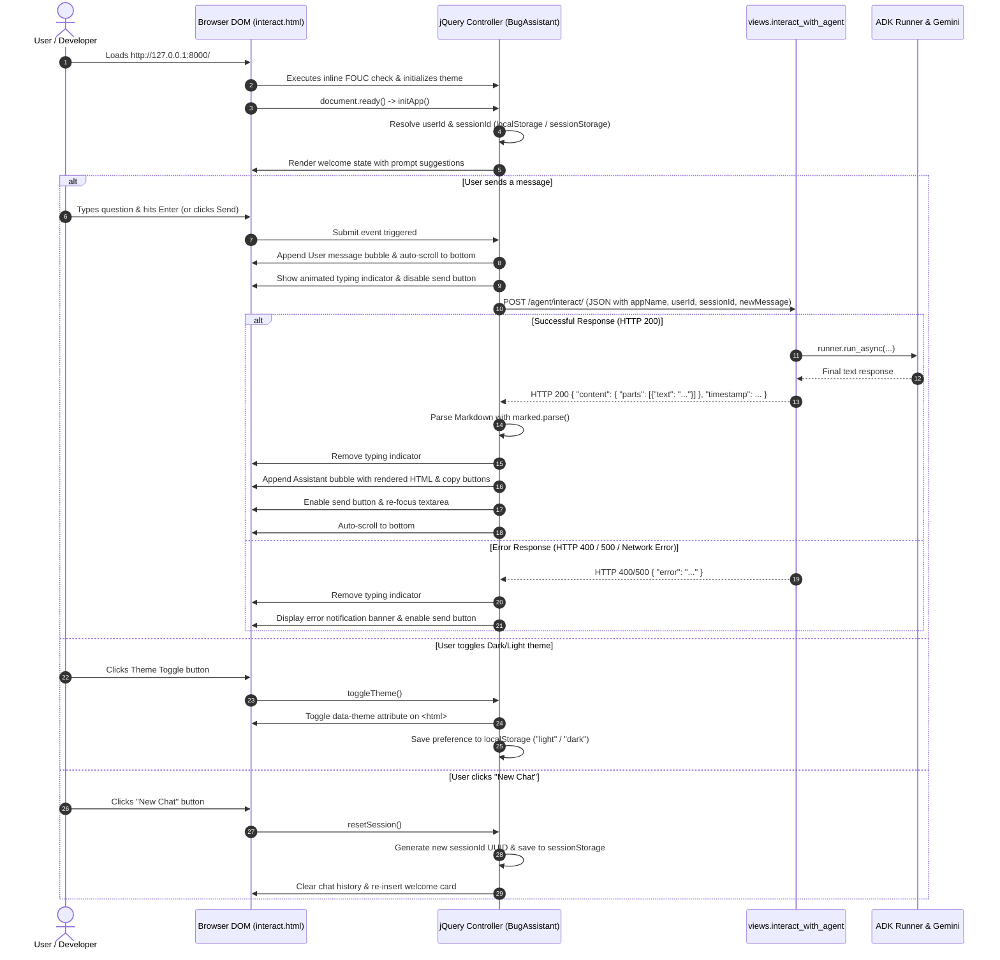

# Feature Implementation Plan: Chat UI (OPS-11)

## 📋 Todo Checklist
- [x] Task 1: Complete and modernize the HTML/CSS/JS template in `adk_bug_ticket_agent/templates/adk_agent/interact.html`
  - [x] Implement responsive layout with light/dark theme CSS variables and anti-FOUC inline head script
  - [x] Add header controls: theme toggle button with `localStorage` persistence, status pill, session ID badge, and "New Chat" button
  - [x] Build scrollable messages container with welcome empty-state prompt chips, distinct user/assistant message bubbles, and typing dots indicator
  - [x] Implement interactive auto-expanding textarea, send button, Enter/Shift+Enter keyboard handlers, and dynamic button states
  - [x] Integrate Marked.js for markdown rendering (code blocks, syntax highlighting containers, copy buttons, lists, tables)
  - [x] Develop modular jQuery client logic managing session persistence, UUID generation, AJAX POST communication, error handling, and auto-scrolling
- [x] Task 2: Verify and ensure compatibility of Django views and URL configurations
  - [x] Confirm `interact_with_agent` in `adk_bug_ticket_agent/views.py` handles both GET (renders `adk_agent/interact.html`) and POST (ADK runner execution)
  - [x] Confirm route mappings in `web/urls.py` (`/`, `/agent/`) and `adk_bug_ticket_agent/urls.py` (`/`, `/interact/`, `/chat/`)
- [x] Task 3: Build automated Django integration test suite in `tests/test_chat_ui_endpoints.py`
  - [x] Add tests for GET requests across `/`, `/agent/`, `/agent/interact/`, and `/agent/chat/`
  - [x] Add tests for POST request payload validation (missing keys, empty message text, invalid JSON)
  - [x] Add tests for unsupported HTTP methods (405)
  - [x] Add mocked ADK `Runner` test verifying end-to-end POST response contract
- [x] Task 4: Execute test suite and run live sanity check using `curl` commands
  - [x] Run `uv run pytest tests/test_chat_ui_endpoints.py` to ensure 100% test pass rate
  - [x] Run the Django development server and execute sanity `curl` checks across all URIs

---

## 🔍 Analysis & Investigation

### Codebase Structure
The files directly related to the Chat UI feature and their roles:

| File / Path | Responsibility | Current Status |
| :--- | :--- | :--- |
| `adk_bug_ticket_agent/templates/adk_agent/interact.html` | Chat UI template containing HTML markup, CSS stylesheet, and jQuery interaction logic. | Incomplete / Truncated at line 41 in the middle of `<header>`. Lacks styling, chat container, input controls, and JavaScript. |
| `adk_bug_ticket_agent/views.py` | Handles incoming HTTP requests: GET serves `interact.html`, POST executes ADK agent runner and returns JSON. | Implemented with `async def interact_with_agent(request)`. Expects specific JSON payload and returns structured response. |
| `adk_bug_ticket_agent/urls.py` | App-level URL routes: `""` (`interact_root`), `"interact/"` (`interact_with_agent`), `"chat/"` (`chat`). | Fully configured and routing to `views.interact_with_agent`. |
| `web/urls.py` | Project root URL configuration: maps `""` to `interact_with_agent` and `"agent/"` to include `adk_bug_ticket_agent.urls`. | Fully configured. |
| `web/settings.py` | Django configuration settings (installed apps, middleware, template loaders, static files). | Configured with `APP_DIRS: True` and Whitenoise for static files. |
| `tests/test_chat_ui_endpoints.py` | Automated integration and regression tests for UI rendering and API endpoints. | Does not exist yet; must be created. |

### Current Architecture
1. **Model-View-Template (MVT) Pattern**:
   - The Django application serves as both the Web UI provider (rendering templates via GET) and the backend API gateway for the ADK agent (via POST).
   - `web/urls.py` exposes root `/` and delegates `/agent/*` routes to `adk_bug_ticket_agent/urls.py`.
   - Both `/` and `/agent/interact/` route to `views.interact_with_agent`.
2. **ADK Agent Execution Layer**:
   - When a POST request arrives, `views.interact_with_agent` parses the JSON body:
     ```json
     {
       "appName": "adk_agent",
       "userId": "user_...",
       "sessionId": "session_...",
       "newMessage": {
         "parts": [
           { "text": "<user query>" }
         ]
       }
     }
     ```
   - The view retrieves or creates a persistent session via `_service_manager.session_service`, instantiates `google.adk.runners.Runner`, passes `genai_types.Content(role="user", ...)`, runs asynchronously, captures the final response text, and returns:
     ```json
     {
       "content": {
         "parts": [
           { "text": "<agent response>" }
         ],
         "role": "model"
       },
       "timestamp": 1718000000.0
     }
     ```
3. **Template Serving**:
   - A GET request to `/`, `/agent/`, `/agent/interact/`, or `/agent/chat/` executes `render(request, 'adk_agent/interact.html')`.
   - Because `interact.html` is currently truncated at line 41, accessing any of these endpoints in a browser yields an unstyled, broken header with no interface to chat or submit input.

### Dependencies & Integration Points
- **jQuery 3.7.1** (via CDN `https://code.jquery.com/jquery-3.7.1.min.js`): Simplifies DOM traversal, event handling, animations, and asynchronous HTTP POST (`$.ajax`).
- **Marked.js** (via CDN `https://cdn.jsdelivr.net/npm/marked/marked.min.js`): Parses markdown syntax returned by the Gemini agent (code blocks, bullet points, headers, tables, links) into clean, safe HTML.
- **Google Fonts (Inter)**: Typography for modern developer-focused UI.
- **Django 5.0+ Web Framework**: Serves static templates and handles RESTful JSON API requests.
- **Google ADK (`google-adk[db]>=1.37.0`)**: Back-end AI agent engine powering the conversational assistant.

### Considerations & Challenges
- **Flash of Unstyled Content (FOUC)**: If the user has dark mode selected in `localStorage` or OS settings, applying the theme via a deferred script or jQuery `$(document).ready()` causes a visible white flash before darkening. An early inline script inside `<head>` must inspect `localStorage` and `window.matchMedia` and immediately set `data-theme` on `<html>`.
- **Markdown & Code Block Styling**: Agent responses frequently contain SQL queries, Python stack traces, and JSON snippets. Code blocks must have syntax highlighting contrast, horizontal scroll handling, and a one-click copy button.
- **Session Continuity**: Multi-turn dialogue requires persistent `userId` and `sessionId`. Generating a UUID on initial load, persisting `userId` in `localStorage` and `sessionId` in `sessionStorage` (with fallback to `localStorage`), ensures continuous conversation across refreshes while providing a "New Chat" button to start a clean session.
- **CSRF Exemption & API Consistency**: `views.interact_with_agent` is decorated with `@csrf_exempt`. However, standard jQuery AJAX setup should include proper JSON content headers (`Content-Type: application/json; charset=UTF-8`) and graceful handling of network drops or HTTP 400/500 errors.
- **Auto-expanding Input**: Standard `<input type="text">` truncates long multi-line bug descriptions. An auto-expanding `<textarea>` provides superior ergonomics, expanding up to 160px with `Enter` bound to submit and `Shift+Enter` bound to newline insertion.

---

## 📐 Technical Specification & Design

### Component Architecture

```
+-----------------------------------------------------------------------------------------+
|                                    Client Browser                                       |
|                                                                                         |
|  +-----------------------------------------------------------------------------------+  |
|  | Header: Brand Logo | Status Pill | Session ID | "New Chat" | Dark Mode Toggle    |  |
|  +-----------------------------------------------------------------------------------+  |
|  | Messages View:                                                                    |  |
|  |   - Welcome Prompt Suggestions Chips                                              |  |
|  |   - User Message Bubbles (Right-aligned, primary blue)                            |  |
|  |   - Assistant Message Bubbles (Left-aligned, card surface, Marked.js rendered)    |  |
|  |   - Typing Indicator Animation (3 pulsing dots)                                   |  |
|  +-----------------------------------------------------------------------------------+  |
|  | Input Form: Auto-expanding Textarea | Send Button (with busy/disabled state)       |  |
|  +-----------------------------------------------------------------------------------+  |
|  | Error Banner: Toast notification for network/API failures                         |  |
|  +-----------------------------------------------------------------------------------+  |
|                                         |                                               |
|                    jQuery Client Controller (BugAssistant)                              |
|           (UUID Management, Event Handlers, Marked.js, $.ajax POST)                     |
+-----------------------------------------+-----------------------------------------------+
                                          |
                      HTTP POST /agent/interact/ (JSON payload)
                      or HTTP GET / (renders template)
                                          |
                                          v
+-----------------------------------------------------------------------------------------+
|                                  Django Web Framework                                   |
|                                                                                         |
|  web/urls.py  -> adk_bug_ticket_agent/urls.py -> views.interact_with_agent              |
|                                                                                         |
|  - GET:  render(request, 'adk_agent/interact.html')                                     |
|  - POST: Validate payload -> _service_manager.session_service -> ADK Runner             |
+-----------------------------------------+-----------------------------------------------+
                                          |
                                          v
+-----------------------------------------------------------------------------------------+
|                                  Google ADK Agent                                       |
|  Runner(agent, session_service, memory_service).run_async(...) -> Gemini Model          |
+-----------------------------------------------------------------------------------------+
```

### Mermaid Diagram
The sequence diagram below details the client-side interaction flow, state transitions, and server communication:



### Schemas & Models

#### 1. Request Payload Schema (Client -> `POST /agent/interact/`)
```json
{
  "$schema": "http://json-schema.org/draft-07/schema#",
  "title": "AgentChatRequest",
  "type": "object",
  "properties": {
    "appName": {
      "type": "string",
      "const": "adk_agent",
      "description": "Identifier of the target ADK application."
    },
    "userId": {
      "type": "string",
      "pattern": "^user_[a-zA-Z0-9_-]+$",
      "description": "Unique identifier for the user client."
    },
    "sessionId": {
      "type": "string",
      "pattern": "^session_[a-zA-Z0-9_-]+$",
      "description": "Unique identifier for the conversational session."
    },
    "newMessage": {
      "type": "object",
      "properties": {
        "parts": {
          "type": "array",
          "minItems": 1,
          "items": {
            "type": "object",
            "properties": {
              "text": {
                "type": "string",
                "minLength": 1
              }
            },
            "required": ["text"]
          }
        }
      },
      "required": ["parts"]
    }
  },
  "required": ["appName", "userId", "sessionId", "newMessage"]
}
```

#### 2. Response Payload Schema (`POST /agent/interact/` -> Client)
```json
{
  "$schema": "http://json-schema.org/draft-07/schema#",
  "title": "AgentChatResponse",
  "type": "object",
  "properties": {
    "content": {
      "type": "object",
      "properties": {
        "parts": {
          "type": "array",
          "items": {
            "type": "object",
            "properties": {
              "text": { "type": "string" }
            },
            "required": ["text"]
          }
        },
        "role": {
          "type": "string",
          "const": "model"
        }
      },
      "required": ["parts", "role"]
    },
    "timestamp": {
      "type": "number",
      "description": "UNIX epoch timestamp in seconds."
    }
  },
  "required": ["content", "timestamp"]
}
```

#### 3. Error Response Schema
```json
{
  "type": "object",
  "properties": {
    "error": { "type": "string" },
    "traceback": { "type": "string" }
  },
  "required": ["error"]
}
```

### API & Code Signatures

#### 1. Django View (`adk_bug_ticket_agent/views.py`)
```python
@csrf_exempt
async def interact_with_agent(request: HttpRequest) -> HttpResponse:
    """
    Handles both GET (serving the chat HTML UI) and POST (agent interaction).

    Args:
        request: Standard Django HttpRequest object.

    Returns:
        - GET: HttpResponse rendering 'adk_agent/interact.html'.
        - POST: JsonResponse containing the agent's response payload or an error dict.
        - Other: JsonResponse with status 405 for unsupported HTTP methods.
    """
```

#### 2. Client-Side JavaScript Architecture (`interact.html`)
```javascript
/**
 * BugAssistant Chat Client Module
 */
const BugAssistant = {
  // Configuration
  config: {
    appName: 'adk_agent',
    apiEndpoint: '/agent/interact/',
    storageKeyPrefix: 'adk_'
  },

  // State
  state: {
    userId: null,
    sessionId: null,
    theme: 'light',
    isGenerating: false
  },

  // Lifecycle & Initialization
  init: function() {},
  initSession: function() {},
  initTheme: function() {},
  bindEvents: function() {},

  // Theme Management
  setTheme: function(theme) {},
  toggleTheme: function() {},

  // Message Handling & UI
  sendMessage: function() {},
  appendUserMessage: function(text) {},
  appendAssistantMessage: function(markdownText) {},
  showTypingIndicator: function() {},
  removeTypingIndicator: function() {},
  showError: function(message) {},
  hideError: function() {},
  scrollToBottom: function() {},
  resetSession: function() {},
  autoResizeInput: function(element) {},
  copyToClipboard: function(buttonElement, codeText) {}
};
```

---

## 📝 Step-by-Step Implementation Steps

### Step 1: Complete and Modernize the Chat UI Template
- **Files to modify/create**: `adk_bug_ticket_agent/templates/adk_agent/interact.html`
- **Changes needed**:
  Replace the truncated 41-line file with the full, production-ready HTML5 template. The exact blueprint implementation to be applied by the engineer:

```html
<!DOCTYPE html>
<html lang="en" data-theme="light">
<head>
  <meta charset="UTF-8">
  <meta name="viewport" content="width=device-width, initial-scale=1.0">
  <meta name="color-scheme" content="light dark">
  <title>IT Bug Assistant - AI Support</title>

  <!-- Prevent dark mode flicker / FOUC -->
  <script>
    (function() {
      const savedTheme = localStorage.getItem('adk_theme');
      const prefersDark = window.matchMedia && window.matchMedia('(prefers-color-scheme: dark)').matches;
      const theme = savedTheme || (prefersDark ? 'dark' : 'light');
      document.documentElement.setAttribute('data-theme', theme);
    })();
  </script>

  <!-- Google Fonts: Inter -->
  <link rel="preconnect" href="https://fonts.googleapis.com">
  <link rel="preconnect" href="https://fonts.gstatic.com" crossorigin>
  <link href="https://fonts.googleapis.com/css2?family=Inter:wght@400;500;600;700&display=swap" rel="stylesheet">

  <!-- jQuery 3.7.1 CDN -->
  <script src="https://code.jquery.com/jquery-3.7.1.min.js"></script>
  <!-- Marked.js CDN -->
  <script src="https://cdn.jsdelivr.net/npm/marked/marked.min.js"></script>

  <style>
    :root {
      --bg-page: #f8fafc;
      --bg-surface: #ffffff;
      --bg-header: rgba(255, 255, 255, 0.9);
      --border-subtle: #e2e8f0;
      --border-focus: #3b82f6;
      --text-main: #0f172a;
      --text-secondary: #475569;
      --text-muted: #94a3b8;
      --primary: #2563eb;
      --primary-hover: #1d4ed8;
      --user-bubble-bg: #2563eb;
      --user-bubble-text: #ffffff;
      --assistant-bubble-bg: #ffffff;
      --assistant-bubble-border: #e2e8f0;
      --assistant-bubble-text: #1e293b;
      --code-bg: #0f172a;
      --code-text: #e2e8f0;
      --inline-code-bg: #e2e8f0;
      --inline-code-text: #0f172a;
      --shadow-sm: 0 1px 3px rgba(0, 0, 0, 0.05);
      --shadow-md: 0 4px 6px -1px rgba(0, 0, 0, 0.07), 0 2px 4px -2px rgba(0, 0, 0, 0.05);
      --danger-bg: #fef2f2;
      --danger-border: #fecaca;
      --danger-text: #b91c1c;
      --chip-bg: #f1f5f9;
      --chip-hover: #e2e8f0;
      --chip-text: #334155;
    }

    [data-theme="dark"] {
      --bg-page: #0b0f19;
      --bg-surface: #131b2e;
      --bg-header: rgba(19, 27, 46, 0.9);
      --border-subtle: #243049;
      --border-focus: #60a5fa;
      --text-main: #f8fafc;
      --text-secondary: #94a3b8;
      --text-muted: #64748b;
      --primary: #3b82f6;
      --primary-hover: #60a5fa;
      --user-bubble-bg: #2563eb;
      --user-bubble-text: #ffffff;
      --assistant-bubble-bg: #182238;
      --assistant-bubble-border: #243049;
      --assistant-bubble-text: #f1f5f9;
      --code-bg: #0b0f19;
      --code-text: #e2e8f0;
      --inline-code-bg: #243049;
      --inline-code-text: #93c5fd;
      --shadow-sm: 0 1px 3px rgba(0, 0, 0, 0.3);
      --shadow-md: 0 4px 8px rgba(0, 0, 0, 0.4);
      --danger-bg: #450a0a;
      --danger-border: #7f1d1d;
      --danger-text: #fca5a5;
      --chip-bg: #1e293b;
      --chip-hover: #2e3d5b;
      --chip-text: #cbd5e1;
    }

    * {
      box-sizing: border-box;
      margin: 0;
      padding: 0;
    }

    body {
      font-family: 'Inter', -apple-system, BlinkMacSystemFont, "Segoe UI", Roboto, sans-serif;
      background-color: var(--bg-page);
      color: var(--text-main);
      display: flex;
      flex-direction: column;
      height: 100vh;
      overflow: hidden;
      transition: background-color 0.25s ease, color 0.25s ease;
    }

    /* App Header */
    header {
      display: flex;
      align-items: center;
      justify-content: space-between;
      padding: 12px 24px;
      background-color: var(--bg-header);
      backdrop-filter: blur(10px);
      border-bottom: 1px solid var(--border-subtle);
      z-index: 10;
    }

    .header-brand {
      display: flex;
      align-items: center;
      gap: 12px;
    }

    .brand-icon {
      width: 38px;
      height: 38px;
      border-radius: 10px;
      background: linear-gradient(135deg, #2563eb, #7c3aed);
      color: #ffffff;
      display: flex;
      align-items: center;
      justify-content: center;
      box-shadow: var(--shadow-sm);
    }

    .brand-icon svg {
      width: 22px;
      height: 22px;
    }

    .brand-text h1 {
      font-size: 1.05rem;
      font-weight: 700;
      line-height: 1.2;
    }

    .status-pill {
      display: inline-flex;
      align-items: center;
      gap: 6px;
      font-size: 0.72rem;
      font-weight: 500;
      color: #10b981;
    }

    .status-dot {
      width: 7px;
      height: 7px;
      border-radius: 50%;
      background-color: #10b981;
      animation: pulse-dot 2s infinite ease-in-out;
    }

    @keyframes pulse-dot {
      0%, 100% { opacity: 1; transform: scale(1); }
      50% { opacity: 0.4; transform: scale(1.2); }
    }

    .header-actions {
      display: flex;
      align-items: center;
      gap: 10px;
    }

    .session-badge {
      font-size: 0.75rem;
      font-family: monospace;
      color: var(--text-muted);
      background: var(--bg-surface);
      border: 1px solid var(--border-subtle);
      padding: 4px 8px;
      border-radius: 6px;
      max-width: 140px;
      overflow: hidden;
      text-overflow: ellipsis;
      white-space: nowrap;
    }

    .btn-header {
      background: var(--bg-surface);
      border: 1px solid var(--border-subtle);
      color: var(--text-secondary);
      cursor: pointer;
      padding: 7px 12px;
      border-radius: 8px;
      font-size: 0.82rem;
      font-weight: 500;
      display: inline-flex;
      align-items: center;
      gap: 6px;
      transition: all 0.2s ease;
    }

    .btn-header:hover {
      background: var(--chip-hover);
      color: var(--text-main);
      border-color: var(--border-focus);
    }

    .btn-header svg {
      width: 16px;
      height: 16px;
    }

    /* Error Toast Banner */
    #error-banner {
      display: none;
      background-color: var(--danger-bg);
      border-bottom: 1px solid var(--danger-border);
      color: var(--danger-text);
      padding: 8px 24px;
      font-size: 0.85rem;
      align-items: center;
      justify-content: space-between;
      animation: slide-down 0.2s ease-out;
    }

    #error-banner.active {
      display: flex;
    }

    @keyframes slide-down {
      from { transform: translateY(-100%); opacity: 0; }
      to { transform: translateY(0); opacity: 1; }
    }

    #error-banner button {
      background: none;
      border: none;
      color: var(--danger-text);
      font-size: 1.1rem;
      cursor: pointer;
      line-height: 1;
      padding: 0 4px;
    }

    /* Main Chat Layout */
    main {
      flex: 1;
      display: flex;
      flex-direction: column;
      max-width: 900px;
      width: 100%;
      margin: 0 auto;
      height: calc(100vh - 65px);
      position: relative;
    }

    #messages-list {
      flex: 1;
      overflow-y: auto;
      padding: 24px 20px;
      display: flex;
      flex-direction: column;
      gap: 18px;
      scroll-behavior: smooth;
    }

    /* Welcome / Empty State Card */
    .welcome-card {
      background: var(--bg-surface);
      border: 1px solid var(--border-subtle);
      border-radius: 14px;
      padding: 28px 24px;
      text-align: center;
      box-shadow: var(--shadow-sm);
      margin: 20px 0;
      animation: fade-in 0.4s ease;
    }

    .welcome-card h2 {
      font-size: 1.25rem;
      font-weight: 700;
      margin-bottom: 8px;
      color: var(--text-main);
    }

    .welcome-card p {
      font-size: 0.9rem;
      color: var(--text-secondary);
      max-width: 540px;
      margin: 0 auto 20px;
      line-height: 1.5;
    }

    .suggestion-chips {
      display: flex;
      flex-wrap: wrap;
      gap: 8px;
      justify-content: center;
    }

    .chip {
      background: var(--chip-bg);
      color: var(--chip-text);
      border: 1px solid var(--border-subtle);
      padding: 8px 14px;
      border-radius: 20px;
      font-size: 0.82rem;
      cursor: pointer;
      transition: all 0.15s ease;
      font-weight: 500;
    }

    .chip:hover {
      background: var(--chip-hover);
      color: var(--primary);
      border-color: var(--primary);
      transform: translateY(-1px);
    }

    /* Message Rows & Bubbles */
    .message-row {
      display: flex;
      gap: 12px;
      max-width: 82%;
      animation: message-pop 0.25s ease-out;
    }

    @keyframes message-pop {
      from { opacity: 0; transform: translateY(8px); }
      to { opacity: 1; transform: translateY(0); }
    }

    .message-row.user {
      align-self: flex-end;
      flex-direction: row-reverse;
    }

    .message-row.assistant {
      align-self: flex-start;
    }

    .avatar {
      width: 32px;
      height: 32px;
      border-radius: 50%;
      flex-shrink: 0;
      display: flex;
      align-items: center;
      justify-content: center;
      font-size: 0.8rem;
      font-weight: 600;
      box-shadow: var(--shadow-sm);
    }

    .message-row.user .avatar {
      background: var(--primary);
      color: #ffffff;
    }

    .message-row.assistant .avatar {
      background: linear-gradient(135deg, #2563eb, #7c3aed);
      color: #ffffff;
    }

    .avatar svg {
      width: 18px;
      height: 18px;
    }

    .bubble-wrapper {
      display: flex;
      flex-direction: column;
      gap: 4px;
    }

    .message-row.user .bubble-wrapper {
      align-items: flex-end;
    }

    .message-bubble {
      padding: 12px 16px;
      border-radius: 14px;
      font-size: 0.92rem;
      line-height: 1.6;
      word-break: break-word;
      box-shadow: var(--shadow-sm);
    }

    .message-row.user .message-bubble {
      background-color: var(--user-bubble-bg);
      color: var(--user-bubble-text);
      border-bottom-right-radius: 4px;
    }

    .message-row.assistant .message-bubble {
      background-color: var(--assistant-bubble-bg);
      border: 1px solid var(--assistant-bubble-border);
      color: var(--assistant-bubble-text);
      border-bottom-left-radius: 4px;
    }

    .message-time {
      font-size: 0.7rem;
      color: var(--text-muted);
      padding: 0 4px;
    }

    /* Markdown Formatted Elements within Assistant Bubbles */
    .message-bubble p {
      margin-bottom: 8px;
    }
    .message-bubble p:last-child {
      margin-bottom: 0;
    }

    .message-bubble ul, .message-bubble ol {
      margin-left: 20px;
      margin-bottom: 8px;
    }

    .message-bubble li {
      margin-bottom: 4px;
    }

    .message-bubble code {
      font-family: ui-monospace, SFMono-Regular, Menlo, Monaco, Consolas, monospace;
      font-size: 0.85em;
      padding: 2px 6px;
      border-radius: 4px;
      background: var(--inline-code-bg);
      color: var(--inline-code-text);
    }

    .message-bubble pre {
      position: relative;
      background: var(--code-bg);
      color: var(--code-text);
      padding: 14px 16px;
      border-radius: 8px;
      overflow-x: auto;
      margin: 10px 0;
      font-size: 0.85rem;
      line-height: 1.45;
    }

    .message-bubble pre code {
      background: none;
      color: inherit;
      padding: 0;
    }

    .copy-btn {
      position: absolute;
      top: 8px;
      right: 8px;
      background: rgba(255, 255, 255, 0.15);
      border: 1px solid rgba(255, 255, 255, 0.2);
      color: #e2e8f0;
      border-radius: 4px;
      font-size: 0.72rem;
      padding: 3px 8px;
      cursor: pointer;
      transition: background 0.15s;
    }

    .copy-btn:hover {
      background: rgba(255, 255, 255, 0.3);
    }

    .message-bubble table {
      border-collapse: collapse;
      width: 100%;
      margin: 10px 0;
      font-size: 0.85rem;
    }

    .message-bubble th, .message-bubble td {
      border: 1px solid var(--border-subtle);
      padding: 8px 10px;
      text-align: left;
    }

    .message-bubble th {
      background: var(--chip-bg);
      font-weight: 600;
    }

    .message-bubble a {
      color: var(--primary);
      text-decoration: underline;
    }

    /* Typing Dots Indicator */
    .typing-row {
      display: none;
      align-self: flex-start;
      align-items: center;
      gap: 12px;
    }

    .typing-row.active {
      display: flex;
    }

    .typing-bubble {
      background: var(--assistant-bubble-bg);
      border: 1px solid var(--assistant-bubble-border);
      padding: 12px 18px;
      border-radius: 14px;
      display: flex;
      align-items: center;
      gap: 5px;
      box-shadow: var(--shadow-sm);
    }

    .typing-dot {
      width: 6px;
      height: 6px;
      background-color: var(--text-muted);
      border-radius: 50%;
      animation: dot-wave 1.4s infinite ease-in-out;
    }

    .typing-dot:nth-child(1) { animation-delay: 0s; }
    .typing-dot:nth-child(2) { animation-delay: 0.2s; }
    .typing-dot:nth-child(3) { animation-delay: 0.4s; }

    @keyframes dot-wave {
      0%, 80%, 100% { transform: translateY(0); opacity: 0.4; }
      40% { transform: translateY(-6px); opacity: 1; }
    }

    /* Input Footer */
    .chat-footer {
      padding: 12px 20px 20px;
      background: var(--bg-page);
    }

    .input-box-wrapper {
      background: var(--bg-surface);
      border: 1px solid var(--border-subtle);
      border-radius: 14px;
      padding: 8px 12px 8px 16px;
      display: flex;
      align-items: flex-end;
      gap: 10px;
      box-shadow: var(--shadow-md);
      transition: border-color 0.2s, box-shadow 0.2s;
    }

    .input-box-wrapper:focus-within {
      border-color: var(--border-focus);
      box-shadow: 0 0 0 2px rgba(59, 130, 246, 0.2);
    }

    #chat-input {
      flex: 1;
      background: transparent;
      border: none;
      outline: none;
      color: var(--text-main);
      font-family: inherit;
      font-size: 0.95rem;
      resize: none;
      max-height: 160px;
      min-height: 24px;
      line-height: 1.5;
      padding: 4px 0;
    }

    #chat-input::placeholder {
      color: var(--text-muted);
    }

    #send-btn {
      width: 36px;
      height: 36px;
      border-radius: 10px;
      border: none;
      background-color: var(--primary);
      color: #ffffff;
      cursor: pointer;
      display: flex;
      align-items: center;
      justify-content: center;
      transition: background-color 0.15s, transform 0.1s, opacity 0.15s;
      flex-shrink: 0;
      margin-bottom: 2px;
    }

    #send-btn:hover:not(:disabled) {
      background-color: var(--primary-hover);
      transform: scale(1.05);
    }

    #send-btn:disabled {
      opacity: 0.4;
      cursor: not-allowed;
      transform: none;
    }

    #send-btn svg {
      width: 18px;
      height: 18px;
    }

    .input-hint {
      text-align: center;
      font-size: 0.72rem;
      color: var(--text-muted);
      margin-top: 6px;
    }

    @media (max-width: 640px) {
      header {
        padding: 10px 14px;
      }
      .brand-text h1 {
        font-size: 0.95rem;
      }
      .session-badge {
        display: none;
      }
      #messages-list {
        padding: 16px 12px;
      }
      .chat-footer {
        padding: 8px 12px 14px;
      }
    }
  </style>
</head>
<body>

  <!-- App Header -->
  <header>
    <div class="header-brand">
      <div class="brand-icon">
        <!-- Robot Icon SVG -->
        <svg fill="currentColor" viewBox="0 0 24 24">
          <path d="M12 2a2 2 0 0 1 2 2c0 .74-.4 1.39-1 1.73V7h2a6 6 0 0 1 6 6v1h1a2 2 0 0 1 2 2v2a2 2 0 0 1-2 2h-1v1a4 4 0 0 1-4 4H8a4 4 0 0 1-4-4v-1H3a2 2 0 0 1-2-2v-2a2 2 0 0 1 2-2h1v-1a6 6 0 0 1 6-6h2V5.73A2 2 0 0 1 12 2zm-3 9a2 2 0 1 0 0 4 2 2 0 0 0 0-4zm6 0a2 2 0 1 0 0 4 2 2 0 0 0 0-4zm-7 8a2 2 0 0 0 2 2h4a2 2 0 0 0 2-2v-1H8v1z"/>
        </svg>
      </div>
      <div class="brand-text">
        <h1>IT Bug Assistant</h1>
        <div class="status-pill">
          <span class="status-dot"></span>
          <span>Online</span>
        </div>
      </div>
    </div>

    <div class="header-actions">
      <div id="session-badge" class="session-badge" title="Active ADK Session ID">Session: ...</div>
      
      <!-- New Chat Button -->
      <button id="btn-new-chat" class="btn-header" title="Start New Conversation">
        <svg fill="none" stroke="currentColor" stroke-width="2" viewBox="0 0 24 24">
          <path stroke-linecap="round" stroke-linejoin="round" d="M12 4v16m8-8H4"></path>
        </svg>
        <span>New Chat</span>
      </button>

      <!-- Theme Toggle Button -->
      <button id="btn-theme-toggle" class="btn-header" title="Toggle Light/Dark Theme" aria-label="Toggle theme">
        <!-- Moon Icon (for Light mode) -->
        <svg id="theme-moon-icon" fill="currentColor" viewBox="0 0 24 24">
          <path d="M21.64 13a1 1 0 0 0-1.05-.14 8.05 8.05 0 0 1-3.37.73A8.15 8.15 0 0 1 9.08 5.49a8.59 8.59 0 0 1 .25-2 1 1 0 0 0-1.28-1.16A10.15 10.15 0 1 0 21.78 14.1a1 1 0 0 0-.14-1.1z"/>
        </svg>
        <!-- Sun Icon (for Dark mode) -->
        <svg id="theme-sun-icon" style="display:none;" fill="currentColor" viewBox="0 0 24 24">
          <path d="M12 7a5 5 0 1 0 0 10 5 5 0 0 0 0-10zm0-5a1 1 0 0 1 1 1v2a1 1 0 1 1-2 0V3a1 1 0 0 1 1-1zm0 18a1 1 0 0 1 1 1v2a1 1 0 1 1-2 0v-2a1 1 0 0 1 1-1zm10-9a1 1 0 0 1-1 1h-2a1 1 0 1 1 0-2h2a1 1 0 0 1 1 1zM5 12a1 1 0 0 1-1 1H2a1 1 0 1 1 0-2h2a1 1 0 0 1 1 1zm14.07-7.07a1 1 0 0 1 0 1.41l-1.42 1.42a1 1 0 1 1-1.41-1.42l1.42-1.41a1 1 0 0 1 1.41 0zM6.34 17.66a1 1 0 0 1 0 1.41L4.93 20.48a1 1 0 1 1-1.41-1.41l1.41-1.42a1 1 0 0 1 1.41 0zm12.73 2.82a1 1 0 0 1-1.41 0l-1.42-1.41a1 1 0 1 1 1.41-1.42l1.42 1.42a1 1 0 0 1 0 1.41zM6.34 6.34a1 1 0 0 1-1.41 0L3.52 4.93a1 1 0 0 1 1.41-1.41l1.42 1.41a1 1 0 0 1 0 1.41z"/>
        </svg>
      </button>
    </div>
  </header>

  <!-- Error Toast Banner -->
  <div id="error-banner">
    <span id="error-message">An error occurred while connecting to the assistant.</span>
    <button id="btn-close-error" title="Dismiss error">&times;</button>
  </div>

  <!-- Main Chat Content -->
  <main>
    <div id="messages-list">
      <!-- Welcome Hero Card -->
      <div id="welcome-card" class="welcome-card">
        <h2>Welcome to IT Bug Assistant</h2>
        <p>Your AI-driven partner for triaging software bugs, diagnosing PostgreSQL issues, and managing Jira tickets via the Google Agent Development Kit.</p>
        <div class="suggestion-chips">
          <button class="chip" data-prompt="Check ticket status for BUG-102">Check ticket status for BUG-102</button>
          <button class="chip" data-prompt="Diagnose PostgreSQL connection timeouts in production">Diagnose PostgreSQL connection timeouts</button>
          <button class="chip" data-prompt="Explain how to restart the MCP Toolbox server">Restart MCP Toolbox server</button>
        </div>
      </div>

      <!-- Typing Indicator -->
      <div id="typing-row" class="typing-row">
        <div class="avatar">
          <svg fill="currentColor" viewBox="0 0 24 24">
            <path d="M12 2a2 2 0 0 1 2 2c0 .74-.4 1.39-1 1.73V7h2a6 6 0 0 1 6 6v1h1a2 2 0 0 1 2 2v2a2 2 0 0 1-2 2h-1v1a4 4 0 0 1-4 4H8a4 4 0 0 1-4-4v-1H3a2 2 0 0 1-2-2v-2a2 2 0 0 1 2-2h1v-1a6 6 0 0 1 6-6h2V5.73A2 2 0 0 1 12 2z"/>
          </svg>
        </div>
        <div class="typing-bubble">
          <span class="typing-dot"></span>
          <span class="typing-dot"></span>
          <span class="typing-dot"></span>
        </div>
      </div>
    </div>

    <!-- Input Footer -->
    <div class="chat-footer">
      <form id="chat-form" class="input-box-wrapper" onsubmit="return false;">
        <textarea id="chat-input" rows="1" placeholder="Describe the issue or ask a question... (Enter to send, Shift+Enter for newline)" autofocus></textarea>
        <button id="send-btn" type="submit" title="Send message" disabled>
          <!-- Send Arrow SVG -->
          <svg fill="none" stroke="currentColor" stroke-width="2.2" viewBox="0 0 24 24">
            <path stroke-linecap="round" stroke-linejoin="round" d="M6 12L3 21l18-9L3 3l3 9zm0 0h8"></path>
          </svg>
        </button>
      </form>
      <div class="input-hint">Enter to send • Shift + Enter for newline • Powered by Google ADK</div>
    </div>
  </main>

  <!-- jQuery Client Application Logic -->
  <script>
    $(document).ready(function() {
      // Marked.js Configuration for GitHub Flavored Markdown
      if (typeof marked !== 'undefined') {
        marked.setOptions({
          gfm: true,
          breaks: true
        });
      }

      const BugAssistant = {
        config: {
          appName: 'adk_agent',
          apiEndpoint: '/agent/interact/',
          userKey: 'adk_user_id',
          sessionKey: 'adk_session_id',
          themeKey: 'adk_theme'
        },
        state: {
          userId: null,
          sessionId: null,
          isGenerating: false
        },

        init: function() {
          this.initUserAndSession();
          this.initTheme();
          this.bindEvents();
          this.updateSessionBadge();
        },

        generateUUID: function(prefix) {
          if (crypto && crypto.randomUUID) {
            return prefix + '_' + crypto.randomUUID().replace(/-/g, '').substring(0, 16);
          }
          return prefix + '_' + Math.random().toString(36).substring(2, 12);
        },

        initUserAndSession: function() {
          let uid = localStorage.getItem(this.config.userKey);
          if (!uid) {
            uid = this.generateUUID('user');
            localStorage.setItem(this.config.userKey, uid);
          }
          this.state.userId = uid;

          let sid = sessionStorage.getItem(this.config.sessionKey);
          if (!sid) {
            sid = this.generateUUID('session');
            sessionStorage.setItem(this.config.sessionKey, sid);
          }
          this.state.sessionId = sid;
        },

        updateSessionBadge: function() {
          const shortSid = this.state.sessionId ? this.state.sessionId.substring(0, 15) + '...' : '...';
          $('#session-badge').text('Session: ' + shortSid).attr('title', 'Session ID: ' + this.state.sessionId);
        },

        initTheme: function() {
          const currentTheme = document.documentElement.getAttribute('data-theme') || 'light';
          this.updateThemeIcons(currentTheme);
        },

        updateThemeIcons: function(theme) {
          if (theme === 'dark') {
            $('#theme-moon-icon').hide();
            $('#theme-sun-icon').show();
          } else {
            $('#theme-sun-icon').hide();
            $('#theme-moon-icon').show();
          }
        },

        toggleTheme: function() {
          const currentTheme = document.documentElement.getAttribute('data-theme') || 'light';
          const newTheme = currentTheme === 'dark' ? 'light' : 'dark';
          document.documentElement.setAttribute('data-theme', newTheme);
          localStorage.setItem(this.config.themeKey, newTheme);
          this.updateThemeIcons(newTheme);
        },

        resetSession: function() {
          this.state.sessionId = this.generateUUID('session');
          sessionStorage.setItem(this.config.sessionKey, this.state.sessionId);
          this.updateSessionBadge();
          $('#messages-list .message-row').remove();
          $('#welcome-card').show();
          this.hideError();
          $('#chat-input').val('').trigger('input').focus();
        },

        formatTimestamp: function() {
          const now = new Date();
          return now.toLocaleTimeString([], { hour: '2-digit', minute: '2-digit' });
        },

        bindEvents: function() {
          const self = this;

          // Theme toggle
          $('#btn-theme-toggle').on('click', function() {
            self.toggleTheme();
          });

          // New Chat
          $('#btn-new-chat').on('click', function() {
            self.resetSession();
          });

          // Dismiss Error Banner
          $('#btn-close-error').on('click', function() {
            self.hideError();
          });

          // Suggestion Chips
          $(document).on('click', '.chip', function() {
            const prompt = $(this).data('prompt');
            $('#chat-input').val(prompt).trigger('input');
            self.sendMessage();
          });

          // Textarea auto-resize and Enter submit
          $('#chat-input').on('input', function() {
            this.style.height = 'auto';
            const newHeight = Math.min(this.scrollHeight, 160);
            this.style.height = newHeight + 'px';
            $('#send-btn').prop('disabled', $(this).val().trim().length === 0 || self.state.isGenerating);
          });

          $('#chat-input').on('keydown', function(e) {
            if (e.key === 'Enter' && !e.shiftKey) {
              e.preventDefault();
              if (!$('#send-btn').prop('disabled')) {
                self.sendMessage();
              }
            }
          });

          // Form Submit
          $('#chat-form').on('submit', function(e) {
            e.preventDefault();
            if (!$('#send-btn').prop('disabled')) {
              self.sendMessage();
            }
          });

          // Copy code blocks
          $(document).on('click', '.copy-btn', function() {
            const btn = $(this);
            const code = btn.siblings('code').text();
            if (navigator.clipboard) {
              navigator.clipboard.writeText(code).then(function() {
                btn.text('Copied!');
                setTimeout(function() { btn.text('Copy'); }, 2000);
              });
            }
          });
        },

        showError: function(msg) {
          $('#error-message').text(msg || 'An error occurred while communicating with the assistant.');
          $('#error-banner').addClass('active');
        },

        hideError: function() {
          $('#error-banner').removeClass('active');
        },

        scrollToBottom: function() {
          const container = $('#messages-list');
          container.stop().animate({ scrollTop: container[0].scrollHeight }, 200);
        },

        escapeHtml: function(string) {
          const entityMap = {
            '&': '&amp;',
            '<': '&lt;',
            '>': '&gt;',
            '"': '&quot;',
            "'": '&#39;'
          };
          return String(string).replace(/[&<>"']/g, function (s) {
            return entityMap[s];
          });
        },

        appendUserMessage: function(text) {
          $('#welcome-card').hide();
          const time = this.formatTimestamp();
          const escaped = this.escapeHtml(text).replace(/\n/g, '<br>');
          const html = `
            <div class="message-row user">
              <div class="avatar" title="You">U</div>
              <div class="bubble-wrapper">
                <div class="message-bubble">${escaped}</div>
                <div class="message-time">${time}</div>
              </div>
            </div>
          `;
          $('#typing-row').before(html);
          this.scrollToBottom();
        },

        appendAssistantMessage: function(markdownText) {
          const time = this.formatTimestamp();
          let renderedHtml = '';
          if (typeof marked !== 'undefined') {
            renderedHtml = marked.parse(markdownText);
          } else {
            renderedHtml = this.escapeHtml(markdownText).replace(/\n/g, '<br>');
          }

          // Inject copy button inside code blocks
          const tempDiv = $('<div>').html(renderedHtml);
          tempDiv.find('pre').each(function() {
            $(this).prepend('<button class="copy-btn" title="Copy code">Copy</button>');
          });
          renderedHtml = tempDiv.html();

          const html = `
            <div class="message-row assistant">
              <div class="avatar" title="IT Bug Assistant">
                <svg fill="currentColor" viewBox="0 0 24 24">
                  <path d="M12 2a2 2 0 0 1 2 2c0 .74-.4 1.39-1 1.73V7h2a6 6 0 0 1 6 6v1h1a2 2 0 0 1 2 2v2a2 2 0 0 1-2 2h-1v1a4 4 0 0 1-4 4H8a4 4 0 0 1-4-4v-1H3a2 2 0 0 1-2-2v-2a2 2 0 0 1 2-2h1v-1a6 6 0 0 1 6-6h2V5.73A2 2 0 0 1 12 2z"/>
                </svg>
              </div>
              <div class="bubble-wrapper">
                <div class="message-bubble">${renderedHtml}</div>
                <div class="message-time">${time}</div>
              </div>
            </div>
          `;
          $('#typing-row').before(html);
          this.scrollToBottom();
        },

        sendMessage: function() {
          const self = this;
          const input = $('#chat-input');
          const messageText = input.val().trim();
          if (!messageText || self.state.isGenerating) return;

          self.hideError();
          self.appendUserMessage(messageText);

          // Reset input textarea
          input.val('').css('height', 'auto');
          $('#send-btn').prop('disabled', true);

          // Enter generating state
          self.state.isGenerating = true;
          $('#typing-row').addClass('active');
          self.scrollToBottom();

          const payload = {
            appName: self.config.appName,
            userId: self.state.userId,
            sessionId: self.state.sessionId,
            newMessage: {
              parts: [
                { text: messageText }
              ]
            }
          };

          $.ajax({
            url: self.config.apiEndpoint,
            method: 'POST',
            contentType: 'application/json; charset=UTF-8',
            data: JSON.stringify(payload),
            dataType: 'json',
            timeout: 60000,
            success: function(response) {
              $('#typing-row').removeClass('active');
              self.state.isGenerating = false;

              if (response && response.content && response.content.parts && response.content.parts[0].text) {
                self.appendAssistantMessage(response.content.parts[0].text);
              } else {
                self.appendAssistantMessage("Agent returned an empty or unformatted response.");
              }
              $('#chat-input').trigger('input').focus();
            },
            error: function(xhr, status, error) {
              $('#typing-row').removeClass('active');
              self.state.isGenerating = false;

              let errorMessage = "Unable to reach the assistant server. Please try again.";
              if (xhr.responseJSON && xhr.responseJSON.error) {
                errorMessage = xhr.responseJSON.error;
              } else if (error) {
                errorMessage = "Request failed: " + error;
              }

              self.showError(errorMessage);
              $('#chat-input').trigger('input').focus();
            }
          });
        }
      };

      // Initialize application
      BugAssistant.init();
    });
  </script>
</body>
</html>
```

- **Implementation Notes**:
  - Ensure all external resources (fonts, jQuery, marked) use HTTPS CDN links.
  - The script sets `marked.setOptions({ breaks: true, gfm: true })` to support GitHub-flavored line breaks.
  - The inline script in `<head>` ensures no FOUC by setting `data-theme` prior to initial paint.
- **Status**: `- [x]` Completed

### Step 2: Validate Django View and URL Route Configuration
- **Files to modify/create**: 
  - `adk_bug_ticket_agent/views.py` (review/verify)
  - `adk_bug_ticket_agent/urls.py` (review/verify)
  - `web/urls.py` (review/verify)
- **Changes needed**:
  1. Inspect `views.py` line 99-102:
     ```python
     elif request.method == 'GET':
         return render(request, 'adk_agent/interact.html')
     ```
     Ensure that both `/` and `/agent/interact/` successfully serve `adk_agent/interact.html` with an HTTP 200 status code and `Content-Type: text/html; charset=utf-8`.
  2. Verify that in `adk_bug_ticket_agent/urls.py`:
     - `path("", views.interact_with_agent, name="interact_root")`
     - `path("interact/", views.interact_with_agent, name="interact_with_agent")`
     - `path("chat/", views.interact_with_agent, name="chat")`
     all properly resolve to `views.interact_with_agent`.
- **Implementation Notes**:
  - `interact_with_agent` is an asynchronous view (`async def`). In Django 5.x, returning `render(request, ...)` from an async view is natively handled.
- **Status**: `- [x]` Completed

### Step 3: Implement Automated Integration Test Suite
- **Files to modify/create**: `tests/test_chat_ui_endpoints.py`
- **Changes needed**:
  Create an exhaustive Django test suite using `django.test.AsyncClient` or `django.test.Client`:
  1. `test_get_root_url_renders_ui()`:
     - Issues `GET /` and asserts `response.status_code == 200`.
     - Asserts response contains `<title>IT Bug Assistant - AI Support</title>`.
     - Asserts response contains key UI elements: `#chat-input`, `#send-btn`, `#messages-list`, `#btn-theme-toggle`, and Marked.js script inclusion.
  2. `test_get_all_configured_routes_render_ui()`:
     - Loops through `["/", "/agent/", "/agent/interact/", "/agent/chat/"]`.
     - Asserts each route returns `status_code == 200` with `text/html` content type.
  3. `test_post_empty_body_returns_400()`:
     - Issues `POST /agent/interact/` with empty JSON `{}`.
     - Asserts `response.status_code == 400` and `response.json()["error"] == "Invalid payload structure."`.
  4. `test_post_missing_parts_returns_400()`:
     - Issues `POST /agent/interact/` with missing `newMessage.parts`.
     - Asserts `response.status_code == 400`.
  5. `test_post_empty_text_returns_400()`:
     - Issues `POST /agent/interact/` with `parts: [{"text": ""}]`.
     - Asserts `response.status_code == 400` and `response.json()["error"] == "No message provided"`.
  6. `test_post_invalid_json_returns_400()`:
     - Issues `POST /agent/interact/` with payload `"invalid-json-string"`.
     - Asserts `response.status_code == 400` and `response.json()["error"] == "Invalid JSON in request"`.
  7. `test_unsupported_methods_return_405()`:
     - Issues `DELETE /agent/interact/` and `PUT /agent/interact/`.
     - Asserts `response.status_code == 405` and `response.json()["error"] == "Unsupported method"`.
  8. `test_post_valid_chat_mocked_runner()`:
     - Mocks `google.adk.runners.Runner.run_async` to yield a mock event with `is_final_response() == True` returning `"Triage completed: ticket BUG-102 has been resolved."`.
     - Issues `POST /agent/interact/` with a complete valid payload.
     - Asserts `response.status_code == 200`.
     - Asserts response JSON matches `{ "content": { "parts": [{"text": "Triage completed: ticket BUG-102 has been resolved."}], "role": "model" }, "timestamp": ... }`.
- **Implementation Notes**:
  - The test file must configure `os.environ.setdefault("DJANGO_SETTINGS_MODULE", "web.settings")` and `os.environ.setdefault("DJANGO", "true")`, then call `django.setup()`.
- **Status**: `- [x]` Completed

### Step 4: Verification, Test Execution & Live Sanity Checking
- **Files to modify/create**: N/A (execution step)
- **Changes needed**:
  1. Execute `uv run pytest tests/test_chat_ui_endpoints.py` to ensure all tests pass.
  2. Execute the full test suite `uv run pytest` to guarantee no regressions in database session or A2A components.
  3. Run live sanity `curl` commands against the Django application (or test client) verifying all HTTP status codes and payloads.
- **Status**: `- [x]` Completed

---

## 🧪 Verification & Testing Strategy

### Unit & Integration Tests (`tests/test_chat_ui_endpoints.py`)

The test suite must be implemented with the following precise structure:

```python
import os
import json
import pytest
from unittest.mock import patch, MagicMock

# Ensure DJANGO environment flags are set before importing Django modules
os.environ.setdefault("DJANGO_SETTINGS_MODULE", "web.settings")
os.environ.setdefault("DJANGO", "true")

import django
django.setup()

from django.test import AsyncClient
from google.genai import types as genai_types


@pytest.mark.asyncio
async def test_get_root_url_renders_ui():
    """Verifies that GET / renders the full chat UI template."""
    client = AsyncClient()
    response = await client.get("/")
    assert response.status_code == 200
    assert "text/html" in response["Content-Type"]
    content = response.content.decode("utf-8")
    assert "<title>IT Bug Assistant - AI Support</title>" in content
    assert "id=\"chat-input\"" in content
    assert "id=\"send-btn\"" in content
    assert "id=\"messages-list\"" in content
    assert "id=\"btn-theme-toggle\"" in content
    assert "jquery-3.7.1.min.js" in content
    assert "marked.min.js" in content


@pytest.mark.asyncio
async def test_get_all_chat_routes_render_ui():
    """Verifies that all aliased chat routes serve the UI."""
    client = AsyncClient()
    for route in ["/", "/agent/", "/agent/interact/", "/agent/chat/"]:
        response = await client.get(route)
        assert response.status_code == 200
        assert "text/html" in response["Content-Type"]


@pytest.mark.asyncio
async def test_post_empty_body_returns_400():
    """Verifies that an empty JSON payload returns HTTP 400."""
    client = AsyncClient()
    response = await client.post(
        "/agent/interact/",
        data=json.dumps({}),
        content_type="application/json"
    )
    assert response.status_code == 400
    data = response.json()
    assert data["error"] == "Invalid payload structure."


@pytest.mark.asyncio
async def test_post_empty_query_text_returns_400():
    """Verifies that empty message text returns HTTP 400."""
    client = AsyncClient()
    payload = {
        "appName": "adk_agent",
        "userId": "user_test_123",
        "sessionId": "session_test_123",
        "newMessage": {"parts": [{"text": ""}]}
    }
    response = await client.post(
        "/agent/interact/",
        data=json.dumps(payload),
        content_type="application/json"
    )
    assert response.status_code == 400
    data = response.json()
    assert data["error"] == "No message provided"


@pytest.mark.asyncio
async def test_post_invalid_json_returns_400():
    """Verifies that malformed JSON returns HTTP 400."""
    client = AsyncClient()
    response = await client.post(
        "/agent/interact/",
        data="not-a-json-string",
        content_type="application/json"
    )
    assert response.status_code == 400
    data = response.json()
    assert data["error"] == "Invalid JSON in request"


@pytest.mark.asyncio
async def test_unsupported_methods_return_405():
    """Verifies that DELETE and PUT methods return HTTP 405."""
    client = AsyncClient()
    for method in [client.delete, client.put]:
        response = await method("/agent/interact/")
        assert response.status_code == 405
        assert response.json()["error"] == "Unsupported method"


@pytest.mark.asyncio
async def test_post_valid_chat_mocked_runner():
    """Verifies that a valid chat POST returns the expected response contract."""
    mock_event = MagicMock()
    mock_event.is_final_response.return_value = True
    mock_part = MagicMock()
    mock_part.text = "Hello! I am your IT Bug Assistant."
    mock_event.content.parts = [mock_part]

    async def mock_run_async(*args, **kwargs):
        yield mock_event

    with patch("adk_bug_ticket_agent.views.Runner") as mock_runner_cls, \
         patch("adk_bug_ticket_agent.views._service_manager") as mock_sm:
        
        mock_session_service = MagicMock()
        mock_session_service.get_session = MagicMock(return_value=None)
        mock_session_service.create_session = MagicMock(return_value=MagicMock())
        mock_sm.session_service = mock_session_service
        mock_sm.memory_service = MagicMock()
        mock_sm.root_agent = MagicMock()

        mock_runner_instance = MagicMock()
        mock_runner_instance.run_async = mock_run_async
        mock_runner_cls.return_value = mock_runner_instance

        client = AsyncClient()
        payload = {
            "appName": "adk_agent",
            "userId": "user_test_999",
            "sessionId": "session_test_999",
            "newMessage": {"parts": [{"text": "Hello assistant"}]}
        }
        response = await client.post(
            "/agent/interact/",
            data=json.dumps(payload),
            content_type="application/json"
        )
        assert response.status_code == 200
        data = response.json()
        assert "content" in data
        assert data["content"]["role"] == "model"
        assert data["content"]["parts"][0]["text"] == "Hello! I am your IT Bug Assistant."
        assert "timestamp" in data
```

### Precise Execution Commands
```bash
# 1. Run the new Chat UI endpoint tests
uv run pytest tests/test_chat_ui_endpoints.py -v

# 2. Run the full project test suite
uv run pytest

# 3. Perform Django configuration check
uv run python manage.py check
```

### Live Sanity `curl` Verification Commands
When the local Django server is running (`uv run python manage.py runserver 8000`), the following `curl` commands must be executed to verify behavior on new and existing URIs:

```bash
# 1. Sanity check GET / (Root UI)
curl -I -s http://127.0.0.1:8000/ | grep -E "HTTP/|Content-Type"
# Expected: HTTP/1.1 200 OK, Content-Type: text/html; charset=utf-8

# 2. Sanity check GET /agent/interact/ (Direct UI endpoint)
curl -I -s http://127.0.0.1:8000/agent/interact/ | grep -E "HTTP/|Content-Type"
# Expected: HTTP/1.1 200 OK, Content-Type: text/html; charset=utf-8

# 3. Sanity check GET /agent/chat/ (Aliased UI endpoint)
curl -I -s http://127.0.0.1:8000/agent/chat/ | grep -E "HTTP/|Content-Type"
# Expected: HTTP/1.1 200 OK, Content-Type: text/html; charset=utf-8

# 4. Sanity check POST /agent/interact/ with empty payload (Validation test)
curl -s -X POST http://127.0.0.1:8000/agent/interact/ \
  -H "Content-Type: application/json" \
  -d '{}'
# Expected: {"error": "Invalid payload structure."}

# 5. Sanity check POST /agent/interact/ with valid payload (End-to-End Chat API)
curl -s -X POST http://127.0.0.1:8000/agent/interact/ \
  -H "Content-Type: application/json" \
  -d '{
    "appName": "adk_agent",
    "userId": "user_curl_sanity",
    "sessionId": "session_curl_sanity",
    "newMessage": {
      "parts": [
        {"text": "Ping: Respond with Pong."}
      ]
    }
  }'
# Expected: JSON object with content.role == "model", content.parts[0].text, and timestamp

# 6. Sanity check DELETE /agent/interact/ (Method Not Allowed)
curl -s -X DELETE http://127.0.0.1:8000/agent/interact/
# Expected: {"error": "Unsupported method"}
```

---

## 🎯 Success Criteria
1. **Complete & Modern Template**: `adk_bug_ticket_agent/templates/adk_agent/interact.html` is fully implemented without truncation, featuring dark/light theme switching without FOUC, responsive layout, message bubbles with Marked.js rendering, typing animations, auto-resizing input, and copy-code functionality.
2. **Robust jQuery Integration**: All client interactions (DOM manipulation, UUID generation, `localStorage`/`sessionStorage` state management, error handling, and AJAX POST requests) are implemented using modular jQuery.
3. **API Contract Adherence**: The client strictly produces the OpenAPI-defined JSON payload (`appName`, `userId`, `sessionId`, `newMessage.parts`) and correctly consumes the model response structure (`content.parts[0].text`, `timestamp`).
4. **100% Automated Test Pass Rate**: All unit and integration tests in `tests/test_chat_ui_endpoints.py` pass cleanly via `uv run pytest`.
5. **Live Sanity Verified**: Live execution of the prescribed `curl` commands confirms expected HTTP status codes (200 for GETs and valid POSTs, 400 for malformed payloads, 405 for unsupported methods) across all configured routes.
