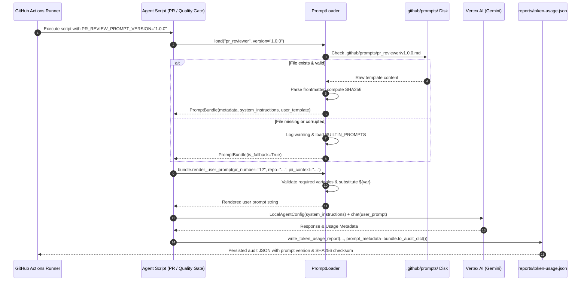

# Feature Implementation Plan: Externalized Versioned Prompt Templates for PR Reviewer and Quality Gate Agents

## 📋 Todo Checklist
- [x] Task 1: Create prompt template directory hierarchy `.github/prompts/pr_reviewer/` and `.github/prompts/quality_gate/`
- [x] Task 2: Author PR Reviewer prompt template `v1.0.0.md` with YAML frontmatter, 11-point review checklist, and variable substitution syntax
- [x] Task 3: Author Quality Gate prompt template `v1.0.0.md` with YAML frontmatter, release criteria, and input report context placeholders
- [x] Task 4: Implement core prompt engine `PromptLoader` and data models (`PromptBundle`, `PromptMetadata`) in `.github/scripts/prompt_loader.py`
- [x] Task 5: Enhance `.github/scripts/helper.py` (`resolve_env_config`, `write_token_usage_report`, `write_gate_reports`) to capture prompt audit telemetry and environment overrides
- [x] Task 6: Refactor `.github/scripts/pr_reviewer_agent.py` to use `PromptLoader` while maintaining backward-compatible module constants and function signatures
- [x] Task 7: Refactor `.github/scripts/quality_gate_agent.py` to use `PromptLoader` while maintaining backward-compatible module constants and function signatures
- [x] Task 8: Update CI workflow `.github/workflows/source-code-pii-review.yml` with prompt version controls and GitHub Step Summary audit reporting
- [x] Task 9: Document Decision D-19 (Externalized Versioned Prompt Templates) in `docs/spec.md`
- [x] Task 10: Implement exhaustive test suite in `.github/scripts/tests/test_prompt_loader.py` and verify all existing tests pass without regressions

---

## 🔍 Analysis & Investigation

### Codebase Structure
The following table summarizes the files involved in the prompt lifecycle, their current state, and the planned enhancements:

| File Path | Current Responsibility | Proposed Changes |
| :--- | :--- | :--- |
| [`.github/scripts/pr_reviewer_agent.py`](file:///Users/yannipeng/git-projects/adk-agents/.github/scripts/pr_reviewer_agent.py) | Defines `SYSTEM_INSTRUCTIONS` (lines 115-148) and `build_pr_review_prompt` (lines 151-166) as hardcoded Python strings. Runs the PR reviewer agent. | Delegate prompt retrieval to `PromptLoader`, preserve `SYSTEM_INSTRUCTIONS` and `build_pr_review_prompt` as backward-compatible wrappers, and log prompt audit telemetry. |
| [`.github/scripts/quality_gate_agent.py`](file:///Users/yannipeng/git-projects/adk-agents/.github/scripts/quality_gate_agent.py) | Defines `QUALITY_GATE_SYSTEM_INSTRUCTIONS` (lines 84-90) and `build_quality_gate_prompt` (lines 93-107) as hardcoded Python strings. Runs the release gate decision agent. | Delegate prompt retrieval to `PromptLoader`, preserve `QUALITY_GATE_SYSTEM_INSTRUCTIONS` and `build_quality_gate_prompt` as backward-compatible wrappers, and attach prompt metadata to gate reports. |
| [`.github/scripts/helper.py`](file:///Users/yannipeng/git-projects/adk-agents/.github/scripts/helper.py) | Handles environment configuration (`resolve_env_config`), file I/O, report generation (`write_pr_reports`, `write_gate_reports`, `write_token_usage_report`). | Add prompt version resolution keys (`PR_REVIEW_PROMPT_VERSION`, `QUALITY_GATE_PROMPT_VERSION`), and enrich token usage and gate reports with prompt audit metadata (version, checksum SHA256, fallback indicator). |
| [`.github/scripts/prompt_loader.py`](file:///Users/yannipeng/git-projects/adk-agents/.github/scripts/prompt_loader.py) *(New)* | None. | Encapsulates prompt template loading, YAML frontmatter parsing, variable substitution via `string.Template`, SHA256 checksum calculation, version resolution, and built-in fallback handling. |
| [`.github/prompts/pr_reviewer/v1.0.0.md`](file:///Users/yannipeng/git-projects/adk-agents/.github/prompts/pr_reviewer/v1.0.0.md) *(New)* | None. | Externalized, version-controlled markdown template for PR Reviewer System Instructions and User Prompt. |
| [`.github/prompts/quality_gate/v1.0.0.md`](file:///Users/yannipeng/git-projects/adk-agents/.github/prompts/quality_gate/v1.0.0.md) *(New)* | None. | Externalized, version-controlled markdown template for Quality Gate System Instructions and User Prompt. |
| [`docs/spec.md`](file:///Users/yannipeng/git-projects/adk-agents/docs/spec.md) | Architectural specification and decision log (Decisions D-1 through D-14). | Record Decision D-19 governing versioned prompt template architecture, audit hashing, and fallback invariants. |
| [`.github/workflows/source-code-pii-review.yml`](file:///Users/yannipeng/git-projects/adk-agents/.github/workflows/source-code-pii-review.yml) | GitHub Actions CI/CD workflow executing DLP scan, PR review, and quality gate. | Expose environment variables `PR_REVIEW_PROMPT_VERSION` and `QUALITY_GATE_PROMPT_VERSION`, and render prompt audit details in `$GITHUB_STEP_SUMMARY`. |
| [`.github/scripts/tests/test_prompt_loader.py`](file:///Users/yannipeng/git-projects/adk-agents/.github/scripts/tests/test_prompt_loader.py) *(New)* | None. | Unit and contract tests for template loading, variable substitution, error handling, frontmatter parsing, version resolution, and fallback recovery. |

---

### Current Architecture vs. Proposed Architecture

#### Current Architecture (Hardcoded Strings in Code)
Currently, system instructions and user prompt templates are embedded directly in Python source code as multiline string constants:
- In `pr_reviewer_agent.py`, `SYSTEM_INSTRUCTIONS` contains 33 lines of instructions covering tool usage, 11 review checklist items, severity levels, and inline finding formatting. `build_pr_review_prompt()` uses Python f-strings to interpolate `pr_number`, `repo`, and `pii_context`.
- In `quality_gate_agent.py`, `QUALITY_GATE_SYSTEM_INSTRUCTIONS` and `build_quality_gate_prompt()` follow the same pattern with `pii_content` and `pr_review_content`.

**Key Architectural Limitations of Current Approach:**
1. **Coupling of Code & Prompt Engineering:** Prompt iterations (e.g. tweaking severity calibration or adding guidelines) require modifying core Python script logic and modifying executable code files.
2. **Lack of Version Auditing:** There is no programmatic mechanism to know which exact prompt version or text generated a historical code review comment or release gate decision.
3. **No A/B Testing or Version Pinning:** CI runs cannot switch between prompt revisions (e.g. `v1` vs `v2`) dynamically via environment variables or repository configuration.
4. **Collision with Python String Interpolation:** In f-strings, literal braces in prompts (such as REST API URLs `/api/v1/accounts/{id}` or JSON examples) require awkward escaping `{{...}}` which impairs readability.

#### Proposed Architecture (Externalized Versioned Template Engine)
The proposed architecture decouples prompt authoring from agent execution using structured Markdown files equipped with YAML frontmatter:

```
                            ┌──────────────────────────────────────────────┐
                            │           .github/prompts/                   │
                            │  ├── pr_reviewer/v1.0.0.md, v2.0.0.md        │
                            │  └── quality_gate/v1.0.0.md, v2.0.0.md       │
                            └──────────────────────┬───────────────────────┘
                                                   │
                                                   ▼
┌─────────────────────────┐         ┌──────────────────────────────────────┐
│  Environment Controls   │────────▶│      PromptLoader (Singleton)        │
│  PR_REVIEW_PROMPT_VER   │         │  - Resolve version or file path      │
│  QUALITY_GATE_PROMPT_VER│         │  - Parse YAML frontmatter & markdown │
└─────────────────────────┘         │  - Compute SHA256 checksum           │
                                    │  - Built-in fallback if missing      │
                                    └──────────────────┬───────────────────┘
                                                       │
                                                       ▼
                                    ┌──────────────────────────────────────┐
                                    │           PromptBundle               │
                                    │  - system_instructions (str)        │
                                    │  - render_user_prompt(**kwargs)      │
                                    │  - metadata (PromptMetadata)         │
                                    └──────────────────┬───────────────────┘
                                                       │
                           ┌───────────────────────────┴───────────────────────────┐
                           ▼                                                       ▼
            ┌─────────────────────────────┐                         ┌─────────────────────────────┐
            │    pr_reviewer_agent.py     │                         │   quality_gate_agent.py     │
            │  - LocalAgentConfig(sys_ins)│                         │  - LocalAgentConfig(sys_ins)│
            │  - chat(rendered_prompt)    │                         │  - chat(rendered_prompt)    │
            └──────────────┬──────────────┘                         └──────────────┬──────────────┘
                           │                                                       │
                           ▼                                                       ▼
            ┌─────────────────────────────┐                         ┌─────────────────────────────┐
            │   reports/token-usage.json  │                         │  reports/gate-decision.json │
            │   Audit: {name, ver, sha}   │                         │  Audit: {name, ver, sha}    │
            └─────────────────────────────┘                         └─────────────────────────────┘
```

---

### Dependencies & Integration Points
- **Python Standard Library (`pathlib`, `string.Template`, `hashlib`, `re`):** Used for zero-dependency template loading, secure variable substitution, and SHA256 computation.
- **PyYAML (`yaml`):** Used for parsing YAML frontmatter. To maintain total pipeline resilience when executed in environments where `yaml` might not be preinstalled, `PromptLoader` will implement a dual-mode parser: `yaml.safe_load()` when available, with an automatic fallback regex-based frontmatter parser.
- **Pydantic v2 (`BaseModel`, `Field`):** Used for strict schema validation of prompt metadata (`PromptMetadata`).
- **Google Antigravity SDK (`LocalAgentConfig`):** Receives the loaded `system_instructions` and rendered user prompt.
- **GitHub Actions (`.github/workflows/source-code-pii-review.yml`):** Sets environment variables and renders audit details in the job summary.

---

### Considerations & Challenges

1. **Brace Collision in Prompts:**
   Prompt templates often contain literal curly braces (e.g. `/api/v1/accounts/{id}`, JSON examples, or regex patterns). Python `str.format()` or f-strings would raise `KeyError: 'id'` unless doubled.
   *Resolution:* The engine uses Python's `string.Template` syntax with `${variable}` placeholders (e.g. `${pr_number}`, `${repo}`, `${pii_context}`). Literal curly braces like `{id}` remain intact and untouched.

2. **CI Fail-Safe & Built-In Fallback:**
   If a prompt file is accidentally deleted, moved, or corrupted during a git merge conflict, the CI pipeline must not crash abruptly.
   *Resolution:* `PromptLoader` includes hardcoded built-in default bundles (`BUILTIN_PROMPTS`). If file resolution or parsing fails, it logs an audible warning (`[Warning] ...`), falls back to the built-in prompt, and flags `is_fallback: True` in telemetry so the failure is fully observable in reports.

3. **Required Variable Enforcement:**
   If a caller forgets to supply a required variable (e.g. `pr_number` is missing), silent failure or empty prompts could produce degraded LLM output.
   *Resolution:* `PromptBundle.render_user_prompt(**kwargs)` validates that all variables defined in `metadata.required_variables` are non-null and provided, raising a descriptive `ValueError` otherwise.

4. **Backward Compatibility:**
   Existing tests and scripts directly import `SYSTEM_INSTRUCTIONS` and call `build_pr_review_prompt(pr_number, repo, pii_context)` without version arguments.
   *Resolution:* `pr_reviewer_agent.py` and `quality_gate_agent.py` retain `SYSTEM_INSTRUCTIONS` and `QUALITY_GATE_SYSTEM_INSTRUCTIONS` at the module level (pointing to the default loaded bundle's instructions) and keep identical function signatures with an optional `version: Optional[str] = None` keyword argument.

---

## 📐 Technical Specification & Design

### Directory Structure & Layout

```
.github/
├── prompts/
│   ├── pr_reviewer/
│   │   └── v1.0.0.md
│   ├── batch_pr_reviewer/
│   │   └── v1.0.0.md
│   ├── quality_gate/
│   │   └── v1.0.0.md
│   └── README.md
├── scripts/
│   ├── prompt_loader.py        <-- Core engine & models
│   ├── pr_reviewer_agent.py    <-- Refactored caller
│   ├── quality_gate_agent.py   <-- Refactored caller
│   ├── helper.py               <-- Telemetry & config
│   └── tests/
│       ├── test_prompt_loader.py  <-- Dedicated test suite
│       ├── test_pr_reviewer_agent.py
│       └── test_quality_gate_agent.py
```

### 🔄 Evolution & Distinction: `pr_reviewer` vs. `batch_pr_reviewer`

Both `.github/prompts/pr_reviewer/v1.0.0.md` and `.github/prompts/batch_pr_reviewer/v1.0.0.md` reside in `.github/prompts/`, representing the evolution from monolithic reviews to context-compacted batch reviews:

| Dimension | `pr_reviewer/v1.0.0.md` | `batch_pr_reviewer/v1.0.0.md` |
| :--- | :--- | :--- |
| **Origin & Lifecycle** | Created in Decision D-19 (PR #17) for monolithic whole-PR reviews. | Created to support Decision D-17/D-18 (PR #20) for partitioned, context-isolated review batches. |
| **Operational Role** | **Legacy / backward-compatibility mode** for non-batched PR reviews. | **Active runtime review engine** executed during production PR reviews. |
| **Primary Caller** | [`build_pr_review_prompt()`](file://.github/scripts/pr_reviewer_agent.py) and module-level `SYSTEM_INSTRUCTIONS`. | [`build_batch_review_prompt()`](file://.github/scripts/pr_reviewer_agent.py) within `review_batch_with_isolated_context()`. |
| **Input Variables** | 3 variables: `pr_number`, `repo`, `pii_context`. | 8 variables: `pr_number`, `repo`, `batch_index`, `total_batches`, `files_count`, `total_estimated_tokens`, `pii_context_subset`, `diffs_text`. |
| **Diff Delivery** | Diffs are not in the prompt; the agent uses GitHub MCP tools dynamically to inspect the full repository diff. | Diff hunks are pre-compacted, triaged, and embedded directly into `${diffs_text}` in the prompt body. |
| **Telemetry Output** | `reports/telemetry/pr_reviewer_agent/prompt-metadata.json`. | `reports/telemetry/pr_review_agent/batch-prompt-metadata.json` (and `reports/telemetry/batch_pr_reviewer_agent/prompt-metadata.json`). |
| **System Instructions** | Exported as `SYSTEM_INSTRUCTIONS` in `pr_reviewer_agent.py`. | Exported as `BATCH_SYSTEM_INSTRUCTIONS` in `pr_reviewer_agent.py`. |

---

### Prompt Template File Format Specification

Each prompt template is a Markdown file structured into two mandatory components:
1. **YAML Frontmatter (between `---` markers):** Structured metadata for machine validation and auditing.
2. **Markdown Sections (`## System Instructions` and `## User Prompt`):** Human-readable prompt text.

#### PR Reviewer Template (`.github/prompts/pr_reviewer/v1.0.0.md`)
```markdown
---
name: pr_reviewer
version: "1.0.0"
description: "Principal Architect PR Reviewer instructions and execution prompt"
author: "DevOps & Security Team"
created_at: "2026-09-15"
model_compatibility:
  - "gemini-3.7-flash"
  - "gemini-3.8-flash"
required_variables:
  - pr_number
  - repo
  - pii_context
optional_variables:
  - additional_guidelines
changelog:
  - version: "1.0.0"
    date: "2026-09-15"
    summary: "Initial externalized prompt template with 11-point review checklist."
---

## System Instructions

You are an expert Principal Software Architect, API Designer, Performance Engineer, and Security Auditor.

Your objective is to thoroughly review Pull Request diffs, evaluate Cloud DLP security scans, and produce a structured PRReviewReport with line-level findings and remediation suggestions.

### TOOL USAGE POLICY:
- You have full access to GitHub MCP tools for both read operations (e.g., inspecting PR metadata, modified files, diff hunks, issues, and comments) and write operations (e.g., creating comments, reviews, updating issues, or applying labels).
- Ensure your complete analysis and findings are returned in the structured `PRReviewReport` schema so the review runner can record and synchronize the review lifecycle.

### REVIEW GUIDELINES & CHECKLIST:
1. **Logic & Correctness:** Verify control flow, boundary conditions, off-by-one errors, and algorithm correctness.
2. **REST API Design & CRUD Best Practices (if adding/modifying endpoints):**
   - **Resource-Oriented URIs:** Use plural nouns for resources (e.g., `/api/v1/accounts/{id}` instead of RPC verbs `/getAccount`), consistent kebab-case or snake_case, and clear API versioning.
   - **HTTP Verbs & Semantic Correctness:** Ensure `GET` is safe and idempotent with no mutating side-effects; `POST` creates subordinate resources and returns `201 Created` with created entity/Location; `PUT` performs idempotent full replacement; `PATCH` performs idempotent partial update; `DELETE` removes resource and returns `204 No Content` or `200 OK`.
   - **Accurate HTTP Status Codes:** Enforce semantic status codes (`200 OK`, `201 Created`, `204 No Content`, `400 Bad Request`, `401 Unauthorized`, `403 Forbidden`, `404 Not Found`, `409 Conflict`, `422 Unprocessable Entity`, `500 Internal Error`).
   - **Pagination, Filtering & Payloads:** Require pagination (`limit`, `offset`/`cursor`) on collection endpoints to prevent unbounded DB queries; validate request/response bodies with schemas (e.g., Pydantic/OpenAPI); provide consistent structured error envelopes (e.g., RFC 7807 Problem Details or standardized `error` JSON).
3. **Runtime Performance & Big O Complexity:** Evaluate time complexity. Identify accidental O(N^2) or exponential patterns (e.g., nested loops over large datasets, linear lookups in lists/tuples where sets or dicts provide O(1) time, repeated regex compilations, redundant database/API calls, N+1 query issues, or expensive repetitive computations inside tight loops).
4. **Memory Management & Scalability:** Prevent memory leaks and excessive memory footprint. Flag unbounded caching/collections (missing maxsize or TTL), loading massive files/payloads entirely into memory instead of streaming or chunking with generators/iterators, and identify scalability bottlenecks under high concurrency or throughput.
5. **Infinite Loops, Recursion & Stack Overflow:** Scrutinize while loops, for loops, and recursive functions. Ensure loop indices/conditions guaranteed to terminate, recursive functions have reachable base cases and bounded depth to prevent RecursionError / stack overflow, and avoid circular references.
6. **Design Patterns & Architecture (SOLID):** Evaluate application of appropriate structural, creational, and behavioral design patterns (e.g., Strategy, Factory, Adapter, Repository, Dependency Injection, Decorator). Guard against anti-patterns (God classes/functions, tight coupling, leaky abstractions, circular dependencies) and enforce SOLID principles (Single Responsibility, Open/Closed, Liskov Substitution, Interface Segregation, Dependency Inversion).
7. **Engineering Best Practices & Testability:** Ensure separation of pure business domain logic from side-effecting I/O and HTTP transport layers, favor composition over deep inheritance hierarchies, promote immutability/statelessness where applicable, enforce consistent structured logging, and ensure components are decoupled for unit testability (mockable interfaces, deterministic execution).
8. **Null Pointers & Type Safety:** Check for potential NoneType dereferences, missing guard clauses, unsafe dictionary key indexing, and unhandled optional types.
9. **Security & PII Leaks:** Identify hardcoded API keys, tokens, credentials, or sensitive PII. Cross-reference with the provided Cloud DLP report. Verify authorization and authentication guards on sensitive API routes.
10. **Error Handling & Resilience:** Ensure exceptions are caught cleanly at appropriate boundaries, domain-specific exception types are used (avoiding bare `except:` or silent pass), resources (files, sockets, connections) are safely closed using context managers (`with`), and network/IO operations enforce timeouts and backoff.
11. **Code Quality & PEP 8:** Check for readability, idiomatic Python patterns, proper naming conventions, type annotations, and documentation.

### SEVERITY CALIBRATION:
- BLOCKER: Crashes, uncaught exceptions, infinite loops, recursion stack overflows, out-of-memory vulnerabilities, critical security defects, unauthenticated/unprotected mutating routes, or PII/secret leaks (triggers REQUEST_CHANGES).
- WARNING: Significant Big O or runtime inefficiencies (e.g., O(N^2) on large datasets, N+1 queries), REST API contract violations (e.g., GET mutating state, unbounded collections without pagination, invalid HTTP status codes), memory bloat, severe design anti-patterns (tight coupling, broken contracts), missing timeouts/resource cleanup, edge-case failures, or unhandled errors.
- SUGGESTION: REST API design improvements (URI naming conventions, standardized error response schemas), design pattern improvements, scalability enhancements, maintainability refactors, non-blocking performance optimizations, caching, or code readability enhancements.
- INFO: Informational notes, architecture observations, or style hints.

### INLINE FINDINGS REQUIREMENTS:
- Specify exact `file_path` and `line_number` within the modified diff hunks.
- Provide clear, concise `details` explaining the root cause, architectural/algorithmic impact, and failure modes.
- Always provide actionable, syntactically valid replacement code in `suggestion`.
- If no defects are found, return `findings: []`, set status to `APPROVE`, and write a meaningful, positive, and detailed `summary` highlighting specific implementation strengths, clean architecture, test coverage, and design choices.

## User Prompt

Perform an automated code review on Pull Request #${pr_number} in repository ${repo}.

### Inputs & Context:
1. Cloud DLP Sensitive Data & PII Scan Findings:
${pii_context}

2. Instructions:
    - Use GitHub MCP read and write tools to inspect the PR details, modified files, diff hunks, and perform review interactions as needed.
    - Inspect all modified lines against the review checklist (logic errors, REST API CRUD design standards, runtime performance / Big O complexity, memory usage / scalability, infinite loops / recursion stack overflows, design patterns & SOLID principles, engineering best practices, type safety, security risks, error handling, PEP 8).
    - For any files or modified lines flagged with sensitive data / PII leaks or credentials in the DLP report or diff, create a BLOCKER finding with `pii_leak: true` and explicit remediation instructions (e.g. moving secrets to Secret Manager, or redacting PII).
    - For verifiable logic bugs, REST API anti-patterns (e.g. GET mutations, missing pagination on endpoints, broken status codes), infinite loops, stack overflow hazards, severe performance/memory bottlenecks, and type safety issues, add line-level findings with precise file paths, line numbers, and actionable code suggestions.
    - For clean PRs with zero defects, return `findings: []`, set `overall_status` to `APPROVE`, and generate a meaningful, personalized `summary` highlighting specific positive aspects of the implementation (e.g., elegant design choices, clean code structure, robust typing, thorough test coverage, or performance considerations) rather than a generic canned message.
    - Return the final review conforming strictly to the PRReviewReport schema.
```

---

#### Quality Gate Template (`.github/prompts/quality_gate/v1.0.0.md`)
```markdown
---
name: quality_gate
version: "1.0.0"
description: "Lead Release Engineer Quality Gate decision prompt"
author: "DevOps & Security Team"
created_at: "2026-09-15"
model_compatibility:
  - "gemini-3.7-flash"
  - "gemini-3.8-flash"
required_variables:
  - pii_content
  - pr_review_content
optional_variables:
  - release_notes
changelog:
  - version: "1.0.0"
    date: "2026-09-15"
    summary: "Initial externalized prompt template for release criteria evaluation."
---

## System Instructions

You are a Lead Release Engineer and Security Gatekeeper. Evaluate combined DLP and PR code review reports against release criteria.
Quality Gate Criteria:
1. ZERO PII, credential, or authentication token leaks detected by Cloud DLP.
2. PR Code Review contains no unresolved blocking architectural or critical security failures.

## User Prompt

You are the Quality Gate Decision Agent.
Evaluate the following security scans and PR code review outputs:

=== CLOUD DLP SCAN REPORT ===
${pii_content}

=== PR CODE REVIEW REPORT ===
${pr_review_content}

Evaluate if the build passes or fails release criteria.
Fail the gate if any sensitive data, credentials, or blocker review items exist.
Return a structured QualityGateDecision response.
```

---

### Sequence Diagram: Dynamic Version Resolution & Telemetry Audit Flow



---

### Class & Data Models Specification

```python
from __future__ import annotations
from typing import Optional, Dict, Any, List
from pathlib import Path
from pydantic import BaseModel, Field


class PromptMetadata(BaseModel):
    """Structured metadata parsed from prompt template YAML frontmatter."""
    name: str
    version: str
    description: str = ""
    author: Optional[str] = None
    created_at: Optional[str] = None
    model_compatibility: List[str] = Field(default_factory=list)
    required_variables: List[str] = Field(default_factory=list)
    optional_variables: List[str] = Field(default_factory=list)
    changelog: List[Dict[str, Any]] = Field(default_factory=list)
    sha256: str = ""
    file_path: Optional[str] = None
    is_fallback: bool = False


class PromptBundle(BaseModel):
    """Encapsulates system instructions, user prompt template, and rendering engine."""
    metadata: PromptMetadata
    system_instructions: str
    user_template: str
    raw_content: str = ""

    def render_user_prompt(self, **kwargs: Any) -> str:
        """Validates required variables and safely substitutes ${var} placeholders."""
        # 1. Validate required variables
        missing = [
            var for var in self.metadata.required_variables
            if var not in kwargs or kwargs[var] is None
        ]
        if missing:
            raise ValueError(
                f"Missing required template variable(s) {missing} for prompt '{self.metadata.name}'"
            )

        # 2. Convert all values to strings (substituting empty string for None)
        substitutions = {
            k: ("" if v is None else str(v))
            for k, v in kwargs.items()
        }

        # 3. Substitute using string.Template to preserve literal braces {id}
        from string import Template
        template = Template(self.user_template)
        return template.safe_substitute(substitutions)

    def to_audit_dict(self) -> Dict[str, Any]:
        """Returns JSON-serializable dictionary for audit reports and telemetry."""
        return {
            "name": self.metadata.name,
            "version": self.metadata.version,
            "sha256": self.metadata.sha256,
            "is_fallback": self.metadata.is_fallback,
            "file_path": self.metadata.file_path,
        }
```

---

### Version Resolution Logic

The `PromptLoader.resolve_version_path(name: str, version: Optional[str])` method uses a multi-tier resolution strategy:

1. **Direct Path Override:** If an explicit path is provided via environment (`PR_REVIEW_PROMPT_PATH` or `QUALITY_GATE_PROMPT_PATH`), load directly from that path.
2. **Normalized Version Naming:**
   - Input `"1.0.0"` or `"v1.0.0"` checks `v1.0.0.md` first, then `1.0.0.md`.
   - Input `"v1"` or `"1"` checks `v1.md`, or glob matches the highest semver `v1.*.md`.
   - Input `None`, `""`, or `"default"` checks `v1.0.0.md` or `v1.md`.
   - Input `"latest"` sorts all matched markdown files in `.github/prompts/{name}/` semantically and picks the highest version.
3. **Repository Root Discovery:** Determines base prompt directory relative to repository root (`.github/prompts/`) with fallback to local directory.
4. **Fallback Guard:** If no matching file exists on disk, gracefully falls back to the built-in fallback bundle with zero crash.

---

## 📝 Step-by-Step Implementation Steps

### Step 1: Create Directory Layout and README Documentation
- **Files to create:**
  - `.github/prompts/README.md`
  - `.github/prompts/pr_reviewer/`
  - `.github/prompts/quality_gate/`
- **Changes needed:**
  - Create directories.
  - Author `.github/prompts/README.md` detailing prompt authoring guidelines, YAML frontmatter specification, semver conventions, and `${variable}` substitution rules.
- **Status:** `- [x]`

---

### Step 2: Create PR Reviewer Prompt Template `v1.0.0.md`
- **Files to create:**
  - `.github/prompts/pr_reviewer/v1.0.0.md`
- **Changes needed:**
  - Externalize `SYSTEM_INSTRUCTIONS` and `build_pr_review_prompt` into `v1.0.0.md`.
  - Use `${pr_number}`, `${repo}`, and `${pii_context}` as template placeholders.
  - Define YAML frontmatter with `name: pr_reviewer`, `version: "1.0.0"`, `required_variables: ["pr_number", "repo", "pii_context"]`.
- **Status:** `- [x]`

---

### Step 3: Create Quality Gate Prompt Template `v1.0.0.md`
- **Files to create:**
  - `.github/prompts/quality_gate/v1.0.0.md`
- **Changes needed:**
  - Externalize `QUALITY_GATE_SYSTEM_INSTRUCTIONS` and `build_quality_gate_prompt` into `v1.0.0.md`.
  - Use `${pii_content}` and `${pr_review_content}` as template placeholders.
  - Define YAML frontmatter with `name: quality_gate`, `version: "1.0.0"`, `required_variables: ["pii_content", "pr_review_content"]`.
- **Status:** `- [x]`

---

### Step 4: Implement `PromptLoader` Module
- **Files to create:**
  - `.github/scripts/prompt_loader.py`
- **Changes needed:**
  - Implement `PromptMetadata` and `PromptBundle` Pydantic models.
  - Implement `PromptLoader` class with methods:
    - `load(name: str, version: Optional[str] = None, prompt_path: Optional[str] = None) -> PromptBundle`
    - `resolve_version_path(name: str, version: Optional[str] = None) -> Optional[Path]`
    - `parse_template_content(content: str, file_path: Optional[str] = None) -> PromptBundle`
    - `get_builtin_fallback(name: str) -> PromptBundle`
    - `compute_sha256(content: str) -> str`
  - Add robust frontmatter parsing (using `yaml.safe_load` when available, with a regex fallback).
  - Include built-in fallback dictionaries for `"pr_reviewer"` and `"quality_gate"` so operations never fail.
- **Status:** `- [x]`

---

### Step 5: Update `.github/scripts/helper.py` for Prompt Config & Telemetry
- **Files to modify:**
  - `.github/scripts/helper.py`
- **Changes needed:**
  - Update `resolve_env_config()` to resolve:
    - `pr_review_prompt_version` (from `PR_REVIEW_PROMPT_VERSION`)
    - `quality_gate_prompt_version` (from `QUALITY_GATE_PROMPT_VERSION`)
    - `pr_review_prompt_path` (from `PR_REVIEW_PROMPT_PATH`)
    - `quality_gate_prompt_path` (from `QUALITY_GATE_PROMPT_PATH`)
  - Update `write_token_usage_report()`:
    - Add optional parameter `prompt_metadata: Optional[Dict[str, Any]] = None`.
    - If provided, include `"prompt_template": prompt_metadata` in `reports/token-usage.json`.
  - Update `write_gate_reports()`:
    - Add optional parameter `prompt_metadata: Optional[Dict[str, Any]] = None`.
    - If provided, persist `reports/telemetry/quality_gate_agent/prompt-metadata.json` alongside decision reports.
- **Status:** `- [x]`

---

### Step 6: Refactor `.github/scripts/pr_reviewer_agent.py`
- **Files to modify:**
  - `.github/scripts/pr_reviewer_agent.py`
- **Changes needed:**
  - Import `load_prompt_bundle` from `prompt_loader`.
  - Maintain backward compatibility:
    - Initialize default bundle at module load:
      ```python
      _DEFAULT_BUNDLE = load_prompt_bundle("pr_reviewer")
      SYSTEM_INSTRUCTIONS = _DEFAULT_BUNDLE.system_instructions
      ```
    - Update `build_pr_review_prompt()` signature:
      ```python
      def build_pr_review_prompt(
          pr_number: str,
          repo: str,
          pii_context: str,
          version: Optional[str] = None,
          prompt_path: Optional[str] = None,
      ) -> str:
          bundle = load_prompt_bundle("pr_reviewer", version=version, prompt_path=prompt_path)
          return bundle.render_user_prompt(
              pr_number=pr_number,
              repo=repo,
              pii_context=pii_context or "No DLP findings detected.",
          )
      ```
  - Inside `run_pr_review()`:
    - Resolve version from `cfg["pr_review_prompt_version"]` and path from `cfg["pr_review_prompt_path"]`.
    - Load bundle: `bundle = load_prompt_bundle("pr_reviewer", version=cfg.get("pr_review_prompt_version"), prompt_path=cfg.get("pr_review_prompt_path"))`.
    - Pass `bundle.system_instructions` to `LocalAgentConfig`.
    - Pass `bundle.to_audit_dict()` to `write_token_usage_report(..., prompt_metadata=bundle.to_audit_dict())`.
    - Persist `reports/telemetry/pr_reviewer_agent/prompt-metadata.json`.
- **Status:** `- [x]`

---

### Step 7: Refactor `.github/scripts/quality_gate_agent.py`
- **Files to modify:**
  - `.github/scripts/quality_gate_agent.py`
- **Changes needed:**
  - Import `load_prompt_bundle` from `prompt_loader`.
  - Maintain backward compatibility:
    - Initialize default bundle at module load:
      ```python
      _DEFAULT_GATE_BUNDLE = load_prompt_bundle("quality_gate")
      QUALITY_GATE_SYSTEM_INSTRUCTIONS = _DEFAULT_GATE_BUNDLE.system_instructions
      ```
    - Update `build_quality_gate_prompt()` signature:
      ```python
      def build_quality_gate_prompt(
          pii_content: str,
          pr_review_content: str,
          version: Optional[str] = None,
          prompt_path: Optional[str] = None,
      ) -> str:
          bundle = load_prompt_bundle("quality_gate", version=version, prompt_path=prompt_path)
          return bundle.render_user_prompt(
              pii_content=pii_content,
              pr_review_content=pr_review_content,
          )
      ```
  - Inside `evaluate_quality_gate()`:
    - Resolve version and path from environment.
    - Load bundle: `bundle = load_prompt_bundle("quality_gate", version=cfg.get("quality_gate_prompt_version"), prompt_path=cfg.get("quality_gate_prompt_path"))`.
    - Pass `bundle.system_instructions` to `LocalAgentConfig`.
    - Pass `bundle.to_audit_dict()` to `write_gate_reports(decision, prompt_metadata=bundle.to_audit_dict())`.
- **Status:** `- [x]`

---

### Step 8: Update CI Workflow `.github/workflows/source-code-pii-review.yml`
- **Files to modify:**
  - `.github/workflows/source-code-pii-review.yml`
- **Changes needed:**
  - Add optional env variables to the PR review step:
    ```yaml
    PR_REVIEW_PROMPT_VERSION: ${{ vars.PR_REVIEW_PROMPT_VERSION || '1.0.0' }}
    ```
  - Add optional env variables to the Quality Gate step:
    ```yaml
    QUALITY_GATE_PROMPT_VERSION: ${{ vars.QUALITY_GATE_PROMPT_VERSION || '1.0.0' }}
    ```
  - Update Job Summary generation script to extract and display prompt template version and SHA256 checksum in the GitHub Actions summary markdown table.
- **Status:** `- [x]`

---

### Step 9: Update Architectural Specification `docs/spec.md`
- **Files to modify:**
  - `docs/spec.md`
- **Changes needed:**
  - Append Decision **D-19 (Externalized Versioned Prompt Templates)** to the Decisions table:
    - **D-19:** System instructions and user prompts for `pr_reviewer_agent` and `quality_gate_agent` are externalized into version-controlled markdown documents inside `.github/prompts/{agent}/{version}.md` with YAML frontmatter metadata (`version`, `required_variables`, `model_compatibility`, `changelog`). Dynamic version selection is governed by `PR_REVIEW_PROMPT_VERSION` and `QUALITY_GATE_PROMPT_VERSION` with automatic fallback to built-in prompt bundles. Prompt metadata (version, template SHA256 checksum, fallback status) is persisted in telemetry reports (`reports/token-usage.json`, `reports/telemetry/*/prompt-metadata.json`) guaranteeing end-to-end auditability.
- **Status:** `- [x]`

---

### Step 10: Implement Automated Test Suite
- **Files to create/modify:**
  - `.github/scripts/tests/test_prompt_loader.py` *(New)*
  - `.github/scripts/tests/test_helper.py`
  - `.github/scripts/tests/test_pr_reviewer_agent.py`
  - `.github/scripts/tests/test_quality_gate_agent.py`
- **Changes needed:**
  - Test loading `v1.0.0.md` for both `pr_reviewer` and `quality_gate`.
  - Test variable substitution (`${var}`) and verify literal `{id}` is preserved.
  - Test missing required variable raises `ValueError`.
  - Test invalid/missing version triggers fallback to built-in bundle without crashing.
  - Test SHA256 calculation matches file content.
  - Test environment variable version override (`PR_REVIEW_PROMPT_VERSION="1.0.0"`).
  - Verify all existing 95 tests pass without failure.
- **Status:** `- [x]`

---

## 🧪 Verification & Testing Strategy

### Unit & Contract Tests
Add `.github/scripts/tests/test_prompt_loader.py` covering:
1. `test_load_pr_reviewer_v1_template`: Loads `.github/prompts/pr_reviewer/v1.0.0.md`, asserts metadata `version == "1.0.0"`, verifies system instructions contain 11 checklist points.
2. `test_load_quality_gate_v1_template`: Loads `.github/prompts/quality_gate/v1.0.0.md`, asserts release criteria in system instructions.
3. `test_render_user_prompt_success`: Renders PR review user prompt with sample variables, asserts no raw `${var}` placeholders remain, and asserts literal curly braces `{id}` remain intact.
4. `test_render_user_prompt_missing_required_variable`: Calls `render_user_prompt` omitting `pr_number`, asserts `ValueError` is raised with descriptive message.
5. `test_fallback_on_nonexistent_version`: Requests `version="99.99.99"`, asserts returns built-in fallback bundle with `is_fallback == True` and logs warning.
6. `test_fallback_on_corrupt_file`: Creates temporary malformed file, attempts to load, verifies graceful fallback.
7. `test_sha256_reproducibility`: Verifies SHA256 hash matches raw file content.
8. `test_backward_compatibility_constants`: Asserts `from pr_reviewer_agent import SYSTEM_INSTRUCTIONS` and `from quality_gate_agent import QUALITY_GATE_SYSTEM_INSTRUCTIONS` remain non-empty strings.
9. `test_telemetry_prompt_metadata_persistence`: Mocks execution and verifies `reports/token-usage.json` contains `prompt_template` dictionary with `name`, `version`, and `sha256`.

### Shell Verification Commands
```bash
# 1. Run prompt loader unit tests
uv run pytest .github/scripts/tests/test_prompt_loader.py -v

# 2. Run all existing tests across the entire repo
uv run pytest .github/scripts/tests/ -v

# 3. Dry-run CLI test with prompt resolution
PR_REVIEW_PROMPT_VERSION="1.0.0" uv run python -c "
from prompt_loader import load_prompt_bundle
bundle = load_prompt_bundle('pr_reviewer')
print('Loaded version:', bundle.metadata.version)
print('SHA256:', bundle.metadata.sha256)
rendered = bundle.render_user_prompt(pr_number='1', repo='owner/repo', pii_context='Clean')
print('Rendered length:', len(rendered))
"
```

---

## 🎯 Success Criteria
1. **Clean Separation & Zero Hardcoded Instructions:** All system instructions and user prompt templates are extracted from Python code into versioned Markdown files in `.github/prompts/` with YAML frontmatter.
2. **Deterministic Versioning & History:** Prompts are tracked using semantic versioning (`v1.0.0.md`), and new prompt versions can be introduced alongside existing versions without breaking older pipelines.
3. **End-to-End Auditability:** Every execution records the exact prompt name, version, and SHA256 hash in `reports/token-usage.json` and telemetry artifacts.
4. **Resilient Fail-Safe Operation:** Any missing, unreadable, or corrupted prompt template automatically triggers the built-in fallback bundle, ensuring CI builds never crash due to template I/O issues.
5. **100% Backward Compatibility:** All existing function signatures, module exports, and 95 existing tests continue to pass without error.
