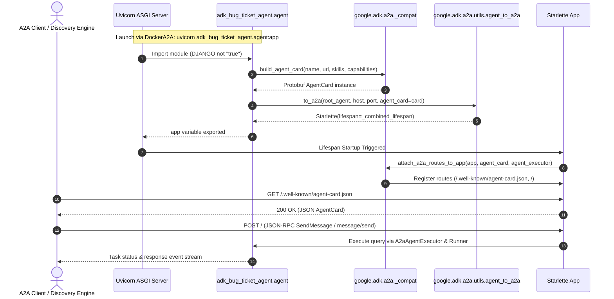

# Feature Implementation Plan: Fix A2A Import and Agent Architecture Issue

## 📋 Todo Checklist
- [x] Task 1: Update `pyproject.toml` dependency specification to include `"a2a-sdk[http-server]>=1.0.0"` and synchronize lockfile with `uv sync`.
- [x] Task 2: Refactor `adk_bug_ticket_agent/agent.py` to remove legacy/missing module-level A2A 0.3 imports (`A2AStarletteApplication`, `DefaultRequestHandler`, `InMemoryTaskStore`, and custom executor).
- [x] Task 3: Migrate `agent_card` construction in `adk_bug_ticket_agent/agent.py` to use `google.adk.a2a._compat.build_agent_card` to support Protobuf `AgentCard` in `a2a-sdk` 1.x without schema errors.
- [x] Task 4: Implement canonical ADK A2A server bootstrap using `google.adk.a2a.utils.agent_to_a2a.to_a2a`, gated cleanly behind the non-Django environment check with lazy-loaded runners.
- [x] Task 5: Modernize `adk_bug_ticket_agent/agent_executor.py` to inherit from or alias `google.adk.a2a.executor.a2a_agent_executor.A2aAgentExecutor` and eliminate deprecated 0.3.x imports (`ServerError`, `TextPart`, `new_task`).
- [x] Task 6: Add comprehensive automated tests in `tests/test_a2a_integration.py` to verify Django import safety, A2A agent card generation, and JSON-RPC Starlette route integrity.
- [x] Task 7: Execute full test suite (`uv run pytest`) and Django system check (`uv run python manage.py check`) to ensure 100% green verification.

---

## 🔍 Analysis & Investigation

### Codebase Structure
The files directly relevant to this issue and their responsibilities:
- `adk_bug_ticket_agent/agent.py`: Core ADK agent definitions, `ServiceManager` singleton, database session/memory initialization, and dual-mode runtime setup (Django web mode vs. A2A ASGI server mode).
- `adk_bug_ticket_agent/agent_executor.py`: Legacy custom A2A executor written against A2A SDK 0.3.x types and error handlers.
- `adk_bug_ticket_agent/views.py`: Django views providing the `/agent/interact/` endpoint; imports `_service_manager` from `agent.py`.
- `web/urls.py`: Django root URL configuration; imports `adk_bug_ticket_agent.views` at module startup.
- `manage.py` / `web/wsgi.py`: Django entry points; sets `DJANGO=true` environment variable.
- `DockerA2A`: Container configuration for running the standalone A2A server using `uvicorn adk_bug_ticket_agent.agent:app --host $A2A_HOST --port 8080`.
- `Dockerfile`: Container configuration for running the Django web application via Gunicorn.
- `pyproject.toml` / `uv.lock`: Dependency definitions and locked package resolutions.
- `tests/test_database_session.py`: Unit tests validating database connection normalization and `ServiceManager` lazy-loading.

### Current Architecture
The application is designed to operate in two operational modes:
1. **Django Web UI Mode (`DJANGO="true"`)**:
   - `manage.py` and `web/wsgi.py` set `DJANGO="true"`.
   - `web/urls.py` imports `adk_bug_ticket_agent.views`, which imports `_service_manager` from `adk_bug_ticket_agent/agent.py`.
   - In this mode, only `_service_manager` services (`session_service`, `memory_service`, `root_agent`) are used by Django views to handle user queries via ADK's `Runner`.
   - The A2A Starlette ASGI application `app` is not needed and must evaluate to `None`.
2. **A2A Agent-to-Agent Service Mode (`DJANGO` unset or not `"true"`)**:
   - Used by `DockerA2A` and agent registration scripts (`register-agent-cr-to-agentspace.sh`).
   - Uvicorn inspects `adk_bug_ticket_agent.agent:app` to serve the A2A protocol (JSON-RPC 2.0 at `/` and the Agent Card metadata at `/.well-known/agent-card.json`).

```
                ┌────────────────────────────────────────────────────────┐
                │               adk_bug_ticket_agent/agent.py            │
                └───────────────────────────┬────────────────────────────┘
                                            │
                     ┌──────────────────────┴──────────────────────┐
                     ▼                                             ▼
           [DJANGO="true"]                               [DJANGO unset / "false"]
     ┌─────────────────────────────┐               ┌─────────────────────────────────────┐
     │      Django Web Mode        │               │           A2A ASGI Server           │
     │  - Used by views.py         │               │  - Used by DockerA2A & Uvicorn      │
     │  - Runner(session, memory)  │               │  - to_a2a(root_agent, agent_card)   │
     │  - app = None               │               │  - Exposes /.well-known/agent-card  │
     └─────────────────────────────┘               │  - Exposes / (JSON-RPC endpoint)    │
                                                   └─────────────────────────────────────┘
```

### Dependencies & Integration Points
- `google-adk[db]>=1.37.0` (installed: `2.9.1`): Provides `Agent`, `Runner`, `DatabaseSessionService`, and the `google.adk.a2a` compatibility package (`to_a2a`, `_compat`, `A2aAgentExecutor`, `AgentCardBuilder`).
- `a2a-sdk` (installed: `1.1.2`, resolved from `pyproject.toml`'s `"a2a-sdk>=0.3.22"`): Protocol SDK for Agent-to-Agent communication.
- `starlette>=0.40.0` & `sse-starlette>=2.0.0`: ASGI application framework and Server-Sent Events support required by `a2a-sdk` for HTTP and JSON-RPC dispatching. Currently, `sse-starlette` is missing because `pyproject.toml` lacks the `[http-server]` extra.

### Root Cause Analysis
1. **Module Removal in A2A SDK 1.x**:
   In `a2a-sdk` 0.3.x, Starlette apps were instantiated using `a2a.server.apps.jsonrpc.starlette_app.A2AStarletteApplication`. In `a2a-sdk` 1.0.0+, the entire `a2a.server.apps` module was deprecated and removed in favor of modular route factories (`create_agent_card_routes`, `create_jsonrpc_routes`).
2. **Top-Level Unconditional Import**:
   `adk_bug_ticket_agent/agent.py` contains:
   ```python
   from a2a.server.apps.jsonrpc.starlette_app import A2AStarletteApplication
   ```
   at line 6. Because this import is at module level, importing `adk_bug_ticket_agent.agent` from anywhere (e.g. `views.py` during Django URL checking, or `test_database_session.py` during pytest collection) immediately crashes with:
   `ModuleNotFoundError: No module named 'a2a.server.apps'`.
   The downstream runtime branch `if django_env is None or django_env.strip().lower() != "true":` at line 223 is never reached.
3. **Missing Package Extra `[http-server]`**:
   When `a2a.server.routes` is imported in `a2a-sdk` 1.x, it imports `sse_starlette.sse.EventSourceResponse`. Because `pyproject.toml` specifies `"a2a-sdk>=0.3.22"` without extras, `sse-starlette` is not installed, causing `ModuleNotFoundError: No module named 'sse_starlette'`.
4. **Protobuf `AgentCard` Incompatibility**:
   In `a2a-sdk` 1.x, `AgentCard` is a Google Protobuf message rather than a Pydantic model. Manually instantiating `AgentCard(url=..., defaultInputModes=...)` raises `ValueError: Protocol message AgentCard has no "url" field.` because in A2A 1.x, the RPC URL resides inside `supported_interfaces[i].url`.
5. **Deprecated Custom Executor in `agent_executor.py`**:
   `adk_bug_ticket_agent/agent_executor.py` imports `ServerError` from `a2a.utils.errors` and `TextPart` from `a2a.types`, which do not exist in `a2a-sdk` 1.x. ADK 2.x natively provides `google.adk.a2a.executor.a2a_agent_executor.A2aAgentExecutor`, rendering the custom executor obsolete.

### Considerations & Challenges
- **Zero Django Module Imports in Agent Scope**: Maintain strict separation between Django web logic and ADK agent tools to avoid pickling/serialization errors when deploying to Vertex AI Reasoning Engine.
- **Backwards Compatibility for `DockerA2A`**: The Dockerfile `DockerA2A` relies on `uvicorn adk_bug_ticket_agent.agent:app`. The variable `app` must still be exported when `DJANGO` is not `"true"`, but cleanly return a valid Starlette application.
- **A2A Card Compatibility**: Gemini Enterprise and Agentspace registration require specific JSON card structures. Using ADK's `_compat.build_agent_card` ensures that the card correctly renders both `supported_interfaces` (1.0) and compatibility interfaces without manual Protobuf parsing errors.

---

## 📐 Technical Specification & Design

### Component Architecture

```
┌────────────────────────────────────────────────────────────────────────────────────────┐
│                                   pyproject.toml                                       │
│                    "a2a-sdk[http-server]>=1.0.0" (provides sse-starlette)              │
└───────────────────────────────────────────┬────────────────────────────────────────────┘
                                            │
                                            ▼
┌────────────────────────────────────────────────────────────────────────────────────────┐
│                             adk_bug_ticket_agent/agent.py                              │
│                                                                                        │
│  1. Top-Level Imports:                                                                 │
│     - Clean ADK imports: Agent, LiteLlm, DatabaseSessionService, InMemoryMemoryService │
│     - Clean A2A imports: AgentCapabilities, AgentSkill                                 │
│     - ADK A2A compatibility: to_a2a, _compat.build_agent_card                         │
│     - REMOVED: a2a.server.apps, a2a.server.request_handlers, a2a.server.tasks          │
│                                                                                        │
│  2. ServiceManager:                                                                    │
│     - Lazily initializes session_service, memory_service, root_agent                   │
│     - Lazily initializes official A2aAgentExecutor using ADK's native class            │
│                                                                                        │
│  3. AgentCard Construction:                                                            │
│     - Built via _compat.build_agent_card(name=..., url=..., skills=[...])              │
│                                                                                        │
│  4. Dual-Mode App Dispatch:                                                            │
│     if os.environ.get("DJANGO", "").strip().lower() == "true":                         │
│         app = None                                                                     │
│     else:                                                                              │
│         app = to_a2a(root_agent, host=A2A_HOST, port=AGENT_PORT, agent_card=agent_card) │
└───────────────────────────────────────────┬────────────────────────────────────────────┘
                                            │
                     ┌──────────────────────┴──────────────────────┐
                     ▼                                             ▼
┌──────────────────────────────────────────┐  ┌──────────────────────────────────────────┐
│        Django App (web / views.py)       │  │        DockerA2A (uvicorn:app)           │
│  - Imports agent._service_manager        │  │  - Runs app as ASGI Starlette            │
│  - app is None (no Starlette collision)  │  │  - Serves /.well-known/agent-card.json   │
│  - manage.py check & pytest pass         │  │  - Dispatches JSON-RPC tasks             │
└──────────────────────────────────────────┘  └──────────────────────────────────────────┘
```

### Mermaid Sequence Diagram: Standalone A2A Server Startup & Execution


### Schemas & Models

#### 1. `pyproject.toml` Dependency Declaration
```toml
dependencies = [
    "google-adk[db]>=1.37.0",
    "a2a-sdk[http-server]>=1.0.0",
    "python-dotenv==1.1.0",
    "toolbox-core==0.5.2",
    "gunicorn",
    "whitenoise[brotli]",
    "django>=5.0,<5.3",
    "google-generativeai>=0.8.5",
    "psycopg2-binary",
    "asyncpg>=0.29.0",
    "greenlet>=3.0.0",
    "litellm>=1.81.4",
    "pytest>=7.4.0",
    "pyyaml>=6.0.0",
]
```

#### 2. Agent Card Model Specification (via `_compat.build_agent_card`)
- `name`: `"IT Bug Assistant Agent"` (str)
- `description`: `"An agent to help users with bug tickets, including searching, creating, and updating them."` (str)
- `version`: `"1.0.0"` (str)
- `url`: `AGENT_URL` (str, defaults to `http://127.0.0.1:8000`)
- `protocol_binding`: `"JSONRPC"` (str)
- `skills`: List of `AgentSkill`:
  - `id`: `"bug_triage_assistant"`
  - `name`: `"Bug Triage Assistant"`
  - `description`: `"Assists in triaging and debugging software issues by searching, creating, and updating bug tickets."`
  - `tags`: `["bug-tracking", "triage"]`
  - `examples`: `["Create a new ticket for a login issue.", "Search for tickets related to 'database connection error'"]`
- `capabilities`: `AgentCapabilities(streaming=True)`
- `default_input_modes`: `["text", "text/plain"]`
- `default_output_modes`: `["text", "text/plain"]`

### API & Code Signatures

#### `adk_bug_ticket_agent/agent.py`
```python
def _build_default_agent_card() -> AgentCard:
    """Builds a version-agnostic A2A AgentCard using ADK's _compat helper."""
    ...

def get_session_service() -> DatabaseSessionService:
    """Returns the lazy-loaded session service instance from ServiceManager."""
    ...

def get_memory_service() -> InMemoryMemoryService:
    """Returns the lazy-loaded memory service instance from ServiceManager."""
    ...

def get_agent() -> Agent:
    """Returns the lazy-loaded root agent instance from ServiceManager."""
    ...

def get_agent_executor() -> A2aAgentExecutor:
    """Returns the lazy-loaded A2A agent executor instance from ServiceManager."""
    ...
```

#### `adk_bug_ticket_agent/agent_executor.py`
```python
from google.adk.a2a.executor.a2a_agent_executor import A2aAgentExecutor

class AdkAgentToA2AExecutor(A2aAgentExecutor):
    """Backwards-compatible wrapper delegating to Google ADK's native A2aAgentExecutor."""
    def __init__(
        self,
        agent: Optional[BaseAgent] = None,
        session_service: Optional[Any] = None,
        memory_service: Optional[Any] = None,
        runner: Optional[Runner] = None,
    ) -> None:
        ...
```

---

## 📝 Step-by-Step Implementation Steps

### Step 1: Update Dependency in `pyproject.toml` and Sync Lockfile
- **Files to modify**: `pyproject.toml`
- **Changes needed**:
  Change `"a2a-sdk>=0.3.22"` to `"a2a-sdk[http-server]>=1.0.0"` in the `dependencies` list. Run `uv sync` to update `uv.lock` and install `sse-starlette` into `.venv`.
- **Implementation Notes**:
  The `[http-server]` extra guarantees that `sse-starlette` and `starlette` are installed, preventing `ModuleNotFoundError: No module named 'sse_starlette'` when A2A router dispatchers are imported.
- **Status**: `- [x]`

### Step 2: Refactor `adk_bug_ticket_agent/agent.py` Imports and ServiceManager
- **Files to modify**: `adk_bug_ticket_agent/agent.py`
- **Changes needed**:
  1. Remove:
     ```python
     from a2a.server.apps.jsonrpc.starlette_app import A2AStarletteApplication
     from a2a.server.request_handlers import DefaultRequestHandler
     from a2a.server.tasks import InMemoryTaskStore
     from .agent_executor import AdkAgentToA2AExecutor
     ```
  2. Keep/Import:
     ```python
     from a2a.types import AgentCapabilities, AgentSkill
     from google.adk.a2a import _compat
     from google.adk.a2a.utils.agent_to_a2a import to_a2a
     ```
  3. In `ServiceManager`:
     Update `_init_agent_executor(self)`:
     ```python
     def _init_agent_executor(self):
         """Initializes the official ADK A2A agent executor."""
         print("Initializing A2aAgentExecutor...")
         from google.adk.a2a.executor.a2a_agent_executor import A2aAgentExecutor
         from google.adk.runners import Runner
         runner = Runner(
             app_name="it_bug_assistant_agent",
             agent=self.root_agent,
             session_service=self.session_service,
             memory_service=self.memory_service,
         )
         return A2aAgentExecutor(runner=runner)
     ```
- **Implementation Notes**:
  Lazy loading ensures that `Runner` and `A2aAgentExecutor` are only created on demand.
- **Status**: `- [x]`

### Step 3: Implement Version-Safe `agent_card` and Dual-Mode `app` Setup in `agent.py`
- **Files to modify**: `adk_bug_ticket_agent/agent.py`
- **Changes needed**:
  1. Replace direct `AgentCard(...)` call with `_compat.build_agent_card(...)`:
     ```python
     capabilities = AgentCapabilities(streaming=True)
     skill = AgentSkill(
         id="bug_triage_assistant",
         name="Bug Triage Assistant",
         description="Assists in triaging and debugging software issues by searching, creating, and updating bug tickets.",
         tags=["bug-tracking", "triage"],
         examples=["Create a new ticket for a login issue.", "Search for tickets related to 'database connection error'"],
     )

     agent_card = _compat.build_agent_card(
         name="IT Bug Assistant Agent",
         description="An agent to help users with bug tickets, including searching, creating, and updating them.",
         version="1.0.0",
         url=AGENT_URL,
         protocol_binding="JSONRPC",
         skills=[skill],
         capabilities=capabilities,
         default_input_modes=SUPPORTED_CONTENT_TYPES,
         default_output_modes=SUPPORTED_CONTENT_TYPES,
     )
     ```
  2. Replace the old conditional app building block (lines 222-241) with:
     ```python
     django_env = os.environ.get("DJANGO")
     if django_env is not None and django_env.strip().lower() == "true":
         # In Django web mode, app is unused to avoid port collisions and unnecessary initialization
         app = None
         root_agent = None
     else:
         # Standalone A2A ASGI server mode (used by DockerA2A & uvicorn)
         root_agent = get_agent()
         app = to_a2a(
             root_agent,
             host=os.environ.get("A2A_HOST", "0.0.0.0"),
             port=int(AGENT_PORT),
             agent_card=agent_card,
         )
     ```
- **Implementation Notes**:
  `to_a2a` natively constructs the `Starlette` app, attaches the A2A endpoints, and configures the default task store and executor.
- **Status**: `- [x]`

### Step 4: Modernize `adk_bug_ticket_agent/agent_executor.py`
- **Files to modify**: `adk_bug_ticket_agent/agent_executor.py`
- **Changes needed**:
  Refactor the file to cleanly subclass `A2aAgentExecutor` from `google.adk.a2a.executor.a2a_agent_executor` or provide a compatibility adapter.
  Remove obsolete imports from `a2a.utils.errors` (`ServerError`) and `a2a.types` (`TextPart`).
  Ensure importing `adk_bug_ticket_agent.agent_executor` succeeds under Python 3.10+ without raising `ImportError`.
- **Implementation Notes**:
  Preserves backwards compatibility for any external callers or legacy scripts that import `AdkAgentToA2AExecutor`.
- **Status**: `- [x]`

### Step 5: Add Regression and Integration Tests
- **Files to create**: `tests/test_a2a_integration.py`
- **Changes needed**:
  Write test cases verifying:
  1. `test_agent_module_imports_cleanly_under_django`: Verify importing `agent.py` with `DJANGO="true"` succeeds and `app is None`.
  2. `test_agent_card_structure_validity`: Verify `agent_card` is built without protobuf schema errors and contains valid skills.
  3. `test_a2a_standalone_app_endpoints`: Use `starlette.testclient.TestClient` to verify `to_a2a` exposes `/.well-known/agent-card.json` returning 200 with the correct agent card name and skills.
  4. `test_agent_executor_import_and_instantiation`: Verify `AdkAgentToA2AExecutor` can be imported and initialized without errors.
- **Status**: `- [x]`

---

## 🧪 Verification & Testing Strategy

### Unit & Integration Tests
1. **Existing Test Suite**:
   Verify `tests/test_database_session.py` passes completely without collection errors:
   - `test_normalize_db_url`
   - `test_database_session_service_initialization`
   - `test_database_session_service_with_normalized_url`
   - `test_service_manager_session_service_lazy_load`
   - `test_cross_event_loop_session_service`
2. **New Integration Tests** (`tests/test_a2a_integration.py`):
   - Import verification with and without `DJANGO="true"`.
   - Starlette `TestClient` verification of `/.well-known/agent-card.json` response schema.
3. **Django System Health Check**:
   - `uv run python manage.py check`: Must exit with code 0 and "System check identified no issues (0 silenced)."

### Execution Commands
```bash
# 1. Update dependencies and ensure lockfile is in sync
uv sync

# 2. Verify Django system checks
uv run python manage.py check

# 3. Run all unit and integration tests
uv run pytest -v

# 4. Verify A2A server boots up and serves agent card via TestClient
uv run python -c "from adk_bug_ticket_agent.agent import agent_card; print('Agent card name:', agent_card.name)"
```

### Expected Results
- `uv run python manage.py check` outputs:
  ```
  System check identified no issues (0 silenced).
  ```
- `uv run pytest` outputs:
  ```
  ====== X passed in Y.YYs ======
  ```
- No `ModuleNotFoundError` for `a2a.server.apps` or `sse_starlette`.
- No `ValueError: Protocol message AgentCard has no "url" field`.

---

## 🎯 Success Criteria
1. **Clean Importability**: Importing `adk_bug_ticket_agent.agent` succeeds in all execution contexts (Django WSGI, manage.py commands, pytest, and standalone Python scripts) without raising `ModuleNotFoundError`.
2. **Django System Check Passes**: `uv run python manage.py check` executes with code 0 and detects 0 issues.
3. **Valid A2A Protocol Execution**: When `DJANGO` is not `"true"`, `adk_bug_ticket_agent.agent:app` is a valid Starlette ASGI application that successfully responds to `GET /.well-known/agent-card.json` with HTTP 200 and valid JSON-RPC routing.
4. **100% Automated Test Passing**: `uv run pytest` executes cleanly without test collection errors, passing both existing database session tests and new A2A integration tests.
