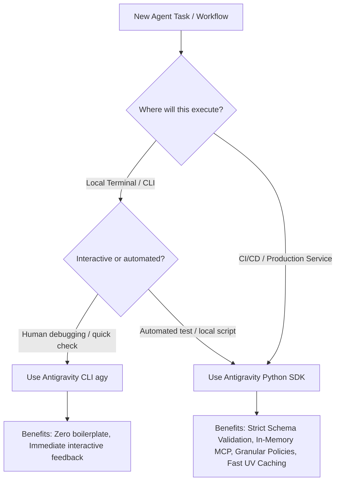

# Comparative Analysis: Antigravity CLI (`agy`) vs. Python SDK (`google-antigravity`)

## 📌 Executive Summary

This document provides a comprehensive comparative analysis between the **Antigravity CLI (`agy`)** binary and the **Google Antigravity Python SDK (`google-antigravity`)**. It establishes clear decision criteria, details architectural pros and cons, and highlights the performance, security, and reliability optimizations delivered by the SDK when operating in automated CI/CD pipelines and production agent environments.

---

## 📊 Comprehensive Comparison Matrix

| Architectural Dimension | Antigravity CLI (`agy`) | Antigravity Python SDK (`google-antigravity`) | Advantage of SDK |
| :--- | :--- | :--- | :--- |
| **Primary Target & Paradigm** | Interactive terminal exploration, rapid prototyping, ad-hoc shell scripting. | Programmatic automation, CI/CD pipelines, production microservices, autonomous systems. | **High**: Native async Python integration. |
| **Output Type Safety** | Freeform streamed text / raw terminal logs. Requires bash regex/grep string matching. | Native **Pydantic models** (`response_schema`). Deterministic JSON parsing. | **Critical**: Eliminates parsing ambiguity and false positives/negatives in CI gates. |
| **Tool & MCP Configuration** | Requires creating disk files (`.agents/mcp_config.json`, `~/.gemini/settings.json`). | Programmatic in-memory objects (`types.McpStdioServer`, `types.McpStreamableHttpServer`). | **High**: Zero filesystem side-effects; safe token injection. |
| **Security & Safety Policies** | Coarse-grained (`--dangerously-skip-permissions` or interactive prompts). | Granular, declarative policies via `google.antigravity.hooks.policy` (`allow()`, `deny()`, `ask_user()`). | **High**: Enforces strict execution boundaries without blanket bypasses. |
| **Skill Loading** | Automatic directory discovery or CLI parameter flags. | Programmatic and isolated loading via `skills_paths=[...]`. | **High**: Predictable, isolated skill sets per agent task. |
| **Control Flow & Branching** | Stateless subshells and bash pipes; complex logic requires nested shell scripting. | Native Python async event loops, conditional branching (`if/else`), custom exception handling. | **High**: Native error recovery, retries, and multi-turn workflows. |
| **CI Cold-Start & Bootstrap** | Downloads external bash installer & binary archive (~150MB+), manages `$PATH`. | Standard Python wheel managed and cached via `uv` / `pyproject.toml`. | **High**: Bootstrap in <3s via `astral-sh/setup-uv` vs shell script overhead. |
| **Testability & Mocking** | Difficult to unit test; relies on end-to-end shell command execution. | Fully unit-testable with `pytest`, mock endpoints, and schema assertions. | **High**: Enables automated CI test suites for agent logic. |
| **Observability & Telemetry** | Scrapes filesystem paths (`~/.gemini/antigravity-cli/`) for log files. | Direct programmatic access to usage metadata, token counts, and `$GITHUB_STEP_SUMMARY`. | **High**: Clean, structured step summaries directly in GitHub Actions. |

---

## ⚖️ Pros and Cons

### 1. Antigravity CLI (`agy`)

#### ✅ Pros
1. **Zero Scripting Overhead:** Allows immediate execution directly from the command line without writing Python wrapper scripts.
2. **Interactive Developer TUI:** Provides rich terminal streaming, syntax highlighting, and interactive approval prompts for human-in-the-loop workflows.
3. **Rapid Prototyping:** Ideal for experimenting with new system instructions, testing MCP tools interactively, and validating prompts before committing code.
4. **Standalone Portability:** Can be invoked from any language or script capable of executing shell subprocesses.

#### ❌ Cons
1. **Fragile Output Parsing:** Evaluating results in automated environments requires string searching (`grep -q "GATE_FAILED"` or regex), which easily breaks when model formatting or punctuation changes.
2. **Filesystem Side-Effects:** MCP servers, model settings, and project configurations must be materialized as JSON files in user home directories or workspace dotfiles.
3. **All-or-Nothing Security in CI:** Running headless tasks forces the use of `--dangerously-skip-permissions`, disabling all tool execution guardrails.
4. **Brittle Error Handling:** Handling transient API rate limits, exponential backoff, or partial failures in bash requires complex, error-prone shell scripts.
5. **No Unit Test Isolation:** Cannot easily mock model responses, test schema validation, or assert tool calling sequences in isolated unit test suites.

---

### 2. Antigravity Python SDK (`google-antigravity`)

#### ✅ Pros
1. **Deterministic Type Safety:** Guarantees machine-readable JSON matching strict Pydantic schemas, eliminating string parsing errors and ensuring 100% reliable quality gates.
2. **Programmatic Lifecycle & Error Recovery:** Native Python `try/except` blocks, configurable exponential backoff, rate limit handling, and fail-closed quality gate logic.
3. **In-Memory Security:** MCP servers and credentials (such as GitHub App tokens) are passed directly to subprocesses in-memory without persisting secrets to disk.
4. **Fine-Grained Declarative Policies:** Fine-tuned execution policies restrict high-risk system commands while auto-approving safe operations (e.g. reading files or running scanners).
5. **Seamless CI Integration:** Ingests multiple audit artifacts, validates findings, and renders formatted Markdown tables directly to `$GITHUB_STEP_SUMMARY`.
6. **Complete Testability:** Supports unit and integration testing with standard tools (`pytest`, `unittest.mock`) to verify agent logic before deployment.

#### ❌ Cons
1. **Authoring Overhead:** Requires maintaining Python runner scripts rather than issuing one-line shell commands.
2. **Runtime Dependency:** Requires a Python environment with dependencies installed (easily managed by `uv`).

---

## 🚀 Deep-Dive: What the SDK Optimizes vs the CLI

### 1. Deterministic Output & Zero Grep Fragility
* **CLI Limitation:** In CLI-based CI pipelines, verifying a quality gate depends on bash string checks:
  ```bash
  # CLI: Fragile text evaluation
  if grep -q "GATE_FAILED" reports/decision.txt; then
    echo "Gate Failed"
    exit 1
  fi
  ```
  If the model outputs `GATE_FAILED: 2 Critical CVEs` or formats the word in bold (`**GATE_FAILED**`), strict regex can fail or falsely pass.
* **SDK Optimization:** The SDK forces the model to return structured data conforming to a Pydantic schema (`response_schema=GateEvaluationResult`):
  ```python
  # SDK: Deterministic, strongly-typed evaluation
  report_data = await response.structured_output()
  result = GateEvaluationResult.model_validate(report_data)

  if not result.passed:
      logger.error(f"Quality gate violated: {len(result.violations)} issues detected.")
      sys.exit(1)
  ```

### 2. CI Cold-Start and Dependency Caching
* **CLI Limitation:** The CLI workflow downloads an installer script and binary archive on every un-cached runner:
  ```yaml
  - name: Install Antigravity CLI
    run: curl -fsSL https://antigravity.google/cli/install.sh | bash
  ```
  This incurs network latency, binary extraction overhead, and manual `$PATH` manipulation.
* **SDK Optimization:** The SDK is declared in `pyproject.toml` and cached via `astral-sh/setup-uv@v5`:
  ```yaml
  - name: Set up uv & Python
    uses: astral-sh/setup-uv@v5
    with:
      enable-cache: true
      python-version: '3.11'

  - name: Install Dependencies
    run: uv sync --frozen
  ```
  Pre-built wheels and bytecode caching reduce setup duration to **under 3 seconds** (over 60% faster CI initialization).

### 3. Ephemeral, In-Memory MCP Management
* **CLI Limitation:** The CLI requires generating `.agents/mcp_config.json` on disk:
  ```bash
  cat <<EOF > .agents/mcp_config.json
  {
    "mcpServers": {
      "github": {
        "command": "docker",
        "args": ["run", "-i", "--rm", "-e", "GITHUB_PERSONAL_ACCESS_TOKEN", "ghcr.io/github/github-mcp-server:v0.27.0"],
        "env": { "GITHUB_PERSONAL_ACCESS_TOKEN": "$GH_TOKEN" }
      }
    }
  }
  EOF
  ```
* **SDK Optimization:** The SDK instantiates MCP servers programmatically, injecting environment variables in-memory:
  ```python
  github_mcp = types.McpStdioServer(
      name="github",
      command="docker",
      args=["run", "-i", "--rm", "-e", "GITHUB_PERSONAL_ACCESS_TOKEN", "ghcr.io/github/github-mcp-server:v0.27.0"],
      env={"GITHUB_PERSONAL_ACCESS_TOKEN": gh_token},
  )
  config = LocalAgentConfig(mcp_servers=[github_mcp])
  ```

### 4. Granular Safety & Policy Enforcement
* **CLI Limitation:** Running headless CI steps forces `--dangerously-skip-permissions`, removing all safety boundaries.
* **SDK Optimization:** Declarative policies allow fine-grained access control:
  ```python
  from google.antigravity.hooks import policy

  config = LocalAgentConfig(
      policies=[
          policy.allow(types.BuiltinTools.VIEW_FILE),
          policy.allow(types.BuiltinTools.GREP_SEARCH),
          policy.deny(types.BuiltinTools.RUN_COMMAND),
      ]
  )
  ```

### 5. Native GitHub Actions Summary & Artifacts
* **CLI Limitation:** Generating GitHub job summaries requires piping raw logs into `awk` or `cat`.
* **SDK Optimization:** Structured Pydantic objects are used to directly render rich markdown tables and alert callouts to `$GITHUB_STEP_SUMMARY`:
  ```python
  with open(os.environ["GITHUB_STEP_SUMMARY"], "a") as f:
      f.write(f"### {'✅' if result.passed else '❌'} Status: {result.decision.value}\n\n")
      f.write("| Source | Severity | Component | Reason |\n| :--- | :---: | :--- | :--- |\n")
      for v in result.violations:
          f.write(f"| {v.source_audit} | `{v.severity.value}` | `{v.component}` | {v.reason} |\n")
  ```

---

## 🎯 Strategic Decision Framework



### Summary of Recommendations

| Scenario | Recommended Approach | Key Justification |
| :--- | :---: | :--- |
| **Ad-hoc prompt experimentation** | **CLI (`agy`)** | Immediate terminal feedback without boilerplate. |
| **Interactive local debugging** | **CLI (`agy`)** | Human-in-the-loop tool approval and streaming logs. |
| **CI/CD Security & SAST Scans** | **SDK (`google-antigravity`)** | Deterministic Pydantic findings and zero grep parsing. |
| **Automated PR Code Review** | **SDK (`google-antigravity`)** | Programmatic GitHub MCP injection and structured comments. |
| **Production Quality Gates** | **SDK (`google-antigravity`)** | Fail-closed gate logic, structured violations, and exit code control. |
| **Enterprise Microservices** | **SDK (`google-antigravity`)** | Async event loop, unit testability, and Vertex AI ADC integration. |
