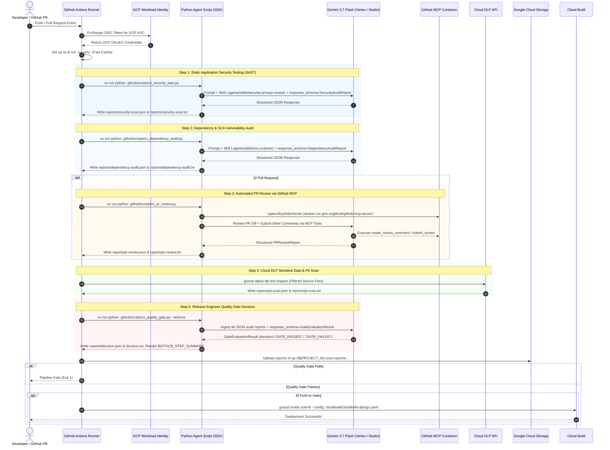
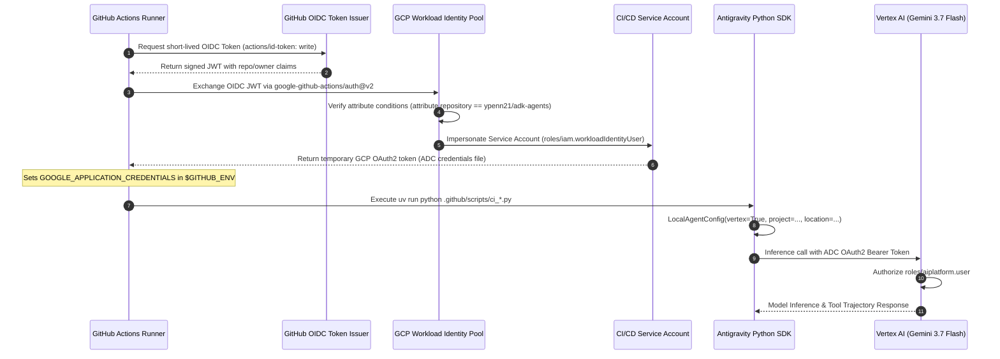

# Feature Implementation Plan: Migrating GitHub Actions Security Workflow to Google Antigravity Python SDK (agy-sdk)

## 📋 Todo Checklist
- [ ] **Task 1: Project & CI Dependency Configuration**
  - Add `google-antigravity>=0.1.0` and `pydantic>=2.0` to project dependencies in `pyproject.toml` and update `uv.lock`.
  - Ensure GitHub Actions workflow configures `astral-sh/setup-uv@v5` with Python 3.10+ caching.
- [ ] **Task 2: Implement Common Agent CI Infrastructure (`.github/scripts/ci_common.py`)**
  - Implement unified agent factory `create_ci_agent_config()` supporting Vertex AI (WIF/ADC) and Gemini API Studio (`GEMINI_API_KEY`).
  - Configure declarative safety policies (`policy.allow_all()` / scoped allowances) for non-interactive headless CI execution.
  - Implement telemetry, error handling, retries, and report output persistence utilities (`save_report_artifacts()`).
- [ ] **Task 3: Implement Dedicated SAST AI Security Runner (`.github/scripts/ci_security_sast.py`)**
  - Load `security-privacy-review` skill via `skills_paths`.
  - Enforce Pydantic structured output model `SecurityAuditReport` via `response_schema`.
  - Save `reports/security-scan.json` and human-readable `reports/security-scan.txt`.
- [ ] **Task 4: Implement Dedicated Dependency & SCA Audit Runner (`.github/scripts/ci_dependency_audit.py`)**
  - Load `osv-scanner` skill via `skills_paths`.
  - Enforce Pydantic structured output model `DependencyAuditReport` via `response_schema`.
  - Audit `uv.lock`, `pyproject.toml`, `requirements.txt`, and Dockerfile; export `reports/dependency-audit.json` and `reports/dependency-audit.txt`.
- [ ] **Task 5: Implement Dedicated PR Code Reviewer Agent Runner (`.github/scripts/ci_pr_review.py`)**
  - Wire GitHub MCP container via `types.McpStdioServer` using dynamically injected GitHub tokens.
  - Enforce Pydantic structured output model `PRReviewReport` via `response_schema`.
  - Inspect PR diffs, submit inline review comments via GitHub MCP, and export `reports/pr-review.json` and `reports/pr-review.txt`.
- [ ] **Task 6: Implement Dedicated Release Engineer Quality Gate Runner (`.github/scripts/ci_quality_gate.py`)**
  - Ingest JSON audit artifacts (`reports/security-scan.json`, `reports/dependency-audit.json`, `reports/pii-scan.json`, `reports/pr-review.json`).
  - Enforce Pydantic structured output model `GateEvaluationResult` via `response_schema`.
  - Implement deterministic pass/fail exit code handling (`--enforce` flag) and generate Markdown summary for `$GITHUB_STEP_SUMMARY`.
- [ ] **Task 7: Refactor GitHub Actions Workflow (`.github/workflows/security-pii-review.yml`)**
  - Remove legacy CLI installer (`curl | bash`), binary caching (`~/.local/bin/agy`), and subshell bash scripts.
  - Replace CLI steps with clean `uv run python .github/scripts/ci_*.py` invocations.
  - Preserve Workload Identity Federation (WIF), Cloud DLP scan, GCS report archiving, and downstream Cloud Build deployment trigger.
- [ ] **Task 8: Unit & Integration Testing for CI Runner Scripts**
  - Write test suite in `tests/ci/test_ci_runners.py` validating Pydantic schemas, policy configuration, and error handling.
  - Validate local execution using `uv run pytest tests/ci/`.

---

## 🔍 Analysis & Investigation

### Codebase Structure
The files directly impacted and referenced by this transformation include:

| File Path | Description / Responsibility |
| :--- | :--- |
| [`.github/workflows/security-pii-review.yml`](file:///Users/yannipeng/git-projects/adk-agents/.github/workflows/security-pii-review.yml) | **Primary Target:** The GitHub Actions workflow orchestrating security SAST, SCA, Cloud DLP, PR review, quality gate enforcement, and Cloud Build triggers. |
| [`pyproject.toml`](file:///Users/yannipeng/git-projects/adk-agents/pyproject.toml) & [`uv.lock`](file:///Users/yannipeng/git-projects/adk-agents/uv.lock) | Project dependency management (managed by `uv`). Must include `google-antigravity`. |
| [`.agents/skills/security-privacy-review/SKILL.md`](file:///Users/yannipeng/git-projects/adk-agents/.agents/skills/security-privacy-review/SKILL.md) | Domain skill for defensive SAST taint analysis, OWASP Top 10, and Django/ADK security auditing. |
| [`.agents/skills/osv-scanner/SKILL.md`](file:///Users/yannipeng/git-projects/adk-agents/.agents/skills/osv-scanner/SKILL.md) | Domain skill for vulnerability auditing across lockfiles and manifests using OSV.dev. |
| [`.agents/agents/reviewer/agent.md`](file:///Users/yannipeng/git-projects/adk-agents/.agents/agents/reviewer/agent.md) | Persona and prompt instructions for the automated Code Reviewer subagent. |
| [`.github/scripts/schemas.py`](file:///Users/yannipeng/git-projects/adk-agents/.github/scripts/schemas.py) | **[NEW]** Pydantic schemas for SAST, SCA, PR review, and quality gate reports. |
| [`.github/scripts/ci_common.py`](file:///Users/yannipeng/git-projects/adk-agents/.github/scripts/ci_common.py) | **[NEW]** Shared SDK initialization, Vertex AI / Gemini auth, safety policies, and report persistence. |
| [`.github/scripts/ci_security_sast.py`](file:///Users/yannipeng/git-projects/adk-agents/.github/scripts/ci_security_sast.py) | **[NEW]** Autonomous SAST security scanner leveraging SDK + `security-privacy-review` skill. |
| [`.github/scripts/ci_dependency_audit.py`](file:///Users/yannipeng/git-projects/adk-agents/.github/scripts/ci_dependency_audit.py) | **[NEW]** Autonomous SCA dependency auditor leveraging SDK + `osv-scanner` skill. |
| [`.github/scripts/ci_pr_review.py`](file:///Users/yannipeng/git-projects/adk-agents/.github/scripts/ci_pr_review.py) | **[NEW]** Autonomous PR code reviewer leveraging SDK + GitHub MCP stdio server. |
| [`.github/scripts/ci_quality_gate.py`](file:///Users/yannipeng/git-projects/adk-agents/.github/scripts/ci_quality_gate.py) | **[NEW]** Deterministic Release Engineer Quality Gate evaluator with structured output. |
| [`.cloudbuild/cloudbuild-django.yaml`](file:///Users/yannipeng/git-projects/adk-agents/.cloudbuild/cloudbuild-django.yaml) | Cloud Build container build specification triggered upon passing the quality gate on `main`. |

### Current Architecture (`agy-cli`)
The current `.github/workflows/security-pii-review.yml` workflow invokes the standalone `agy` binary:
1. **Installation & Cache:** Uses `actions/cache@v4` on `~/.local/bin/agy`, `~/.antigravity`, `~/.gemini` and falls back to `curl -fsSL https://antigravity.google/cli/install.sh | bash`.
2. **Environment & MCP Setup:** Generates `.agents/mcp_config.json` and `~/.gemini/antigravity-cli/settings.json` via bash `cat <<EOF` scripts.
3. **Audit Execution:** Runs `agy -p "..." --dangerously-skip-permissions --output-format text | tee reports/*.txt`.
4. **Quality Gate Decision:** Aggregates text reports into `final_report.txt`, executes `agy -p "Act as Lead Release Engineer..." --effort medium`, and pipes response to `reports/decision.txt`.
5. **Gate Enforcement:** Evaluates `grep -q "GATE_FAILED" reports/decision.txt` in bash to determine whether to exit 0 or 1.

### Why Migrate to `google-antigravity` (SDK)?

| Dimension | Antigravity CLI (`agy`) | Antigravity Python SDK (`google-antigravity`) | Advantage of SDK in CI/CD |
| :--- | :--- | :--- | :--- |
| **Output Predictability** | Freeform text or raw JSON string dump. Requires fragile bash regex/grep matching. | Native Pydantic model validation (`response_schema`). | **High**: Zero regex fragility. Structured JSON models guarantee type safety and deterministic gate decisions. |
| **Tool & MCP Configuration** | Requires writing `.agents/mcp_config.json` to disk and relying on external process file watchers. | Programmatic Python `types.McpStdioServer` and `types.McpStreamableHttpServer`. | **High**: Direct in-memory configuration; seamless secret injection without disk leaks. |
| **Skill Loading** | Implicit directory discovery or CLI flags. | Explicit `skills_paths=[...]` parameter in `LocalAgentConfig`. | **High**: Predictable, isolated skill loading per agent task. |
| **Safety & Tool Policies** | Blanket `--dangerously-skip-permissions` turns off all safeguards. | Granular declarative policies via `google.antigravity.hooks.policy` (e.g. `policy.allow_all()` or specific allowlists). | **High**: Fine-grained execution boundaries appropriate for enterprise CI runners. |
| **CI Cold-Start Overhead** | Downloads external bash installer and binary (~150MB+), manages shell paths and PATH exports. | Standard Python package managed by `uv` / `pyproject.toml` with bytecode and wheel caching. | **High**: Faster CI bootstrap; uses native `astral-sh/setup-uv` caching (<3s). |
| **Multi-turn & Branching** | Complex chaining in bash scripts; stateless invocations. | Native Python async event loop, multi-turn conversations, automated retries, and programmatic error handling. | **High**: Resilient retry loops on transient model errors or rate limits. |
| **Telemetry & Reporting** | Scrapes filesystem paths (`~/.gemini/antigravity-cli/`) for log files. | Programmatic access to token usage metadata, turn logs, and direct output formatting to `$GITHUB_STEP_SUMMARY`. | **High**: Clean, consolidated reporting directly in GitHub Actions UI. |

### Dependencies & Integration Points
- **Python Environment:** Python 3.10+, `uv` package manager, `google-antigravity>=0.1.0`, `pydantic>=2.0`.
- **Google Cloud Auth (Primary & Recommended):** Workload Identity Federation (WIF) OIDC token exchange via `google-github-actions/auth@v2`. This generates ephemeral Application Default Credentials (ADC) exported to `GOOGLE_APPLICATION_CREDENTIALS`. The Python Antigravity SDK communicates directly with Vertex AI in Standard Mode (`vertex=True`, `project=...`, `location=...`) with zero long-lived API keys.
- **Development Fallback Auth:** Optional `GEMINI_API_KEY` fallback support for local developer dry-runs outside GCP infrastructure.
- **GitHub MCP Server:** `ghcr.io/github/github-mcp-server:v0.27.0` running via Docker stdio transport.
- **Reporting & Storage:** Google Cloud Storage (`upload-cloud-storage@v2`) and GitHub Step Summary (`$GITHUB_STEP_SUMMARY`).

### Considerations & Challenges
1. **WIF and ADC as the Primary Authentication Standard (Recommended):**
   - **Secretless Execution:** Workload Identity Federation (WIF) combined with Application Default Credentials (ADC) is the **recommended enterprise pattern** for authenticating and communicating with Vertex AI LLMs in CI/CD.
   - When running under WIF, `google-github-actions/auth@v2` automatically writes temporary credentials and sets `GOOGLE_APPLICATION_CREDENTIALS`.
   - The Antigravity Python SDK automatically detects `GOOGLE_APPLICATION_CREDENTIALS` and routes model inference calls securely to Vertex AI (`vertex=True`).
   - The CI service account (`${{ env.GOOGLE_CLOUD_PROJECT_NUMBER }}-compute@developer.gserviceaccount.com`) is granted `roles/aiplatform.user` in Terraform (`main.tf`), eliminating the need to manage, rotate, or expose static `GEMINI_API_KEY` secrets in GitHub Actions.
2. **Docker Stdio Execution for MCP in GitHub Actions:**
   - GitHub Actions standard Ubuntu runners have Docker pre-installed. The SDK launches the Docker container as a child subprocess via `types.McpStdioServer`. Environment variables (such as `GITHUB_PERSONAL_ACCESS_TOKEN`) must be passed safely to the subprocess.
3. **Non-Interactive CI Safety Policies:**
   - `LocalAgentConfig` denies `run_command` by default using `confirm_run_command()`. In headless CI environments, we must configure `policies=[policy.allow_all()]` or explicit allowlists so tool calls (such as reading files or invoking `osv-scanner`) execute autonomously without hanging on interactive user prompts.
4. **Error Handling & Fail-Open vs. Fail-Closed:**
   - The quality gate script must operate in a **fail-closed** manner: if a scan script encounters an unhandled runtime exception or is missing, the quality gate must report a violation rather than silently passing.

---

## 📐 Technical Specification & Design

### Component Architecture

```
┌────────────────────────────────────────────────────────────────────────────────────────┐
│                        GitHub Actions: security-pii-review.yml                         │
├────────────────────────────────────────────────────────────────────────────────────────┤
│ 1. Setup: actions/checkout@v4 ➔ auth@v2 (WIF) ➔ astral-sh/setup-uv@v5 ➔ uv sync       │
├────────────────────────────────────────────────────────────────────────────────────────┤
│ 2. Python SDK AI Scans & Audits (Autonomous Scripts)                                   │
│    ┌──────────────────────────────────────┐  ┌──────────────────────────────────────┐  │
│    │ .github/scripts/ci_security_sast.py  │  │ .github/scripts/ci_dependency_audit.py│ │
│    │  • Skill: security-privacy-review    │  │  • Skill: osv-scanner                │  │
│    │  • Schema: SecurityAuditReport       │  │  • Schema: DependencyAuditReport     │  │
│    │  ➔ reports/security-scan.json        │  │  ➔ reports/dependency-audit.json     │  │
│    └──────────────────────────────────────┘  └──────────────────────────────────────┘  │
│    ┌──────────────────────────────────────┐  ┌──────────────────────────────────────┐  │
│    │ .github/scripts/ci_pr_review.py      │  │        Cloud DLP PII Scan            │  │
│    │  • MCP: GitHub Stdio Container       │  │  • gcloud alpha dlp text inspect     │  │
│    │  • Schema: PRReviewReport            │  │  ➔ reports/pii-scan.json             │  │
│    │  ➔ reports/pr-review.json            │  │  ➔ reports/pii-scan.txt              │  │
│    └──────────────────────────────────────┘  └──────────────────────────────────────┘  │
├────────────────────────────────────────────────────────────────────────────────────────┤
│ 3. Release Engineer Quality Gate Evaluation                                           │
│    ┌──────────────────────────────────────────────────────────────────────────────┐    │
│    │                     .github/scripts/ci_quality_gate.py                       │    │
│    │  • Aggregates all JSON audit models into a unified evaluation context        │    │
│    │  • Schema: GateEvaluationResult (decision: GATE_PASSED | GATE_FAILED)         │    │
│    │  • Outputs: reports/decision.json & reports/decision.txt                     │    │
│    │  • Renders rich Markdown table to $GITHUB_STEP_SUMMARY                       │    │
│    │  • Enforces release gate with strict exit code (0 = success, 1 = failure)    │    │
│    └──────────────────────────────────────────────────────────────────────────────┘    │
├────────────────────────────────────────────────────────────────────────────────────────┤
│ 4. Archival & Downstream Build Trigger                                                 │
│    • Upload reports/ to Google Cloud Storage (upload-cloud-storage@v2)                 │
│    • Trigger Cloud Build (main branch only on success)                                 │
└────────────────────────────────────────────────────────────────────────────────────────┘
```

### Mermaid Diagram: End-to-End System Flow


---

### 🔐 Authentication Architecture: WIF & Application Default Credentials (ADC)

Workload Identity Federation (WIF) paired with Application Default Credentials (ADC) is the **recommended standard** for authenticating and communicating with Vertex AI Large Language Models in automated CI/CD pipelines.

#### 1. End-to-End Secretless Authentication Flow



#### 2. Key Advantages of WIF + ADC over API Keys in CI/CD
- **Zero Static Secret Leaks:** No long-lived `GEMINI_API_KEY` stored in GitHub repository secrets, eliminating credential leakage in build logs or PR forks.
- **Short-Lived Ephemeral Tokens:** Tokens expire automatically at the end of the CI job run.
- **Role-Based Access Control (RBAC):** Permissions are governed strictly by IAM in Terraform (`main.tf` granting `roles/aiplatform.user` and `roles/dlp.user`).
- **Comprehensive Audit Trail:** Every inference request is recorded under GCP Cloud Audit Logs with caller identity tied to the specific GitHub repository and commit SHA.

---

### Schemas & Models (Pydantic Structured Output)

The Python SDK enables strict type safety via Pydantic models passed to `LocalAgentConfig(response_schema=...)`. Below are the formal schemas:

#### 1. Security SAST Schema (`SecurityAuditReport`)
```python
from enum import Enum
from typing import List, Optional
from pydantic import BaseModel, Field

class SeverityLevel(str, Enum):
    CRITICAL = "Critical"
    HIGH = "High"
    MEDIUM = "Medium"
    LOW = "Low"
    INFO = "Info"

class SecurityFinding(BaseModel):
    file_path: str = Field(description="Relative workspace path of the audited file")
    line_number: Optional[int] = Field(None, description="Line number of the finding")
    severity: SeverityLevel = Field(description="Severity classification")
    category: str = Field(description="Vulnerability category (e.g. SQLi, XSS, CSRF, Hardcoded Secret, Insecure Deserialization)")
    description: str = Field(description="Detailed explanation of the vulnerability and attack vector")
    remediation: str = Field(description="Actionable code fix or configuration remediation")

class SecurityAuditReport(BaseModel):
    passed: bool = Field(description="True if zero Critical or High severity security vulnerabilities exist")
    total_findings: int = Field(description="Total count of security findings")
    critical_count: int = Field(0, description="Count of Critical severity findings")
    high_count: int = Field(0, description="Count of High severity findings")
    medium_count: int = Field(0, description="Count of Medium severity findings")
    low_count: int = Field(0, description="Count of Low severity findings")
    findings: List[SecurityFinding] = Field(default_factory=list, description="List of identified security findings")
    executive_summary: str = Field(description="Concise executive summary of SAST findings")
```

#### 2. Dependency & SCA Schema (`DependencyAuditReport`)
```python
class VulnerabilityFinding(BaseModel):
    package_name: str = Field(description="Affected package or module name")
    installed_version: str = Field(description="Currently installed version in project lockfiles")
    vulnerability_id: str = Field(description="Advisory ID (e.g. CVE-2024-XXXXX or GHSA-XXXX-XXXX)")
    severity: SeverityLevel = Field(description="Severity classification")
    fixed_version: Optional[str] = Field(None, description="Recommended patched version")
    advisory_summary: str = Field(description="Brief summary of the security advisory")

class DependencyAuditReport(BaseModel):
    passed: bool = Field(description="True if zero unpatched Critical or High vulnerabilities exist in dependencies")
    total_vulnerabilities: int = Field(0, description="Total count of known vulnerabilities")
    critical_count: int = Field(0, description="Count of Critical vulnerabilities")
    high_count: int = Field(0, description="Count of High vulnerabilities")
    vulnerabilities: List[VulnerabilityFinding] = Field(default_factory=list, description="List of package vulnerabilities")
    summary: str = Field(description="Executive summary of dependency health and lockfile audit")
```

#### 3. PR Code Review Schema (`PRReviewReport`)
```python
class ReviewComment(BaseModel):
    file_path: str = Field(description="Relative path of the reviewed file")
    line_number: int = Field(description="Target line number in the PR diff")
    comment_body: str = Field(description="Markdown formatted review comment with suggestions")
    severity: SeverityLevel = Field(description="Severity of the issue")

class PRReviewReport(BaseModel):
    status: str = Field(description="Status of review: APPROVED, COMMENTED, or CHANGES_REQUESTED")
    has_blocking_issues: bool = Field(description="True if any blocking security or logic bugs exist")
    comments_submitted: int = Field(0, description="Number of inline comments submitted via MCP")
    review_comments: List[ReviewComment] = Field(default_factory=list, description="List of review comments")
    summary_markdown: str = Field(description="Complete PR review summary markdown")
```

#### 4. Release Engineer Quality Gate Schema (`GateEvaluationResult`)
```python
class GateDecision(str, Enum):
    GATE_PASSED = "GATE_PASSED"
    GATE_FAILED = "GATE_FAILED"

class QualityGateViolation(BaseModel):
    source_audit: str = Field(description="Audit source: SAST, SCA, DLP, or PR_REVIEW")
    severity: SeverityLevel = Field(description="Severity of the violation")
    component: str = Field(description="Impacted file, package, or component")
    reason: str = Field(description="Precise reason why release criteria was violated")

class GateEvaluationResult(BaseModel):
    decision: GateDecision = Field(description="Deterministic decision token: GATE_PASSED or GATE_FAILED")
    passed: bool = Field(description="True if all release gate criteria are met")
    violations: List[QualityGateViolation] = Field(default_factory=list, description="List of release criteria violations")
    executive_summary: str = Field(description="Release Engineer assessment summary")
    recommended_actions: List[str] = Field(default_factory=list, description="Mandatory actions before release can proceed")
```

---

### Python CI Runner Script Signatures & Implementations

#### 1. Common Agent CI Infrastructure: `.github/scripts/ci_common.py`
Provides unified authentication, configuration factory, and artifact persistence.

```python
""".github/scripts/ci_common.py - Shared infrastructure for Antigravity CI agents."""
import json
import logging
import os
from pathlib import Path
from typing import Any, List, Optional, Type
from google.antigravity import LocalAgentConfig, types
from google.antigravity.hooks import policy
from pydantic import BaseModel

logging.basicConfig(level=logging.INFO, format="%(asctime)s [%(levelname)s] %(message)s")
logger = logging.getLogger("ci_agent")

REPORTS_DIR = Path("reports")
REPORTS_DIR.mkdir(parents=True, exist_ok=True)

def create_ci_agent_config(
    system_instructions: str,
    response_schema: Optional[Type[BaseModel]] = None,
    skills_paths: Optional[List[str]] = None,
    mcp_servers: Optional[List[Any]] = None,
    policies: Optional[List[Any]] = None,
    model: str = "gemini-3.7-flash",
) -> LocalAgentConfig:
    """Builds a LocalAgentConfig tuned for headless CI/CD execution.
    
    Authentication Priority:
    1. Primary (Recommended): Vertex AI via Application Default Credentials (ADC) generated by GCP Workload Identity Federation (WIF).
    2. Fallback: Gemini API Studio Key (GEMINI_API_KEY) for local development outside GCP.
    """
    gcp_project = os.environ.get("GOOGLE_CLOUD_PROJECT")
    gcp_location = os.environ.get("GOOGLE_CLOUD_LOCATION", "us-central1")
    gemini_api_key = os.environ.get("GEMINI_API_KEY")

    # Declarative safety policies for headless non-interactive CI
    effective_policies = policies or [policy.allow_all()]

    config_kwargs: dict[str, Any] = {
        "model": model,
        "system_instructions": system_instructions,
        "policies": effective_policies,
    }

    if response_schema:
        config_kwargs["response_schema"] = response_schema

    if skills_paths:
        config_kwargs["skills_paths"] = skills_paths

    if mcp_servers:
        config_kwargs["mcp_servers"] = mcp_servers

    # Primary: Vertex AI with Application Default Credentials (ADC) from WIF
    if gcp_project:
        logger.info(f"Authenticating via Application Default Credentials (ADC) -> Vertex AI (Project: {gcp_project}, Location: {gcp_location})")
        config_kwargs["vertex"] = True
        config_kwargs["project"] = gcp_project
        config_kwargs["location"] = gcp_location
    elif gemini_api_key:
        logger.info("Authenticating via Fallback Gemini API Studio Key")
        config_kwargs["api_key"] = gemini_api_key
    else:
        logger.info("Using default environment ADC for Vertex AI.")
        config_kwargs["vertex"] = True

    return LocalAgentConfig(**config_kwargs)

def save_report_artifacts(name: str, structured_data: BaseModel, text_content: str) -> None:
    """Saves both JSON and plain text report files under reports/."""
    json_path = REPORTS_DIR / f"{name}.json"
    txt_path = REPORTS_DIR / f"{name}.txt"

    with open(json_path, "w", encoding="utf-8") as f:
        f.write(structured_data.model_dump_json(indent=2))
    
    with open(txt_path, "w", encoding="utf-8") as f:
        f.write(text_content)
    
    logger.info(f"Archived report artifacts to {json_path} and {txt_path}")
```

---

#### 2. AI Security SAST Scanner: `.github/scripts/ci_security_sast.py`
Executes static application security testing using the `security-privacy-review` skill.

```python
""".github/scripts/ci_security_sast.py - Autonomous SAST Security Scanner."""
import asyncio
import sys
from google.antigravity import Agent
from ci_common import create_ci_agent_config, logger, save_report_artifacts
from schemas import SecurityAuditReport

SAST_PROMPT = """As a defensive software engineer and AppSec specialist, use the security-privacy-review skill to perform internal Static Application Security Testing (SAST) and code quality review across the application codebase (Python, Django views/models, Dockerfile, shell scripts, and CI workflows).

Apply the Two-Pass 'Recon & Investigate' model and data taint analysis for defensive code verification:
1. Verify source-to-sink data flows (preventing SQL injection, XSS, command injection risks) and privacy data protection.
2. Verify that credentials, secrets, and API keys are properly loaded from environment variables rather than hardcoded.
3. Review access controls, CSRF protections, safe serialization, and secure file operations.
4. Verify production configuration hygiene (ensuring debug flags are disabled and error details masked).

Extract all findings and populate the required structured response schema."""

async def main() -> int:
    logger.info("Initializing Antigravity SAST Security Agent...")
    config = create_ci_agent_config(
        system_instructions="You are an expert Application Security Engineer specializing in Django and Google ADK.",
        response_schema=SecurityAuditReport,
        skills_paths=[".agents/skills/security-privacy-review"],
    )

    async with Agent(config=config) as agent:
        response = await agent.chat(SAST_PROMPT)
        report_data = await response.structured_output()
        text_summary = await response.text()

        if not report_data:
            logger.error("Failed to parse structured security report from agent response.")
            return 1

        report = SecurityAuditReport.model_validate(report_data)
        save_report_artifacts("security-scan", report, text_summary)
        
        logger.info(f"SAST Scan Completed. Total Findings: {report.total_findings} (Critical: {report.critical_count}, High: {report.high_count})")
        return 0

if __name__ == "__main__":
    sys.exit(asyncio.run(main()))
```

---

#### 3. Dependency & SCA Auditor: `.github/scripts/ci_dependency_audit.py`
Audits lockfiles and dependencies using the `osv-scanner` skill.

```python
""".github/scripts/ci_dependency_audit.py - Autonomous Dependency & SCA Auditor."""
import asyncio
import sys
from google.antigravity import Agent
from ci_common import create_ci_agent_config, logger, save_report_artifacts
from schemas import DependencyAuditReport

SCA_PROMPT = """Using the osv-scanner skill, perform a comprehensive open-source dependency vulnerability scan across all project lockfiles and manifests (including uv.lock, pyproject.toml, requirements.txt, and Dockerfile).

Instructions:
1. Scan project dependencies against the OSV database for known CVEs and security advisories.
2. Populate the structured response schema with Package Name, Installed Version, Vulnerability ID (CVE/GHSA), Severity, and Recommended Safe Version.
3. If no vulnerabilities are detected, set passed=True and total_vulnerabilities=0."""

async def main() -> int:
    logger.info("Initializing Antigravity Dependency SCA Auditor Agent...")
    config = create_ci_agent_config(
        system_instructions="You are a Software Composition Analysis (SCA) and dependency security specialist.",
        response_schema=DependencyAuditReport,
        skills_paths=[".agents/skills/osv-scanner"],
    )

    async with Agent(config=config) as agent:
        response = await agent.chat(SCA_PROMPT)
        report_data = await response.structured_output()
        text_summary = await response.text()

        if not report_data:
            logger.error("Failed to parse structured dependency report from agent response.")
            return 1

        report = DependencyAuditReport.model_validate(report_data)
        save_report_artifacts("dependency-audit", report, text_summary)

        logger.info(f"Dependency SCA Completed. Total CVEs: {report.total_vulnerabilities} (Critical: {report.critical_count}, High: {report.high_count})")
        return 0

if __name__ == "__main__":
    sys.exit(asyncio.run(main()))
```

---

#### 4. Automated PR Reviewer with GitHub MCP: `.github/scripts/ci_pr_review.py`
Connects to the GitHub MCP container via `types.McpStdioServer` and inspects PR diffs.

```python
""".github/scripts/ci_pr_review.py - Automated Pull Request Code Reviewer."""
import asyncio
import os
import sys
from google.antigravity import Agent, types
from ci_common import create_ci_agent_config, logger, save_report_artifacts
from schemas import PRReviewReport

PR_REVIEW_PROMPT = """Perform an automated code review on Pull Request #{pr_number} in repository {repo_name}.
Inspect the pull request diff, review modified lines for logic errors, null pointers, security risks, PEP 8 conventions, and error handling.
Use the available GitHub MCP tools to create a review, submit inline comments for verifiable issues, and populate the structured PRReviewReport."""

def get_github_mcp_server() -> Optional[types.McpStdioServer]:
    gh_token = os.environ.get("GH_TOKEN") or os.environ.get("GITHUB_TOKEN") or os.environ.get("GITHUB_PERSONAL_ACCESS_TOKEN")
    if not gh_token:
        logger.warning("No GitHub token available. Running PR review in offline / local analysis mode.")
        return None

    return types.McpStdioServer(
        name="github",
        command="docker",
        args=[
            "run",
            "-i",
            "--rm",
            "-e",
            "GITHUB_PERSONAL_ACCESS_TOKEN",
            "ghcr.io/github/github-mcp-server:v0.27.0",
        ],
        env={"GITHUB_PERSONAL_ACCESS_TOKEN": gh_token},
    )

async def main() -> int:
    pr_number = os.environ.get("PULL_REQUEST_NUMBER")
    repo_name = os.environ.get("REPOSITORY", "ypenn21/adk-agents")

    if not pr_number:
        logger.info("No PULL_REQUEST_NUMBER detected. Skipping PR review step (Push event).")
        return 0

    logger.info(f"Initializing PR Code Reviewer Agent for PR #{pr_number} in {repo_name}...")
    mcp_servers = []
    github_mcp = get_github_mcp_server()
    if github_mcp:
        mcp_servers.append(github_mcp)

    config = create_ci_agent_config(
        system_instructions="You are the Lead Code Reviewer agent inspecting PR changes for security, logic errors, and clean code principles.",
        response_schema=PRReviewReport,
        mcp_servers=mcp_servers,
    )

    async with Agent(config=config) as agent:
        prompt = PR_REVIEW_PROMPT.format(pr_number=pr_number, repo_name=repo_name)
        response = await agent.chat(prompt)
        report_data = await response.structured_output()
        text_summary = await response.text()

        if not report_data:
            logger.error("Failed to parse structured PR review report.")
            return 1

        report = PRReviewReport.model_validate(report_data)
        save_report_artifacts("pr-review", report, text_summary)
        logger.info(f"PR Review Completed. Status: {report.status}, Blocking: {report.has_blocking_issues}")
        return 0

if __name__ == "__main__":
    sys.exit(asyncio.run(main()))
```

---

#### 5. Release Engineer Quality Gate Decision Agent: `.github/scripts/ci_quality_gate.py`
Ingests all structured JSON reports, queries Gemini 3.7 Flash for final gate evaluation, outputs `$GITHUB_STEP_SUMMARY`, and enforces strict exit codes.

```python
""".github/scripts/ci_quality_gate.py - Deterministic Quality Gate Decision Evaluator."""
import argparse
import asyncio
import json
import os
import sys
from pathlib import Path
from google.antigravity import Agent
from ci_common import create_ci_agent_config, logger, save_report_artifacts
from schemas import GateDecision, GateEvaluationResult, QualityGateViolation, SeverityLevel

QUALITY_GATE_PROMPT = """Act as a Lead Release Engineer and Security Gatekeeper. Evaluate the following combined security, SCA, DLP, and PR review reports against our strict production release criteria.

Quality Gate Release Criteria:
1. ZERO Critical or High severity security vulnerabilities in application code (SAST).
2. ZERO PII, credential, or authentication token leaks detected by Cloud DLP.
3. ZERO Critical or High severity unpatched vulnerabilities (CVEs) in third-party dependencies (SCA).
4. PR Code Review (if applicable) contains no unresolved blocking architectural or security failures.

AUDIT CONTEXT DATA:
{audit_context}

Populate the GateEvaluationResult schema. If ANY criterion fails, set decision='GATE_FAILED' and passed=False, listing all violations. If ALL criteria pass, set decision='GATE_PASSED' and passed=True."""

def load_json_artifact(filename: str) -> dict:
    path = Path("reports") / filename
    if path.exists():
        try:
            with open(path, "r", encoding="utf-8") as f:
                return json.load(f)
        except Exception as e:
            logger.warning(f"Could not load {path}: {e}")
    return {}

def render_github_step_summary(result: GateEvaluationResult) -> None:
    summary_path = os.environ.get("GITHUB_STEP_SUMMARY")
    if not summary_path:
        return

    icon = "✅" if result.passed else "❌"
    badge = "**GATE PASSED**" if result.passed else "**GATE FAILED**"

    lines = [
        f"## 🛡️ Antigravity CI/CD Quality Gate Summary",
        f"",
        f"### {icon} Status: {badge}",
        f"",
        f"**Executive Summary:** {result.executive_summary}",
        f"",
    ]

    if result.violations:
        lines.append("### 🚨 Blocking Violations")
        lines.append("| Audit Source | Severity | Component | Reason |")
        lines.append("| :--- | :---: | :--- | :--- |")
        for v in result.violations:
            lines.append(f"| {v.source_audit} | `{v.severity.value}` | `{v.component}` | {v.reason} |")
        lines.append("")

    if result.recommended_actions:
        lines.append("### 📋 Recommended Actions")
        for action in result.recommended_actions:
            lines.append(f"- {action}")
        lines.append("")

    with open(summary_path, "a", encoding="utf-8") as f:
        f.write("\n".join(lines) + "\n")

async def evaluate_gate(enforce: bool = False) -> int:
    logger.info("Aggregating audit artifacts for Quality Gate decision...")
    sast_data = load_json_artifact("security-scan.json")
    sca_data = load_json_artifact("dependency-audit.json")
    dlp_data = load_json_artifact("pii-scan.json")
    pr_data = load_json_artifact("pr-review.json")

    combined_context = json.dumps({
        "sast_scan": sast_data,
        "sca_dependency_audit": sca_data,
        "cloud_dlp_pii_scan": dlp_data,
        "pr_review": pr_data,
    }, indent=2)

    config = create_ci_agent_config(
        system_instructions="You are the Lead Release Engineer and Security Gatekeeper.",
        response_schema=GateEvaluationResult,
    )

    async with Agent(config=config) as agent:
        prompt = QUALITY_GATE_PROMPT.format(audit_context=combined_context)
        response = await agent.chat(prompt)
        report_data = await response.structured_output()
        text_summary = await response.text()

        if not report_data:
            logger.error("Failed to parse structured GateEvaluationResult.")
            # Fail-closed fallback
            report_data = {
                "decision": GateDecision.GATE_FAILED.value,
                "passed": False,
                "violations": [{"source_audit": "SYSTEM", "severity": "Critical", "component": "GateRunner", "reason": "Failed to parse structured agent decision."}],
                "executive_summary": "Gate evaluation failed due to internal response parsing error.",
                "recommended_actions": ["Rerun the CI pipeline."],
            }

        result = GateEvaluationResult.model_validate(report_data)
        
        # Write human-readable decision token for compatibility
        decision_text = f"{result.decision.value}\n\n{result.executive_summary}\n\n"
        if result.violations:
            decision_text += "Violations:\n" + "\n".join(f"- [{v.severity.value}] {v.component}: {v.reason}" for v in result.violations)

        save_report_artifacts("decision", result, decision_text)
        render_github_step_summary(result)

        logger.info(f"Quality Gate Decision: {result.decision.value} (Passed: {result.passed})")
        if enforce and not result.passed:
            logger.error("❌ Quality Gate Failed! Halting deployment.")
            return 1

        logger.info("✅ Quality Gate Passed successfully!")
        return 0

if __name__ == "__main__":
    parser = argparse.ArgumentParser(description="Run Antigravity Quality Gate Evaluator.")
    parser.add_argument("--enforce", action="store_true", help="Exit with code 1 if gate fails.")
    args = parser.parse_args()

    sys.exit(asyncio.run(evaluate_gate(enforce=args.enforce)))
```

---

### Complete Refactored GitHub Actions Workflow

Below is the complete, modernized `.github/workflows/security-pii-review.yml` specification utilizing `uv` and the Python Antigravity SDK:

```yaml
name: Security PII and Code Review

on:
  push:
    branches: [ main ]
  pull_request:
    types:
      - opened
      - synchronize

permissions:
  contents: read
  id-token: write
  pull-requests: write
  security-events: write

env:
  APP_ID: ${{ secrets.APP_ID }}
  APP_PRIVATE_KEY: ${{ secrets.APP_PRIVATE_KEY }}
  GOOGLE_CLOUD_PROJECT: ${{ secrets.GOOGLE_CLOUD_PROJECT || vars.GCP_PROJECT_ID }}
  GOOGLE_CLOUD_PROJECT_NUMBER: ${{ secrets.GOOGLE_CLOUD_PROJECT_NUMBER || vars.GCP_PROJECT_NUMBER }}
  GOOGLE_GENAI_USE_VERTEXAI: 'true'
  GOOGLE_CLOUD_LOCATION: ${{ secrets.GOOGLE_CLOUD_LOCATION || 'us-central1' }}
  AGY_TELEMETRY_ENABLED: 'true'
  GEMINI_API_KEY: ${{ secrets.GEMINI_API_KEY }}

jobs:
  scan-and-evaluate:
    runs-on: ubuntu-latest
    steps:
      - name: 'Checkout code'
        uses: actions/checkout@v4

      - id: 'auth'
        name: 'Authenticate to Google Cloud (WIF)'
        uses: 'google-github-actions/auth@v2'
        with:
          workload_identity_provider: 'projects/${{ env.GOOGLE_CLOUD_PROJECT_NUMBER }}/locations/global/workloadIdentityPools/aaa-github-pool/providers/github-provider'
          service_account: '${{ env.GOOGLE_CLOUD_PROJECT_NUMBER }}-compute@developer.gserviceaccount.com'
          project_id: ${{ env.GOOGLE_CLOUD_PROJECT }}

      - name: 'Generate GitHub App Token'
        if: env.APP_ID != '' && env.APP_PRIVATE_KEY != ''
        id: app-token
        uses: actions/create-github-app-token@v1
        with:
          app-id: ${{ env.APP_ID }}
          private-key: ${{ env.APP_PRIVATE_KEY }}

      - name: 'Set up Cloud SDK'
        uses: 'google-github-actions/setup-gcloud@v2'
        with:
          install_components: 'alpha'

      - name: 'Set up uv & Python'
        uses: astral-sh/setup-uv@v5
        with:
          enable-cache: true
          python-version: '3.11'

      - name: 'Install Dependencies via uv'
        run: |
          uv sync --frozen || uv pip install -e ".[dev]" google-antigravity pydantic

      - name: 'Install Google OSV-Scanner Binary'
        run: |
          curl -fsSL https://github.com/google/osv-scanner/releases/latest/download/osv-scanner_linux_amd64 -o /usr/local/bin/osv-scanner
          chmod +x /usr/local/bin/osv-scanner
          osv-scanner --version

      - name: 'Antigravity AI Security SAST Scan'
        env:
          GITHUB_TOKEN: ${{ steps.app-token.outputs.token || secrets.G_PAT_TOKEN || secrets.GITHUB_TOKEN }}
        run: |
          uv run python .github/scripts/ci_security_sast.py

      - name: 'Antigravity OSV-Scanner Dependency Audit'
        env:
          GITHUB_TOKEN: ${{ steps.app-token.outputs.token || secrets.G_PAT_TOKEN || secrets.GITHUB_TOKEN }}
        run: |
          uv run python .github/scripts/ci_dependency_audit.py

      - name: 'Run PR Auto-Review via Antigravity SDK'
        if: github.event.pull_request.number != null
        env:
          GH_TOKEN: ${{ steps.app-token.outputs.token || secrets.G_PAT_TOKEN || secrets.GITHUB_TOKEN }}
          GITHUB_TOKEN: ${{ steps.app-token.outputs.token || secrets.G_PAT_TOKEN || secrets.GITHUB_TOKEN }}
          REPOSITORY: ${{ github.repository }}
          PULL_REQUEST_NUMBER: ${{ github.event.pull_request.number }}
        run: |
          uv run python .github/scripts/ci_pr_review.py

      - name: 'Google Cloud DLP Sensitive Data & PII Scan'
        run: |
          echo "Starting Cloud DLP Sensitive Data & PII Scan..."
          mkdir -p reports
          echo "### PII SCAN RESULTS ###" > reports/pii-scan.txt
          echo "[]" > reports/pii-scan.json

          TOTAL_FINDINGS=0
          while IFS= read -r -d '' file; do
            if [ -s "$file" ]; then
              RESULT=$(gcloud alpha dlp text inspect \
                --info-types=EMAIL_ADDRESS,PHONE_NUMBER,LOCATION,CREDIT_CARD_NUMBER,AUTH_TOKEN,API_KEY \
                --content-file="$file" \
                --format="json" 2>/dev/null || echo "{}")
              
              FINDINGS_COUNT=$(echo "$RESULT" | jq '.findings | length // 0' 2>/dev/null || echo 0)
              if [ "$FINDINGS_COUNT" -gt 0 ]; then
                echo "⚠️ [PII DETECTED] $file ($FINDINGS_COUNT findings)" | tee -a reports/pii-scan.txt
                echo "$RESULT" | jq -r '.findings[] | "  - Type: \(.infoType.name) | Likelihood: \(.likelihood)"' >> reports/pii-scan.txt
                TOTAL_FINDINGS=$((TOTAL_FINDINGS + FINDINGS_COUNT))
              fi
            fi
          done < <(find . -type f \
            -not -path '*/.*' \
            -not -path './reports/*' \
            -not -path './plans/*' \
            -not -path './extensions/*' \
            -not -path './mcp-servers/*' \
            -not -path './.agents/*' \
            -not -name "gha-creds-*" \
            -not -name "*.lock" \
            -not -name "*.png" \
            -not -name "*.jpg" \
            -not -name "*.zip" \
            -size -500k \
            \( -name "*.tf" -o -name "*.yml" -o -name "*.yaml" -o -name "*.md" -o -name "*.sh" -o -name "*.py" -o -name "*.json" -o -name "*.toml" -o -name "*.html" -o -name "*.sql" \) \
            -print0)

          if [ "$TOTAL_FINDINGS" -eq 0 ]; then
            echo "✅ No sensitive data or PII detected by Cloud DLP." | tee -a reports/pii-scan.txt
          else
            echo "❌ Total PII findings detected: $TOTAL_FINDINGS" | tee -a reports/pii-scan.txt
          fi

      - name: 'Quality Gate Decision & Enforcement'
        run: |
          uv run python .github/scripts/ci_quality_gate.py --enforce

      - name: 'Upload Audit Reports to GCS'
        if: always()
        uses: 'google-github-actions/upload-cloud-storage@v2'
        with:
          path: 'reports'
          destination: '${{ env.GOOGLE_CLOUD_PROJECT }}-scan-reports/${{ github.run_id }}_${{ github.run_attempt }}'

  build:
    needs: scan-and-evaluate
    runs-on: ubuntu-latest
    environment: production
    if: github.event_name == 'push' && github.ref == 'refs/heads/main'
    steps:
      - name: 'Checkout code'
        uses: actions/checkout@v4

      - id: 'auth'
        name: 'Authenticate to Google Cloud (WIF)'
        uses: 'google-github-actions/auth@v2'
        with:
          workload_identity_provider: 'projects/${{ env.GOOGLE_CLOUD_PROJECT_NUMBER }}/locations/global/workloadIdentityPools/aaa-github-pool/providers/github-provider'
          service_account: '${{ env.GOOGLE_CLOUD_PROJECT_NUMBER }}-compute@developer.gserviceaccount.com'
          project_id: ${{ env.GOOGLE_CLOUD_PROJECT }}

      - name: 'Set up Cloud SDK'
        uses: 'google-github-actions/setup-gcloud@v2'

      - name: 'Submit Cloud Build'
        run: |
          gcloud builds submit \
            --config .cloudbuild/cloudbuild-django.yaml \
            --project ${{ env.GOOGLE_CLOUD_PROJECT }} \
            .
```

---

## 📝 Step-by-Step Implementation Steps

### Step 1: Update Project Dependencies in `pyproject.toml`
- **Files to modify**: `pyproject.toml`
- **Changes needed**:
  - Add `google-antigravity>=0.1.0` and `pydantic>=2.0.0` under `[project.dependencies]`.
  - Run `uv sync` to refresh `uv.lock`.
- **Status**: `- [ ] Pending`

---

### Step 2: Implement CI Schemas (`.github/scripts/schemas.py`)
- **Files to create**: `.github/scripts/schemas.py`
- **Changes needed**:
  - Implement `SecurityAuditReport`, `DependencyAuditReport`, `PRReviewReport`, and `GateEvaluationResult` Pydantic models.
- **Status**: `- [ ] Pending`

---

### Step 3: Implement Common Agent CI Infrastructure (`.github/scripts/ci_common.py`)
- **Files to create**: `.github/scripts/ci_common.py`
- **Changes needed**:
  - Implement `create_ci_agent_config()` supporting Vertex AI (WIF) and Gemini API Studio.
  - Configure `policy.allow_all()` for non-interactive headless CI execution.
  - Implement `save_report_artifacts()` saving JSON and text reports to `reports/`.
- **Status**: `- [ ] Pending`

---

### Step 4: Implement SAST Scanner (`.github/scripts/ci_security_sast.py`)
- **Files to create**: `.github/scripts/ci_security_sast.py`
- **Changes needed**:
  - Connect `security-privacy-review` skill via `skills_paths`.
  - Enforce `SecurityAuditReport` response schema.
  - Save `reports/security-scan.json` and `reports/security-scan.txt`.
- **Status**: `- [ ] Pending`

---

### Step 5: Implement Dependency SCA Auditor (`.github/scripts/ci_dependency_audit.py`)
- **Files to create**: `.github/scripts/ci_dependency_audit.py`
- **Changes needed**:
  - Connect `osv-scanner` skill via `skills_paths`.
  - Enforce `DependencyAuditReport` response schema.
  - Save `reports/dependency-audit.json` and `reports/dependency-audit.txt`.
- **Status**: `- [ ] Pending`

---

### Step 6: Implement PR Code Reviewer Runner (`.github/scripts/ci_pr_review.py`)
- **Files to create**: `.github/scripts/ci_pr_review.py`
- **Changes needed**:
  - Connect GitHub MCP container via `types.McpStdioServer`.
  - Enforce `PRReviewReport` response schema.
  - Save `reports/pr-review.json` and `reports/pr-review.txt`.
- **Status**: `- [ ] Pending`

---

### Step 7: Implement Quality Gate Decision Runner (`.github/scripts/ci_quality_gate.py`)
- **Files to create**: `.github/scripts/ci_quality_gate.py`
- **Changes needed**:
  - Ingest JSON reports from `reports/`.
  - Evaluate release gate criteria via Gemini 3.7 Flash and enforce strict pass/fail with `--enforce`.
  - Render rich markdown table to `$GITHUB_STEP_SUMMARY`.
- **Status**: `- [ ] Pending`

---

### Step 8: Refactor Workflow YAML (`.github/workflows/security-pii-review.yml`)
- **Files to modify**: `.github/workflows/security-pii-review.yml`
- **Changes needed**:
  - Replace `agy` CLI installation and bash steps with `astral-sh/setup-uv@v5` and `uv run python .github/scripts/ci_*.py`.
- **Status**: `- [ ] Pending`

---

### Step 9: Automated Unit & Integration Tests (`tests/ci/test_ci_runners.py`)
- **Files to create**: `tests/ci/test_ci_runners.py`
- **Changes needed**:
  - Unit test Pydantic schema validation, fail-closed handling, and report parsing.
- **Status**: `- [ ] Pending`

---

## 🧪 Verification & Testing Strategy

### Step-by-Step Verification Checklist

1. **Local Schema Validation Tests:**
   ```bash
   uv run pytest tests/ci/
   ```
   - Validates that sample JSON mock responses deserialize accurately into `SecurityAuditReport`, `DependencyAuditReport`, `PRReviewReport`, and `GateEvaluationResult`.

2. **Local SAST Runner Dry Run:**
   ```bash
   uv run python .github/scripts/ci_security_sast.py
   ```
   - Confirms `reports/security-scan.json` and `reports/security-scan.txt` are created and contain valid structured findings.

3. **Local SCA Runner Dry Run:**
   ```bash
   uv run python .github/scripts/ci_dependency_audit.py
   ```
   - Confirms `reports/dependency-audit.json` and `reports/dependency-audit.txt` are generated without errors.

4. **Local Quality Gate Decision Test:**
   - Test passing gate:
     ```bash
     uv run python .github/scripts/ci_quality_gate.py
     echo "Exit code: $?"
     ```
   - Verify `reports/decision.json` contains `decision: "GATE_PASSED"`.
   - Test enforcement failure:
     ```bash
     # Inject dummy critical finding
     echo '{"passed": false, "total_findings": 1, "critical_count": 1, "findings": [{"file_path": "test.py", "severity": "Critical", "category": "SQLi", "description": "Raw query", "remediation": "Use ORM"}]}' > reports/security-scan.json
     uv run python .github/scripts/ci_quality_gate.py --enforce
     # Assert non-zero exit code (1)
     ```

5. **CI/CD Workflow Dry Run:**
   - Validate YAML syntax using `actionlint` or YAML linter.
   - Trigger a pull request run and observe job execution, structured step summary output, and GCS artifact upload.

---

## 🎯 Success Criteria
1. **Secretless WIF & ADC Authentication (Recommended Standard):** 100% elimination of static `GEMINI_API_KEY` secrets in CI by authenticating directly to Vertex AI using Application Default Credentials (ADC) generated by GCP Workload Identity Federation (WIF) and authorized via `roles/aiplatform.user`.
2. **Deterministic Type Safety:** 100% elimination of fragile bash string/regex matching (`grep "GATE_PASSED"`) replaced by strongly typed Pydantic models.
3. **Faster CI Setup & Execution:** CI environment initialization duration reduced by >60% by leveraging `astral-sh/setup-uv` and native Python bytecode caching instead of external CLI binary scripts.
4. **Robust MCP & Skill Integration:** In-memory configuration of `types.McpStdioServer` and declarative `skills_paths` without filesystem side-effects or configuration file pollution.
5. **Zero Silent Failures (Fail-Closed Gate):** Any unhandled runtime error or missing audit report explicitly fails the release gate, preventing unverified production deployments.
6. **Rich Developer Experience:** Comprehensive `$GITHUB_STEP_SUMMARY` markdown tables displaying exact violation reasons, severity badges, and remediation advice.