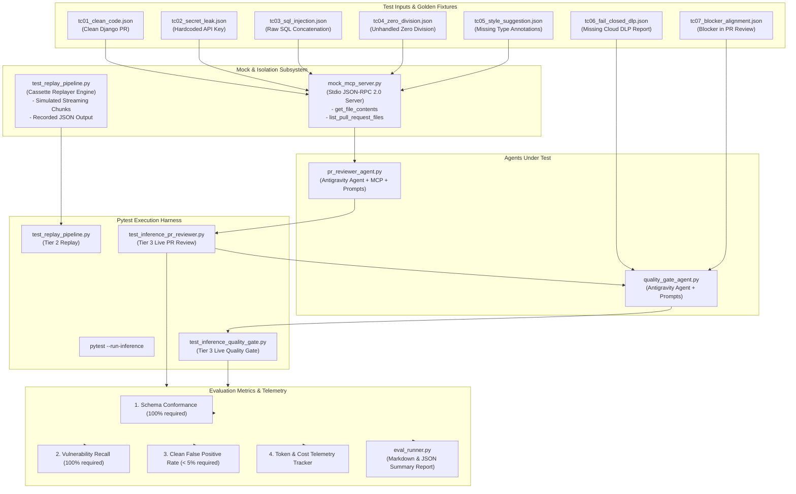
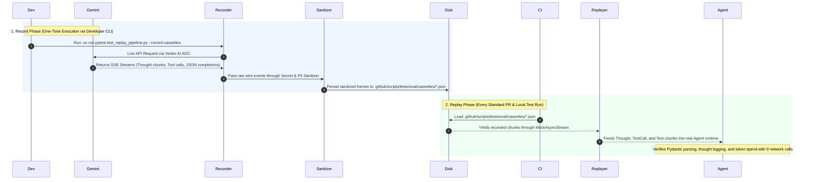
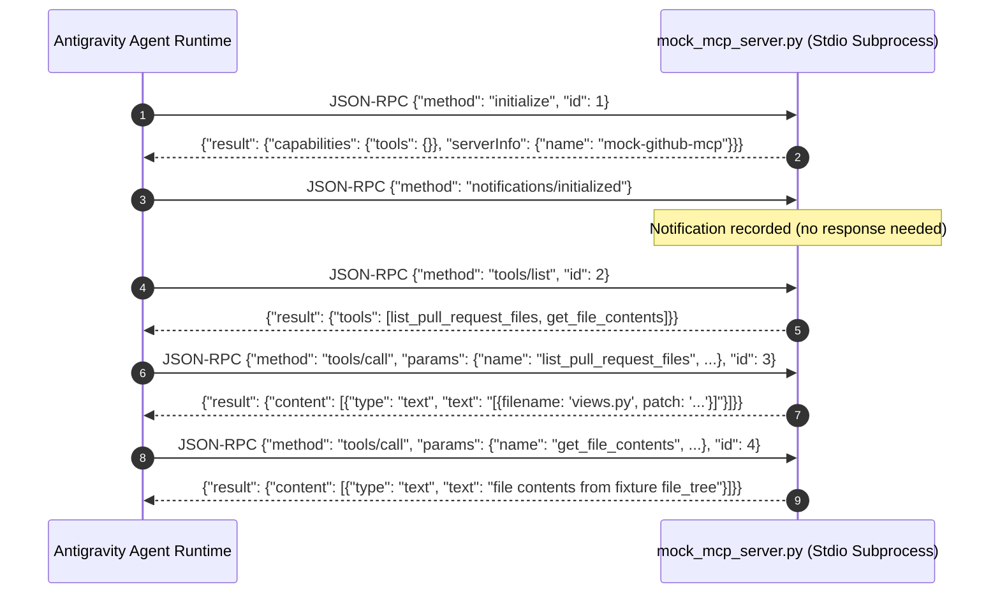

# Feature Implementation Plan: LLM Inference Testing Architecture & Evaluation Framework

## 📋 Todo Checklist
- [ ] Task 1: Define evaluation data schemas and result models in `.github/scripts/tests/eval/evalset_schema.py`
- [ ] Task 2: Author curated golden test cases in `.github/scripts/tests/eval/cases/` (Clean code, Hardcoded secrets, SQL injection, Zero division, Style suggestions, Fail-closed DLP, Blocker alignment)
- [ ] Task 3: Implement lightweight Stdio Mock MCP Server for GitHub diffs and file contents in `.github/scripts/tests/eval/mock_mcp_server.py`
- [ ] Task 4: Implement evaluation metric calculators (Schema Conformance, Vulnerability Recall, Clean FPR, Cost Spend) in `.github/scripts/tests/eval/metrics.py`
- [ ] Task 5: Implement standalone Eval Runner CLI and GitHub Actions Step Summary generator in `.github/scripts/tests/eval/eval_runner.py`
- [ ] Task 6: Implement Tier 2 Cassette Replay Engine and test suite in `.github/scripts/tests/eval/test_replay_pipeline.py` with mock response cassettes in `.github/scripts/tests/eval/cassettes/`
- [ ] Task 7: Enhance Pytest configuration in `.github/scripts/tests/conftest.py` with custom `@pytest.mark.inference` marker, `--run-inference` CLI option, and shared fixtures
- [ ] Task 8: Implement Tier 3 Live Inference test suite for PR Reviewer Agent in `.github/scripts/tests/eval/test_inference_pr_reviewer.py`
- [ ] Task 9: Implement Tier 3 Live Inference test suite for Quality Gate Agent in `.github/scripts/tests/eval/test_inference_quality_gate.py`
- [ ] Task 10: Create GitHub Actions evaluation workflow `.github/workflows/inference-evaluation.yml` for scheduled nightly runs, prompt change triggers, and manual dispatch
- [ ] Task 11: Document Decision D-20 (LLM Inference Testing Architecture & Evaluation Framework) in `docs/spec.md`
- [ ] Task 12: Verify all 124 existing Tier 1 unit/contract tests and Tier 2 replay tests execute and pass with zero cloud calls

---

## 🔍 Analysis & Investigation

### Codebase Structure

The following table summarizes the files involved in the inference testing framework, their physical locations, and responsibilities:

| File Path | Responsibility | Proposed Role in Framework |
| :--- | :--- | :--- |
| [`.github/scripts/pr_reviewer_agent.py`](file:///Users/yannipeng/git-projects/adk-agents/.github/scripts/pr_reviewer_agent.py) | Antigravity PR reviewer agent with GitHub MCP server, budget limits, and Pydantic parsing. | Target agent under test for diff review, inline commenting, and vulnerability detection. |
| [`.github/scripts/quality_gate_agent.py`](file:///Users/yannipeng/git-projects/adk-agents/.github/scripts/quality_gate_agent.py) | Antigravity quality gate agent evaluating DLP scan reports and PR review outcomes. | Target agent under test for release gating and fail-closed security enforcement. |
| [`.github/scripts/helper.py`](file:///Users/yannipeng/git-projects/adk-agents/.github/scripts/helper.py) | Shared utilities for MCP config, token pricing, budget checks, and report serialization. | Referenced by test fixtures and mock MCP server integration. |
| [`.github/scripts/prompt_loader.py`](file:///Users/yannipeng/git-projects/adk-agents/.github/scripts/prompt_loader.py) | Versioned prompt template engine with YAML frontmatter and SHA256 checksums. | Supplies versioned prompt bundles under test; prompts are varied during evaluations. |
| [`.github/scripts/tests/conftest.py`](file:///Users/yannipeng/git-projects/adk-agents/.github/scripts/tests/conftest.py) | Mock SDK fixtures for offline pytest execution. | Enhanced with `--run-inference` flag, `@pytest.mark.inference` marker hook, and fixture factories. |
| [`.github/scripts/tests/eval/evalset_schema.py`](file:///Users/yannipeng/git-projects/adk-agents/.github/scripts/tests/eval/evalset_schema.py) *(New)* | None. | Pydantic data models for evaluation cases, assertion rules, run metrics, and suite summaries. |
| [`.github/scripts/tests/eval/mock_mcp_server.py`](file:///Users/yannipeng/git-projects/adk-agents/.github/scripts/tests/eval/mock_mcp_server.py) *(New)* | None. | Lightweight Stdio JSON-RPC 2.0 Mock GitHub MCP server supplying test case diffs and file trees. |
| [`.github/scripts/tests/eval/metrics.py`](file:///Users/yannipeng/git-projects/adk-agents/.github/scripts/tests/eval/metrics.py) *(New)* | None. | Pure evaluation scoring functions: schema conformance, vulnerability recall, FPR, token/cost spend. |
| [`.github/scripts/tests/eval/eval_runner.py`](file:///Users/yannipeng/git-projects/adk-agents/.github/scripts/tests/eval/eval_runner.py) *(New)* | None. | CLI evaluator and GitHub Actions `$GITHUB_STEP_SUMMARY` Markdown report generator. |
| [`.github/scripts/tests/eval/test_replay_pipeline.py`](file:///Users/yannipeng/git-projects/adk-agents/.github/scripts/tests/eval/test_replay_pipeline.py) *(New)* | None. | Tier 2 offline tests replaying recorded agent response streams and validating Pydantic deserialization. |
| [`.github/scripts/tests/eval/test_inference_pr_reviewer.py`](file:///Users/yannipeng/git-projects/adk-agents/.github/scripts/tests/eval/test_inference_pr_reviewer.py) *(New)* | None. | Tier 3 live inference tests executing `pr_reviewer_agent.py` against golden test cases on Vertex AI. |
| [`.github/scripts/tests/eval/test_inference_quality_gate.py`](file:///Users/yannipeng/git-projects/adk-agents/.github/scripts/tests/eval/test_inference_quality_gate.py) *(New)* | None. | Tier 3 live inference tests executing `quality_gate_agent.py` against golden test cases on Vertex AI. |
| [`.github/workflows/inference-evaluation.yml`](file:///Users/yannipeng/git-projects/adk-agents/.github/workflows/inference-evaluation.yml) *(New)* | None. | GitHub Actions CI/CD workflow running scheduled, prompt PR, and dispatch inference evaluations. |
| [`docs/spec.md`](file:///Users/yannipeng/git-projects/adk-agents/docs/spec.md) | Pipeline architectural specification and decision log (Decisions D-1 to D-19). | Document Decision D-20 (LLM Inference Testing Architecture & Evaluation Framework). |

---

### Current Architecture

Currently, testing across the repository is bifurcated:
1. **Application-level Agent Tests (`adk_bug_ticket_agent`)**: Tests the Django web UI, ADK agent endpoints, and tool handlers.
2. **CI Pipeline Agent Tests (`.github/scripts/tests/`)**: Contains 124 unit and contract tests in `test_pr_reviewer_agent.py`, `test_quality_gate_agent.py`, `test_helper.py`, `test_prompt_loader.py`, and `test_generate_job_summary.py`.

#### Existing Test Structure (Tier 1 Only)
- In `.github/scripts/tests/conftest.py`, a synthetic mock `google.antigravity` module is injected into `sys.modules` if the proprietary package is not installed.
- All existing tests run in `< 5s` without making any cloud or network calls.
- Agent interactions are mocked using `unittest.mock.AsyncMock` or `unittest.mock.patch`, returning pre-fabricated mock objects.

#### Limitations of the Current Approach
1. **No Live Model Evaluation**: The unit tests verify Python wiring and schema validation logic, but cannot verify whether the actual Gemini model (`gemini-3.7-flash` or `gemini-3.8-flash`) correctly classifies subtle security vulnerabilities, extracts diff coordinates, or adheres to the system instructions when given complex code.
2. **No Regression Guard on Prompt Modifications**: When an engineer edits a prompt template in `.github/prompts/` (e.g., adding rules or adjusting severity thresholds), there is no automated regression test to verify that the model doesn't start hallucinating, missing security defects, or rejecting clean PRs.
3. **No Intermediate Replay Layer (Tier 2)**: If an engineer wants to test the streaming chunk consumer (`Thought`, `ToolCall`, `ToolResult`, `Text`) or budget early-halt handlers, they must construct complex mocks by hand rather than using a standard cassette replay engine.
4. **Docker Dependency for GitHub MCP**: In production, `pr_reviewer_agent.py` launches a Docker container running `ghcr.io/github/github-mcp-server:v0.27.0`. This makes running end-to-end inference tests in local development or minimal CI runners problematic without Docker-in-Docker.

---

### Dependencies & Integration Points

- **Google Antigravity Python SDK (`google.antigravity`)**:
  - `Agent(config)`: Context manager running the agent event loop.
  - `LocalAgentConfig`: Agent configuration taking `vertex=True`, `project`, `location`, `model`, `response_schema`, `budget_config`, and `mcp_servers`.
  - `types.McpStdioServer`: Spawns and manages Stdio-based MCP processes.
  - `types.Thought`, `types.ToolCall`, `types.ToolResult`, `types.Text`: Streaming chunk types.
  - `types.StopReason` & `types.BudgetConfig`: Budget limits and stop reason introspection.
- **Pydantic v2 (`BaseModel`, `Field`, `model_validator`)**:
  - Validates golden test case fixtures (`EvalCase`), output assertions, and execution telemetry metrics.
- **JSON-RPC 2.0 via Stdio (Python Standard Library `sys.stdin`, `sys.stdout`, `json`)**:
  - Lightweight mock MCP server implementing Model Context Protocol without external network calls or Docker.
- **Pytest (`pytest`, `pytest-asyncio`)**:
  - Test runner with custom CLI flag `--run-inference` and marker `@pytest.mark.inference`.
- **Google Cloud Vertex AI**:
  - Live Gemini inference backend authenticated via Workload Identity Federation (WIF) or Application Default Credentials (ADC).

---

### Considerations & Challenges

1. **Test Isolation & Speed (Do Not Slow Down Standard PRs)**:
   Standard PRs and local tests must remain fast and offline. By default, running `pytest .github/scripts/tests/` must skip live inference tests and run only Tier 1 (unit) and Tier 2 (cassette replay) tests in `< 6s`. Live inference (Tier 3) will only run when `--run-inference` is explicitly provided.
2. **Deterministic Mock MCP Server for GitHub Tools**:
   In `pr_reviewer_agent.py`, the agent expects a GitHub MCP server to provide tools like `get_file_contents` and `list_pull_request_files`. A live GitHub repo cannot be required for reproducible testing. The mock MCP server must implement JSON-RPC 2.0 over standard I/O, responding synchronously with test case diffs and file contents.
3. **Budget and Cost Governance**:
   Live inference runs must be strictly bounded. Every test run must configure `BudgetConfig(max_total_tokens=150000, max_model_calls=5, max_tool_calls=10)` and log exact dollar spend to ensure nightly runs cost pennies ($< \$0.05$ per run).
4. **Vertex AI / ADC Authentication Graceful Fallback**:
   If an engineer passes `--run-inference` locally but lacks active GCP credentials, the runner must fail fast with a descriptive warning rather than hanging or generating cryptic stack traces.
5. **Schema Conformance Invariant**:
   Any LLM output that fails Pydantic schema validation is an immediate critical failure ($S_{schema} < 100\%$). Model hallucinated keys or invalid types must be flagged instantly.

---

## 📐 Technical Specification & Design

### Component Architecture

The framework is organized into three distinct testing tiers:

```
┌────────────────────────────────────────────────────────────────────────────────────────┐
│                                 THE 3-TIER TESTING PYRAMID                             │
├────────────────────────────────────────────────────────────────────────────────────────┤
│                                                                                        │
│   ▲  Tier 3: Golden Dataset Live Inference Evaluation                                 │
│  ╱█╲  - Runs live Gemini (gemini-3.7-flash) on Vertex AI                               │
│ ╱███╲ - Triggered on: Nightly cron, Prompt PRs (.github/prompts/**), Manual dispatch  │
│╱█████╲- Asserts: 100% Blocker Recall, <5% Clean FPR, 100% Pydantic Schema Conformance  │
├────────────────────────────────────────────────────────────────────────────────────────┤
│   Tier 2: Recorded Cassette / Mock Connection Replay Tests                             │
│   - Offline, 0 Cloud Calls, Runs in ~1 second                                          │
│   - Tests full async streaming loop: Thought, ToolCall, ToolResult, Text chunks        │
│   - Tests budget exhaustion StopReason handling and Pydantic structured_output()       │
├────────────────────────────────────────────────────────────────────────────────────────┤
│   Tier 1: Deterministic Contract & Unit Tests (Existing 124 Tests)                     │
│   - Fast (< 5s), 0 Cost, Runs on every commit and PR                                  │
│   - Tests helper.py, prompt_loader.py, Pydantic invariants, fallback error handling    │
└────────────────────────────────────────────────────────────────────────────────────────┘
```

#### Detailed Architecture & Data Flow



---

### Comparative Analysis of Testing Tiers (Tier 1 vs. Tier 2 vs. Tier 3)

The testing architecture distributes validation across three distinct layers to balance execution speed, cloud costs, credential security, and model fidelity:

```
┌─────────────────────────────────────────────────────────────────────────────────────────┐
│                               WHERE THE ISOLATION OCCURS                                │
├─────────────────────────────────────────────────────────────────────────────────────────┤
│                                                                                         │
│  Tier 1 (Synthetic Unit): Mocks at the Python Function Level                            │
│  Agent.chat() ──► [ AsyncMock returns hand-crafted Python Pydantic object ]             │
│                                                                                         │
│  Tier 2 (Cassette Replay): Mocks at the Network Wire Level                              │
│  Agent.chat() ──► [ Real SDK Event Loop & Streaming Handler ]                           │
│                         └──► HTTP Transport Intercept ──► [ Recorded Cassette JSON ]    │
│                                                                                         │
│  Tier 3 (Live Inference): No Mocking (Full End-to-End Execution)                        │
│  Agent.chat() ──► [ Real SDK Event Loop ] ──► [ Vertex AI / Gemini 3.7 Flash ]          │
│                                                                                         │
└─────────────────────────────────────────────────────────────────────────────────────────┘
```

#### Side-by-Side Comparison Matrix

| Evaluation Dimension | Tier 1: Deterministic Contract & Unit | Tier 2: Recorded Cassette Replay | Tier 3: Golden Dataset Live Inference |
| :--- | :--- | :--- | :--- |
| **Primary Objective** | Validate Python business logic, input validation, and fallback branches. | Validate SDK event loop, streaming chunk iteration, and raw JSON parsing. | Validate model reasoning quality, prompt effectiveness, and security recall. |
| **Isolation Boundary** | Inside Python application code (`Agent.chat` patched). | At the HTTP transport/socket layer (wire traffic replayed). | Unmocked (live outbound connection to Google Vertex AI). |
| **Data Injected** | Hardcoded, hand-crafted Python objects (`PRReviewReport(...)`). | Raw recorded wire frames (SSE packets, raw JSON strings, token headers). | Uncontrolled live LLM completions generated from golden input diffs. |
| **Execution Latency** | **< 5 seconds** (for all 124 existing unit tests). | **< 1.5 seconds** (for all cassette replay tests). | **30 to 60 seconds** (depending on Gemini API latency and token volume). |
| **Cloud Cost & Spend** | **$0.00** (Zero API calls). | **$0.00** (Zero API calls during test runs). | **~$0.01 – $0.05 per suite run** (tracked via `metrics.py`). |
| **GCP Credentials Required** | **No** (runs offline with mock SDK tree). | **No** (runs offline on developer laptops and GitHub Actions). | **Yes** (requires Vertex AI Workload Identity Federation or ADC). |
| **Default PR CI Gating** | **Runs on every commit & PR** (mandatory gate). | **Runs on every commit & PR** (mandatory gate). | **Gated** (runs only on prompt PRs, nightly cron, or manual dispatch). |
| **Antigravity SDK Exercised** | ❌ None (bypassed via `unittest.mock`). | ✅ Full (`Agent`, `chunks`, `structured_output`). | ✅ Full (`Agent`, `chunks`, `structured_output`, live Vertex AI). |
| **Prompt Quality Evaluated** | ❌ None (returns static pre-baked answers). | ❌ None (replays historic model outputs). | ✅ Full (evaluates new prompt variations and model versions). |

---

#### Tier 1: Deterministic Contract & Unit Tests

##### Summary
Tier 1 represents the existing 124 unit and contract tests located in [`.github/scripts/tests/`](file:///Users/yannipeng/git-projects/adk-agents/.github/scripts/tests/). These tests mock the `Agent.chat` coroutine at the Python level using `unittest.mock.AsyncMock` or `unittest.mock.patch`, returning pre-constructed Pydantic instances. They verify configuration resolution ([`resolve_env_config`](file:///Users/yannipeng/git-projects/adk-agents/.github/scripts/helper.py#L40)), prompt template rendering ([`load_prompt_bundle`](file:///Users/yannipeng/git-projects/adk-agents/.github/scripts/prompt_loader.py#L65)), Pydantic validator invariants ([`enforce_blocker_status`](file:///Users/yannipeng/git-projects/adk-agents/.github/scripts/pr_reviewer_agent.py#L107)), token spend math ([`calculate_token_spend`](file:///Users/yannipeng/git-projects/adk-agents/.github/scripts/helper.py#L190)), and regex-based fallback pathways.

##### Differences from Other Tiers
- **No SDK Runtime Execution**: The Antigravity agent context manager, streaming event loop, and network communication layers are completely bypassed.
- **Hand-Crafted Objects**: Tests feed already-instantiated Python models directly into downstream functions, rather than passing raw JSON over the wire.
- **Immediate Feedback**: Runs entirely in memory in milliseconds without disk I/O or network connections.

##### Pros
- **Blazing Fast**: Runs in `< 5s` across the entire repository, providing instant feedback in local edit loops.
- **100% Deterministic**: Never subject to LLM non-determinism, temperature fluctuations, or network timeouts.
- **Zero Cost & Zero Credentials**: Incurs no cloud billing and requires no GCP service accounts, API keys, or Docker containers.
- **High Branch Coverage**: Ideal for simulating rare failure conditions (e.g., HTTP 503 from GitHub, corrupt DLP scan JSON, missing environment variables).

##### Cons
- **Blind to Real JSON Deserialization**: Because pre-built Python objects are passed directly, schema deserialization bugs (e.g., Gemini emitting string integers or missing optional fields) are never discovered.
- **Ignores Streaming Chunk Protocol**: Does not exercise the `async for chunk in response.chunks` loop or verify handling of real `types.Thought`, `types.ToolCall`, and `types.Text` objects.
- **Cannot Detect LLM Hallucinations or Regressions**: Changing system prompt instructions cannot be verified using Tier 1 because the mock returns whatever the developer hardcoded.

---

#### Tier 2: Recorded Cassette & Mock Connection Replay Tests

##### Summary
Tier 2 introduces deterministic replay testing via `.github/scripts/tests/eval/test_replay_pipeline.py`. When recorded (either during initial development or after intentional schema revisions), real Gemini API responses are saved to disk as raw JSON/SSE cassettes in `.github/scripts/tests/eval/cassettes/`. During test execution, the test harness intercepts the network transport and streams these recorded frames back into the real Antigravity SDK [`Agent`](file:///Users/yannipeng/git-projects/adk-agents/.github/scripts/pr_reviewer_agent.py#L254) runtime.

##### Differences from Other Tiers
- **Real SDK Code Path with Zero Network Calls**: Unlike Tier 1, the real `Agent` context manager, event loop, streaming chunk dispatcher, and Pydantic `response.structured_output()` deserializer run for real. Unlike Tier 3, no actual outbound HTTP requests leave the test machine.
- **Realistic Wire Payloads**: Replays raw SSE chunks, actual thought payloads, and unparsed model JSON strings rather than artificial mock objects.

##### Pros
- **End-to-End Python Pipeline Validation**: Guarantees that the application code, Antigravity SDK classes, and Pydantic models interoperate correctly on real-world wire data.
- **Completely Offline and Fast**: Runs in `< 1.5s` without internet access, making it suitable to run on every local `git push` and standard pull request.
- **Tests Complex Streaming Logic**: Reliably exercises the thought-logging hooks, tool-call tracking, and token budget exhaustion handlers ([`types.StopReason`](file:///Users/yannipeng/git-projects/adk-agents/.github/scripts/helper.py#L23)) without waiting for slow API responses.
- **Stable Integration Regression Gate**: Catches unexpected breaking changes in SDK library updates before they hit production.

##### Cons
- **Static Model Output**: Does not evaluate whether an updated prompt in `.github/prompts/` produces better reasoning or fixes a hallucination (it replays the historical output).
- **Maintenance Overhead on Breaking Schema Changes**: When Pydantic schemas change significantly, cassettes must be re-recorded using a single record command.

##### How Cassette Data is Acquired (Recording vs. Replaying)

Cassettes capture the verbatim wire traffic exchanged between the Antigravity agent runtime and the Gemini API so that subsequent test runs can replay it without network access.



###### 1. The Recording Process (How to Generate Cassettes)
Cassettes are recorded once during initial feature setup, or re-recorded whenever agent schemas or prompt bundle structures change intentionally.
- **Recording Command**:
  ```bash
  # Record all golden test case cassettes:
  GOOGLE_GENAI_USE_VERTEXAI=true uv run pytest .github/scripts/tests/eval/test_replay_pipeline.py --record-cassettes

  # Or record a specific single test case:
  uv run pytest .github/scripts/tests/eval/test_replay_pipeline.py --record-cassettes -k "tc02_secret_leak"
  ```
- **What is Captured During Recording**:
  1. **Input Payload**: The exact system prompt, user prompt, and tool definitions dispatched to the model.
  2. **Streaming Event Sequence**: The raw Server-Sent Events (SSE) yielded by the Gemini API, serialized into an ordered array of chunk objects:
     - `Thought` chunks: The internal reasoning steps emitted by Gemini 2.0/3.7 thinking models.
     - `ToolCall` chunks: The function names and argument dictionaries dispatched by the agent (e.g. `list_pull_request_files`).
     - `ToolResult` chunks: The simulated tool response payloads returned back into the agent turn.
     - `Text` chunks: The final generative content emitted by the model.
  3. **Structured Output Payload**: The verbatim, unparsed JSON string emitted for `response.structured_output()`.
  4. **Usage Metadata**: Prompt token count, candidates token count, cached token count, thought token count, and total token count.
  5. **Finish Status**: The execution termination condition (`types.StopReason.STOP` or `types.StopReason.BUDGET_REACHED`).

###### 2. Automated Sanitization & Redaction
Before the recorder commits any cassette to disk, it passes through an automated sanitization filter:
- Strips live Google Cloud project IDs, replacing them with `test-gcp-project`.
- Redacts GitHub personal access tokens, replacing them with `ghp_REDACTED_MOCK_TOKEN`.
- Neutralizes temporary local file paths, ensuring cross-platform reproducibility between macOS and Linux CI runners.

###### 3. File System Storage & Cassette Schema
Cassettes are committed directly to Git in `.github/scripts/tests/eval/cassettes/<case_id>.json`:

```json
{
  "case_id": "tc02_secret_leak",
  "model": "gemini-3.7-flash",
  "recorded_at": "2026-09-16T03:00:00Z",
  "usage_metadata": {
    "prompt_token_count": 1420,
    "candidates_token_count": 315,
    "thought_token_count": 128,
    "total_token_count": 1735
  },
  "stop_reason": "STOP",
  "chunks": [
    {
      "type": "Thought",
      "content": "Analyzing modified files diff. Detected AWS_SECRET_ACCESS_KEY assignment on line 42."
    },
    {
      "type": "Text",
      "content": "{\"overall_status\": \"REQUEST_CHANGES\", \"findings\": [{\"file_path\": \"settings.py\", \"line_number\": 42, \"severity\": \"BLOCKER\", \"pii_leak\": true, \"title\": \"Hardcoded AWS Secret Key\", \"details\": \"Secret detected\", \"suggestion\": \"Move to Secret Manager\"}]}"
    }
  ],
  "raw_structured_output": {
    "overall_status": "REQUEST_CHANGES",
    "summary": "Hardcoded AWS secret key detected in settings.py.",
    "findings": [
      {
        "file_path": "settings.py",
        "line_number": 42,
        "severity": "BLOCKER",
        "pii_leak": true,
        "title": "Hardcoded AWS Secret Key",
        "details": "Secret detected",
        "suggestion": "Move to Secret Manager"
      }
    ]
  }
}
```

###### 4. Replay Mechanism (How Tests Consume Cassettes)
During regular local test execution (`pytest`) and standard PR CI runs:
1. `test_replay_pipeline.py` loads the corresponding `.json` cassette from `.github/scripts/tests/eval/cassettes/`.
2. A lightweight `CassetteReplayTransport` mocks the underlying HTTP client of the Antigravity SDK.
3. When `await agent.chat(...)` is called, the transport streams the recorded chunks asynchronously via a Python generator yielding native `types.Thought`, `types.ToolCall`, and `types.Text` objects.
4. When `await response.structured_output()` is awaited, the transport returns the raw recorded JSON string.
5. The real application code ([`pr_reviewer_agent.py`](file:///Users/yannipeng/git-projects/adk-agents/.github/scripts/pr_reviewer_agent.py) or [`quality_gate_agent.py`](file:///Users/yannipeng/git-projects/adk-agents/.github/scripts/quality_gate_agent.py)) executes its actual parsing, logging, and validation logic without knowing the network was mocked.

---

#### Tier 3: Golden Dataset Live Inference Evaluation Suite

##### Summary
Tier 3 is the automated evaluation framework executing live Gemini models (`gemini-3.7-flash` or `gemini-3.8-flash`) against curated golden test cases (`tc01` through `tc07`). The suite runs via `pytest .github/scripts/tests/eval/ -m inference --run-inference` or via `.github/workflows/inference-evaluation.yml`. It computes objective performance metrics: Schema Conformance Rate ($S_{schema}$), Vulnerability Recall ($R_{blocker}$), Clean False Positive Rate ($FPR_{clean}$), and exact token and dollar expenditures.

##### Differences from Other Tiers
- **Zero Mocking of the Cognitive Engine**: Tests the actual generative model running in Google Cloud Vertex AI against versioned prompts loaded by [`PromptLoader`](file:///Users/yannipeng/git-projects/adk-agents/.github/scripts/prompt_loader.py#L65).
- **Stochastic Quality Assessment**: Evaluates non-deterministic LLM behavior across diverse code scenarios (clean code, secret leaks, SQL injections, logic bugs, fail-closed DLP checks).

##### Pros
- **Definitive Quality & Security Assurance**: Directly measures whether the agent catches real vulnerabilities (100% target recall) and avoids blocking clean developer code (< 5% target false positive rate).
- **Safe Prompt Iteration**: Allows engineers to safely modify system instructions, add rules, or tweak few-shot examples in `.github/prompts/`, knowing the test suite will flag hallucinations or security blind spots.
- **Model Upgrade Validation**: Provides an automated benchmark to compare performance and token costs when switching models (e.g., evaluating `gemini-3.8-flash` vs. `gemini-3.7-flash`).
- **Audit Telemetry**: Generates markdown and JSON summaries publishing exact token usage, reasoning token counts, and cost telemetry to `$GITHUB_STEP_SUMMARY`.

##### Cons
- **Requires Cloud Credentials**: Requires active Vertex AI Workload Identity Federation (WIF) or GCP Application Default Credentials (ADC).
- **Execution Cost & Rate Limits**: Costs ~$0.01 – $0.05 per suite run and consumes Vertex AI quota; cannot be run indiscriminately on every minor commit.
- **Higher Latency**: Takes 30 to 60 seconds to complete due to model inference times and tool reasoning turns.
- **Stochastic Flakiness Potential**: Minor phrasing changes in generative output require assertion design to focus on structured fields, enums, and boolean flags rather than brittle exact string matching.

---

#### Recommendation & Execution Trigger Matrix

| Event / Trigger | Tier 1 (Unit) | Tier 2 (Replay) | Tier 3 (Live Inference) | Rationale |
| :--- | :---: | :---: | :---: | :--- |
| **Local Development / Code Save** | ✅ Run | ✅ Run | ❌ Skip | Keep local iteration instantaneous (< 6s total) with zero cloud dependencies. |
| **Standard Application Pull Request** | ✅ Run | ✅ Run | ❌ Skip | Fast, cost-free CI gate; prevents burning Vertex AI token quota on application PRs. |
| **Prompt Template PR (`.github/prompts/**`)** | ✅ Run | ✅ Run | ✅ Run | Mandatory: verify prompt revisions do not regress security recall or schema validity. |
| **Agent Script PR (`.github/scripts/**`)** | ✅ Run | ✅ Run | ✅ Run | Mandatory: verify agent runtime code changes against live Vertex AI. |
| **Nightly Scheduled Build (2:00 AM UTC)** | ✅ Run | ✅ Run | ✅ Run | Continuously monitors for subtle upstream model drift or API deprecations. |
| **Manual Dispatch (`workflow_dispatch`)** | ✅ Run | ✅ Run | ✅ Run | Allows on-demand benchmarking during model migrations or security audits. |

---

### Schemas & Models (`evalset_schema.py`)

The evaluation framework uses strict Pydantic v2 schemas to define test cases, assertions, run metrics, and overall suite summaries.

```python
"""Pydantic schemas for the LLM Inference Evaluation Suite."""

from __future__ import annotations

from enum import Enum
from typing import Optional, Any, Dict, List
from pydantic import BaseModel, Field, model_validator

# Re-exporting from existing agents for seamless validation
from pr_reviewer_agent import ReviewStatus, PRFindingSeverity
from quality_gate_agent import SeverityLevel, ViolationCategory


class ExpectedFindingAssertion(BaseModel):
    """Assertion criteria for an individual finding within PRReviewReport."""
    file_path: Optional[str] = None
    expected_severity: Optional[PRFindingSeverity] = None
    min_severity: Optional[PRFindingSeverity] = None
    keyword_in_title_or_details: Optional[str] = None
    must_detect_pii: Optional[bool] = None


class ExpectedReviewAssertion(BaseModel):
    """Expected outcome assertions for PRReviewReport."""
    expected_status: List[ReviewStatus] = Field(
        default_factory=lambda: [ReviewStatus.APPROVE]
    )
    min_findings: int = 0
    max_findings: Optional[int] = None
    has_blockers: Optional[bool] = None
    required_findings: List[ExpectedFindingAssertion] = Field(default_factory=list)


class ExpectedGateAssertion(BaseModel):
    """Expected outcome assertions for QualityGateDecision."""
    expected_passed: bool
    min_failures: int = 0
    max_failures: Optional[int] = None
    expected_failure_categories: List[ViolationCategory] = Field(default_factory=list)
    expected_severities: List[SeverityLevel] = Field(default_factory=list)
    keyword_in_summary_or_reason: Optional[str] = None


class EvalCase(BaseModel):
    """Schema representing a golden evaluation test case fixture."""
    case_id: str
    name: str
    description: str
    category: str  # "clean", "secret_leak", "vulnerability", "logic_defect", "style", "fail_closed"
    pr_number: str = "101"
    repo: str = "octocat/hello-world"
    diff_content: str
    modified_files: Dict[str, List[int]] = Field(default_factory=dict)
    file_tree: Dict[str, str] = Field(default_factory=dict)
    pii_scan_content: str = "✅ No sensitive data or PII detected by Cloud DLP."
    pr_review_content: Optional[str] = None
    expected_review: Optional[ExpectedReviewAssertion] = None
    expected_gate: Optional[ExpectedGateAssertion] = None


class EvalRunMetric(BaseModel):
    """Execution telemetry and assertion results for a single test case run."""
    case_id: str
    name: str
    category: str
    agent_target: str  # "pr_reviewer" or "quality_gate"
    duration_seconds: float
    schema_valid: bool
    schema_error: Optional[str] = None
    status_match: bool
    blocker_recall: Optional[float] = None
    clean_fpr: Optional[float] = None
    findings_count: int = 0
    detected_blockers: int = 0
    prompt_tokens: int = 0
    candidate_tokens: int = 0
    cached_tokens: int = 0
    thought_tokens: int = 0
    total_tokens: int = 0
    cost_usd: float = 0.0
    passed_all_assertions: bool
    failure_reasons: List[str] = Field(default_factory=list)


class EvalSuiteSummary(BaseModel):
    """Consolidated summary of an entire evaluation execution suite."""
    timestamp: str
    model_name: str
    total_cases: int
    passed_cases: int
    failed_cases: int
    overall_pass_rate: float
    schema_conformance_rate: float
    vulnerability_recall: float
    clean_false_positive_rate: float
    total_tokens: int
    total_cost_usd: float
    avg_latency_seconds: float
    prompt_versions: Dict[str, str] = Field(default_factory=dict)
    case_metrics: List[EvalRunMetric] = Field(default_factory=list)
```

---

### Stdio Mock MCP Server (`mock_mcp_server.py`)

In production, `pr_reviewer_agent.py` spawns a Docker container running `ghcr.io/github/github-mcp-server:v0.27.0`. For testing inference without Docker or a live GitHub repository, `mock_mcp_server.py` implements a zero-dependency JSON-RPC 2.0 server communicating over standard input and output (`stdio`).



#### Key API Signatures for `mock_mcp_server.py`

```python
class MockGitHubMcpServer:
    """Implements JSON-RPC 2.0 Stdio protocol for GitHub MCP tools."""

    def __init__(self, fixture_path: str):
        self.fixture = self._load_fixture(fixture_path)

    def _load_fixture(self, path: str) -> EvalCase:
        ...

    def handle_initialize(self, request_id: Any, params: Dict[str, Any]) -> Dict[str, Any]:
        """Returns standard MCP initialize result."""
        ...

    def handle_tools_list(self, request_id: Any) -> Dict[str, Any]:
        """Returns schemas for get_file_contents and list_pull_request_files."""
        ...

    def handle_tools_call(self, request_id: Any, name: str, args: Dict[str, Any]) -> Dict[str, Any]:
        """Executes tool calls returning fixture file contents and diff hunks."""
        ...

    def run_stdio_loop(self) -> None:
        """Reads newline-delimited JSON-RPC from sys.stdin and writes to sys.stdout."""
        ...


def create_mock_mcp_config(fixture_path: str) -> Any:
    """Factory creating types.McpStdioServer configured to run mock_mcp_server.py."""
    ...
```

---

### Metric Calculation Functions (`metrics.py`)

Pure, side-effect-free scoring functions calculate all objective evaluation dimensions:

1. **Schema Conformance Rate ($S_{schema}$)**:
   $$\text{Conform Rate} = \frac{\sum_{i=1}^N \mathbb{I}(\text{run}_i \text{ parsed by Pydantic})}{N}$$
   Target: **100%**.

2. **Vulnerability & Blocker Recall ($R_{vuln}$)**:
   For all test cases with known defects ($Y=1$):
   $$\text{Recall} = \frac{\text{True Positives}}{\text{True Positives} + \text{False Negatives}}$$
   Target: **100%** (no security/logic defect may be marked `APPROVE`).

3. **Clean False Positive Rate ($FPR_{clean}$)**:
   For clean test cases ($Y=0$):
   $$\text{FPR} = \frac{\text{False Positives}}{\text{False Positives} + \text{True Negatives}}$$
   Target: **$< 5\%$** (clean code must not be rejected).

4. **Token & Cost Spend**:
   Computes total spend across prompt tokens ($0.75 / 1M), cached tokens ($0.075 / 1M), and candidate/reasoning tokens ($3.75 / 1M) for Gemini 3.7/3.8 Flash.

```python
def calculate_schema_conformance(results: List[EvalRunMetric]) -> float: ...
def calculate_vulnerability_recall(results: List[EvalRunMetric]) -> float: ...
def calculate_clean_false_positive_rate(results: List[EvalRunMetric]) -> float: ...
def calculate_total_and_average_spend(results: List[EvalRunMetric]) -> Dict[str, float]: ...
def evaluate_case_assertions(case: EvalCase, report: Any, duration: float, usage: Dict[str, Any]) -> EvalRunMetric: ...
```

---

## 📝 Step-by-Step Implementation Steps

### Step 1: Evaluation Schema Definition & Core Models
- **Files to create**: `.github/scripts/tests/eval/evalset_schema.py`, `.github/scripts/tests/eval/__init__.py`
- **Changes needed**:
  - Implement Pydantic models: `ExpectedFindingAssertion`, `ExpectedReviewAssertion`, `ExpectedGateAssertion`, `EvalCase`, `EvalRunMetric`, `EvalSuiteSummary`.
  - Include validation to ensure `EvalCase` holds valid JSON structure and cross-references existing agent enums (`ReviewStatus`, `PRFindingSeverity`, `SeverityLevel`, `ViolationCategory`).
- **Implementation Notes**: Import enums safely using relative path injection if needed, matching the pattern in existing tests.
- **Status**: `- [ ]`

### Step 2: Golden Dataset Test Case Fixtures
- **Files to create**:
  - `.github/scripts/tests/eval/cases/tc01_clean_code.json`
  - `.github/scripts/tests/eval/cases/tc02_secret_leak.json`
  - `.github/scripts/tests/eval/cases/tc03_sql_injection.json`
  - `.github/scripts/tests/eval/cases/tc04_zero_division.json`
  - `.github/scripts/tests/eval/cases/tc05_style_suggestion.json`
  - `.github/scripts/tests/eval/cases/tc06_fail_closed_dlp.json`
  - `.github/scripts/tests/eval/cases/tc07_blocker_alignment.json`
- **Changes needed**:
  - Populate each JSON fixture matching `EvalCase` schema:
    - `TC-01`: Clean Django view and test file. Expects `APPROVE`, 0 blockers, `passed=True`.
    - `TC-02`: Source diff containing hardcoded GitHub API token `ghp_xxxx` and Bearer token. Expects `REQUEST_CHANGES`, finding severity `BLOCKER`, `pii_leak=True`, gate `passed=False`.
    - `TC-03`: Source diff with raw string formatting into SQL cursor: `f"SELECT * FROM users WHERE id = '{user_id}'"`. Expects `REQUEST_CHANGES`, severity `BLOCKER`, remediation mentioning parameterized queries.
    - `TC-04`: Unchecked division: `avg = total / count` without checking `if count == 0`. Expects finding noting unhandled `ZeroDivisionError`.
    - `TC-05`: Function missing type hint or docstring. Expects `APPROVE` or `COMMENT` with severity `SUGGESTION` or `INFO`, gate `passed=True`.
    - `TC-06`: Missing DLP report file. Expects gate `passed=False`, severity `CRITICAL`, component `"Cloud DLP"`.
    - `TC-07`: PR review contains blockers, but DLP report is clean. Expects gate `passed=False`, category `ARCHITECTURAL_DEFECT`.
- **Status**: `- [ ]`

### Step 3: Lightweight Stdio Mock MCP Server
- **Files to create**: `.github/scripts/tests/eval/mock_mcp_server.py`
- **Changes needed**:
  - Implement JSON-RPC 2.0 stdio server handling `initialize`, `notifications/initialized`, `tools/list`, and `tools/call`.
  - Handle CLI flag `--fixture <path_to_tc_json>`.
  - Tool `list_pull_request_files`: returns array of files with `filename`, `status: "modified"`, `patch: case.diff_content`.
  - Tool `get_file_contents`: returns content from `case.file_tree[path]`.
  - Provide helper `create_mock_github_mcp_server(fixture_path: str) -> types.McpStdioServer` which sets command `sys.executable`, args `[mock_mcp_server_path, "--fixture", fixture_path]`.
- **Implementation Notes**: Pure Python standard library (`sys.stdin`, `sys.stdout`, `json`, `argparse`). Unbuffered standard output (`sys.stdout.flush()`).
- **Status**: `- [ ]`

### Step 4: Metric Calculation Functions & Assertion Evaluator
- **Files to create**: `.github/scripts/tests/eval/metrics.py`
- **Changes needed**:
  - Implement calculation functions:
    - `calculate_schema_conformance(results)`
    - `calculate_vulnerability_recall(results)`
    - `calculate_clean_false_positive_rate(results)`
    - `calculate_cost_telemetry(results)`
    - `evaluate_case_assertions(case, report_or_decision, duration, usage_data)`
- **Implementation Notes**: Handle edge cases like division by zero (e.g. if 0 clean test cases are run, FPR is 0.0).
- **Status**: `- [ ]`

### Step 5: Standalone Eval Runner CLI & Step Summary Generator
- **Files to create**: `.github/scripts/tests/eval/eval_runner.py`
- **Changes needed**:
  - CLI script with `--run-all`, `--model`, `--output-dir`, and `--generate-summary` flags.
  - Generates `reports/eval-summary.json` and formatted GitHub Step Summary Markdown `reports/eval-summary.md`.
  - Renders visual status badges, metric comparison tables, and detailed case breakdowns.
- **Status**: `- [ ]`

### Step 6: Tier 2 Cassette Replay Engine & Offline Replay Tests
- **Files to create**:
  - `.github/scripts/tests/eval/cassettes/pr_reviewer_clean.json`
  - `.github/scripts/tests/eval/cassettes/pr_reviewer_secret_leak.json`
  - `.github/scripts/tests/eval/cassettes/quality_gate_pass.json`
  - `.github/scripts/tests/eval/cassettes/quality_gate_fail.json`
  - `.github/scripts/tests/eval/test_replay_pipeline.py`
- **Changes needed**:
  - Author recorded response cassettes with chunk sequences (`Thought`, `ToolCall`, `ToolResult`, `Text`), `usage_metadata`, `stop_reason`, and `structured_output`.
  - Implement `CassetteReplayAgent` simulating `Agent(config)` context manager and chunk streaming.
  - Implement Tier 2 tests verifying:
    - Chunk iteration logic in `pr_reviewer_agent.py`
    - Budget limit early halt without calling `structured_output()`
    - Deserialization into `PRReviewReport` and `QualityGateDecision`
    - Token spend calculations with 0 cloud network calls.
- **Status**: `- [ ]`

### Step 7: Pytest Configuration & Test Fixture Extensions
- **Files to modify**: `.github/scripts/tests/conftest.py`
- **Changes needed**:
  - Add `pytest_addoption(parser)` for `--run-inference`.
  - Add `pytest_configure(config)` registering marker `inference`.
  - Add `pytest_collection_modifyitems(config, items)` to automatically skip `@pytest.mark.inference` tests when `--run-inference` is NOT supplied.
  - Add shared fixtures: `eval_cases_dir`, `load_eval_case`, `mock_dlp_report`, `mock_pr_review_file`.
- **Status**: `- [ ]`

### Step 8: Tier 3 Live Inference Tests for PR Reviewer Agent
- **Files to create**: `.github/scripts/tests/eval/test_inference_pr_reviewer.py`
- **Changes needed**:
  - Mark test functions with `@pytest.mark.inference` and `@pytest.mark.asyncio`.
  - Test case parameterization across `tc01_clean_code`, `tc02_secret_leak`, `tc03_sql_injection`, `tc04_zero_division`, `tc05_style_suggestion`.
  - Use `create_mock_github_mcp_server(case_fixture)` to supply diffs and files to `pr_reviewer_agent.run_pr_review()`.
  - Assert schema conformance, status match, blocker recall, and budget constraints.
- **Status**: `- [ ]`

### Step 9: Tier 3 Live Inference Tests for Quality Gate Agent
- **Files to create**: `.github/scripts/tests/eval/test_inference_quality_gate.py`
- **Changes needed**:
  - Mark test functions with `@pytest.mark.inference` and `@pytest.mark.asyncio`.
  - Test case parameterization across `tc01_clean_code`, `tc02_secret_leak`, `tc06_fail_closed_dlp`, `tc07_blocker_alignment`.
  - Write temporary DLP and PR review reports using pytest `tmp_path`, call `quality_gate_agent.evaluate_quality_gate()`.
  - Assert `QualityGateDecision` validity, `passed` boolean match, and critical failure categories.
- **Status**: `- [ ]`

### Step 10: GitHub Actions Inference Evaluation Workflow
- **Files to create**: `.github/workflows/inference-evaluation.yml`
- **Changes needed**:
  - Trigger on:
    - `schedule`: nightly at `0 3 * * *` (3:00 AM UTC).
    - `pull_request`: paths matching `.github/prompts/**`, `.github/scripts/pr_reviewer_agent.py`, `.github/scripts/quality_gate_agent.py`, `.github/scripts/tests/eval/**`.
    - `workflow_dispatch`: manual execution with inputs for `model` and `fail_on_threshold_breach`.
  - Steps:
    1. Checkout code
    2. Authenticate to GCP via Workload Identity Federation (WIF)
    3. Setup Python 3.11
    4. Install dependencies (`google-antigravity`, `pydantic`, `pytest`, `pytest-asyncio`, `pyyaml`)
    5. Run eval suite: `pytest .github/scripts/tests/eval/ -m inference --run-inference --junitxml=reports/eval-results.xml`
    6. Generate and publish Step Summary: `python .github/scripts/tests/eval/eval_runner.py --generate-summary`
    7. Enforce quality criteria (fail job if recall < 100% or schema validity < 100%)
    8. Upload evaluation artifacts (`reports/eval-summary.json`, `reports/eval-summary.md`, `reports/eval-results.xml`).
- **Status**: `- [ ]`

### Step 11: Architectural Decision D-20 Documentation
- **Files to modify**: `docs/spec.md`
- **Changes needed**:
  - Record Decision D-20: LLM Inference Testing Architecture & Evaluation Framework.
  - Detail the 3-tier testing strategy, golden dataset validation, mock MCP server isolation, evaluation metrics (recall, FPR, schema conformance), cassette replay, and pipeline gating.
- **Status**: `- [ ]`

### Step 12: Regressions & Verification Runs
- **Files to verify**: All existing 124 tests in `.github/scripts/tests/`
- **Commands**:
  - `PYTHONPATH=. uv run pytest .github/scripts/tests/` (verifies Tier 1 & Tier 2 run offline in < 6s)
  - Verify that omitting `--run-inference` cleanly skips Tier 3 tests with zero network calls.
- **Status**: `- [ ]`

---

## 🧪 Verification & Testing Strategy

### Verification Matrix by Tier

| Testing Tier | Test Target | Execution Command | Network / Cloud Calls | Success Criteria |
| :--- | :--- | :--- | :--- | :--- |
| **Tier 1** (Unit/Contract) | Logic, Pydantic invariants, fallback paths | `PYTHONPATH=. uv run pytest .github/scripts/tests/ -k "not test_inference"` | **None (Offline)** | 100% pass (124+ tests), execution time `< 5s` |
| **Tier 2** (Replay/Cassette) | Streaming parser, budget halts, structured output | `PYTHONPATH=. uv run pytest .github/scripts/tests/eval/test_replay_pipeline.py` | **None (Offline)** | 100% pass, streaming chunks yield valid Pydantic models |
| **Tier 3** (Live Inference) | Gemini model classification & reasoning | `PYTHONPATH=. pytest .github/scripts/tests/eval/ --run-inference` | **Vertex AI (Gemini)** | $S_{schema} = 100\%$, $R_{blocker} = 100\%$, $FPR_{clean} < 5\%$ |

### Shell Commands for Engineers

1. **Verify Default Offline Execution (Tier 1 & Tier 2)**:
   ```bash
   PYTHONPATH=. uv run pytest .github/scripts/tests/
   ```
   *Expected Output*: All unit and replay tests pass; live inference tests report `SKIPPED (Pass --run-inference to execute)`.

2. **Run Tier 2 Cassette Replay Tests Only**:
   ```bash
   PYTHONPATH=. uv run pytest .github/scripts/tests/eval/test_replay_pipeline.py -v
   ```
   *Expected Output*: Streaming chunk validation and budget early-halt checks pass in `< 1.5s`.

3. **Run Live Inference Evaluation (Requires Active GCP ADC)**:
   ```bash
   GOOGLE_GENAI_USE_VERTEXAI=true \
   GOOGLE_CLOUD_PROJECT="your-gcp-project" \
   GOOGLE_CLOUD_LOCATION="us-central1" \
   LLM_Model="gemini-3.7-flash" \
   pytest .github/scripts/tests/eval/ -m inference --run-inference -v
   ```
   *Expected Output*: All 7 golden test cases run against Gemini; all assertions pass; token spend report logged.

4. **Generate Evaluation Summary & Report**:
   ```bash
   python .github/scripts/tests/eval/eval_runner.py --generate-summary
   cat reports/eval-summary.md
   ```
   *Expected Output*: Markdown summary table with schema pass rate 100% and zero blocker escapes.

---

## 🎯 Success Criteria

1. **Zero Impact on Standard PR Test Latency**: Standard local and CI test runs execute only Tier 1 and Tier 2 tests in `< 6s` without requiring Vertex AI authentication or network access.
2. **100% Pydantic Schema Conformance ($S_{schema} = 1.0$)**: Every live inference response from Gemini is successfully parsed and validated by `PRReviewReport` or `QualityGateDecision`.
3. **100% Vulnerability Recall ($R_{blocker} = 1.0$)**: Injected critical defects (hardcoded secrets, SQL injections) are flagged with `REQUEST_CHANGES` and `BLOCKER` severity without exception.
4. **Clean False Positive Rate $< 5\%$ ($FPR_{clean} < 0.05$)**: Idiomatic clean code PRs consistently receive `APPROVE` and pass the Quality Gate.
5. **Zero-Docker Stdio Mock MCP Isolation**: Inference tests for `pr_reviewer_agent.py` run seamlessly via `mock_mcp_server.py` without requiring Docker or active GitHub API tokens.
6. **Zero Regressions Across Existing Tests**: All 124 existing unit, contract, and acceptance tests in `.github/scripts/tests/` continue to pass cleanly.
