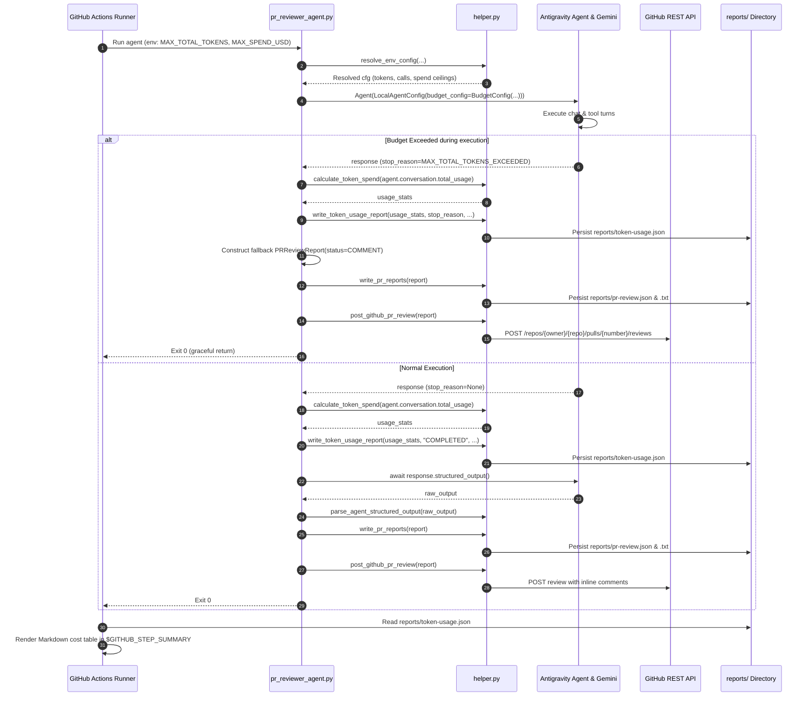

# Feature Implementation Plan: Token Tracking and Spend Capping for PR Reviewer Agent

## 📋 Todo Checklist
- [x] Task 1: Add pricing rate card `MODEL_PRICING` and `calculate_token_spend()` in [`.github/scripts/helper.py`](file:///Users/yannipeng/git-projects/adk-agents/.github/scripts/helper.py)
- [x] Task 2: Add `write_token_usage_report()` in [`.github/scripts/helper.py`](file:///Users/yannipeng/git-projects/adk-agents/.github/scripts/helper.py)
- [x] Task 3: Update `resolve_env_config()` in [`.github/scripts/helper.py`](file:///Users/yannipeng/git-projects/adk-agents/.github/scripts/helper.py) with budget limit parsing (`MAX_TOTAL_TOKENS`, `MAX_INPUT_TOKENS`, `MAX_OUTPUT_TOKENS`, `MAX_MODEL_CALLS`, `MAX_TOOL_CALLS`, `MAX_SPEND_USD`)
- [x] Task 4: Add import resilience for `google.antigravity` in [`.github/scripts/pr_reviewer_agent.py`](file:///Users/yannipeng/git-projects/adk-agents/.github/scripts/pr_reviewer_agent.py) (`try ... except ImportError`)
- [x] Task 5: Inject `types.BudgetConfig` into `LocalAgentConfig` in [`.github/scripts/pr_reviewer_agent.py`](file:///Users/yannipeng/git-projects/adk-agents/.github/scripts/pr_reviewer_agent.py)
- [x] Task 6: Implement stop reason inspection and graceful early halt in [`.github/scripts/pr_reviewer_agent.py`](file:///Users/yannipeng/git-projects/adk-agents/.github/scripts/pr_reviewer_agent.py) (bypass `response.structured_output()`, generate `ReviewStatus.COMMENT` fallback, persist reports, post review comment to GitHub PR)
- [x] Task 7: Persist telemetry metrics to `reports/token-usage.json` on both normal completion and budget exhaustion turns
- [x] Task 8: Update GitHub Actions workflow [`.github/workflows/source-code-pii-review.yml`](file:///Users/yannipeng/git-projects/adk-agents/.github/workflows/source-code-pii-review.yml) to render formatted token usage and cost table in `$GITHUB_STEP_SUMMARY`
- [x] Task 9: Implement unit tests in [`.github/scripts/tests/test_helper.py`](file:///Users/yannipeng/git-projects/adk-agents/.github/scripts/tests/test_helper.py) for pricing calculations, empty/none handling, environment resolution, and report file generation
- [x] Task 10: Implement unit and contract tests in [`.github/scripts/tests/test_pr_reviewer_agent.py`](file:///Users/yannipeng/git-projects/adk-agents/.github/scripts/tests/test_pr_reviewer_agent.py) for budget halt handling, stop reason detection, fallback report construction, and GitHub review posting

---

## 🔍 Analysis & Investigation

### Codebase Structure
The following files govern the PR review pipeline and token tracking:

| File Path | Current Responsibility | Target Changes |
| :--- | :--- | :--- |
| [`.github/scripts/helper.py`](file:///Users/yannipeng/git-projects/adk-agents/.github/scripts/helper.py) | Shared utilities for GitHub REST API, report serialization, environment resolution (`resolve_env_config`), and streaming. | Add rate card `MODEL_PRICING`, `calculate_token_spend()`, `write_token_usage_report()`, and budget parameter parsing in `resolve_env_config()`. |
| [`.github/scripts/pr_reviewer_agent.py`](file:///Users/yannipeng/git-projects/adk-agents/.github/scripts/pr_reviewer_agent.py) | Main agent runner executing `Agent(LocalAgentConfig)` with Vertex AI and GitHub MCP server. | Guard SDK imports with fallback, pass `types.BudgetConfig`, evaluate `response.stop_reason`, record telemetry, and handle graceful early halt with GitHub PR comment. |
| [`.github/workflows/source-code-pii-review.yml`](file:///Users/yannipeng/git-projects/adk-agents/.github/workflows/source-code-pii-review.yml) | GitHub Actions workflow defining pipeline steps, secrets, Cloud DLP scan, agent invocations, and summary output. | Augment `Generate GitHub Actions Job Summary` step to parse `reports/token-usage.json` and output a Markdown summary table to `$GITHUB_STEP_SUMMARY`. |
| [`docs/spec.md`](file:///Users/yannipeng/git-projects/adk-agents/docs/spec.md) | Governing architectural specification and decision log (D-1 through D-12). | Add D-13 (proactive budget controls) and D-14 (graceful halt & usage telemetry), function signatures, and Rule 6. |
| [`.github/scripts/tests/test_helper.py`](file:///Users/yannipeng/git-projects/adk-agents/.github/scripts/tests/test_helper.py) | Unit test suite for helper utilities. | Add tests for token calculations, pricing cards, env resolution, and usage report generation. |
| [`.github/scripts/tests/test_pr_reviewer_agent.py`](file:///Users/yannipeng/git-projects/adk-agents/.github/scripts/tests/test_pr_reviewer_agent.py) | Acceptance and contract tests for PR Reviewer Agent. | Add tests for `BudgetConfig` instantiation, `StopReason` early halts, `COMMENT` report fallback, and PR review submission on halt. |

### Current Architecture
1. **GitHub Actions Trigger:** Triggered on pull request events (`opened`, `synchronize`). Executes Cloud DLP scan writing `reports/pii-scan.txt`.
2. **PR Reviewer Agent Execution:** `run_pr_review()` in `.github/scripts/pr_reviewer_agent.py` initializes `LocalAgentConfig` with Vertex AI authentication (`vertex=True`), connects to `github-mcp-server`, and invokes `Agent(config)`.
3. **Absence of Proactive Budget Limits:** Currently, `LocalAgentConfig` does not specify `budget_config`. A runaway tool loop or massive PR diff can consume hundreds of thousands of tokens without hitting a ceiling.
4. **Structured Output Fragility on Halts:** The agent directly calls `await response.structured_output()`. If a turn is interrupted or truncated by a model or token limit, `structured_output()` fails or raises a deserialization exception rather than recovering cleanly.
5. **Quality Gate Dependency:** The downstream Quality Gate Decision Agent (`quality_gate_agent.py`) reads `reports/pr-review.txt` and `reports/pii-scan.txt`. If `reports/pr-review.txt` is missing on an active PR, the gate fails closed (`passed=False`, `SeverityLevel.HIGH/CRITICAL`).

### Dependencies & Integration Points
- **Google Antigravity SDK (`google.antigravity`):** Provides `LocalAgentConfig`, `Agent`, `types.BudgetConfig`, `types.StopReason`, `agent.conversation.total_usage`, and `response.usage_metadata`.
- **Google Gemini 3.x Flash Models:** Target models `gemini-3.7-flash` and `gemini-3.8-flash`. Pricing rate card: $0.75 / 1M prompt tokens, $0.075 / 1M cached prompt tokens, $3.75 / 1M candidate generation and thinking tokens. Models below Gemini 3.5 are prohibited.
- **GitHub REST API:** `POST /repos/{owner}/{repo}/pulls/{number}/reviews` and fallback `/issues/{number}/comments`. Used to post the review comment informing authors of early halt.
- **GitHub Actions `$GITHUB_STEP_SUMMARY`:** Step summary markdown surface for CI observability.

### Considerations & Challenges
1. **Conditional Import Resilience (Spec Rule 1):** In developer test environments or standard virtualenvs where `google-antigravity` is not installed, `from google.antigravity import ...` raises `ModuleNotFoundError`. All SDK imports must use `try ... except ImportError: types = None, Agent = None, LocalAgentConfig = None`. All references to `types.BudgetConfig` or `types.StopReason` must be guarded by `if types is not None and hasattr(types, ...)`.
2. **Thinking Token Cost Impact:** Gemini 3.7 and 3.8 thinking models emit reasoning tokens (`thoughts_token_count`) that are priced at the candidate output rate ($3.75 / 1M). A prompt with 1,000 output tokens and 9,000 thought tokens uses 10,000 billable generation tokens. The calculation must combine `candidate_tokens + thought_tokens` when multiplying by `output_per_m`.
3. **Conservative Dollar-to-Token Conversion:** When `MAX_SPEND_USD` is defined, the ceiling must assume the highest price tier ($3.75 / 1M tokens) to prevent exceeding the financial cap:
   $$\text{spend\_derived\_tokens} = \left\lfloor \frac{\text{MAX\_SPEND\_USD}}{3.75} \times 1{,}000{,}000 \right\rfloor$$
   The effective `max_total_tokens` is $\min(\text{max\_total\_tokens}, \text{spend\_derived\_tokens})$.
4. **Early Halt Handling Order:** If `budget_halted` is detected, `await response.structured_output()` must NOT be called. A fallback `PRReviewReport` with `overall_status = ReviewStatus.COMMENT` must be created.
5. **Quality Gate Release Safety:** Using `ReviewStatus.COMMENT` with `findings: []` prevents false CI build blockers while alerting PR authors. Cloud DLP continues to enforce zero-tolerance security gate checks independently.
6. **Double Review Avoidance:** The agent must post the fallback review comment to the GitHub PR before returning so the author is immediately notified why the review stopped.

---

## 📐 Technical Specification & Design

### Component Architecture

```
                  ┌────────────────────────────────────────────────────────┐
                  │              resolve_env_config()                      │
                  │  CLI Args > Env Vars (MAX_TOTAL_TOKENS, etc.) > Default │
                  └──────────────────────────┬─────────────────────────────┘
                                             │
                                             ▼
                  ┌────────────────────────────────────────────────────────┐
                  │                 LocalAgentConfig                       │
                  │   budget_config = types.BudgetConfig(                  │
                  │       max_total_tokens, max_input_tokens,             │
                  │       max_output_tokens, max_model_calls,             │
                  │       max_tool_calls                                  │
                  │   )                                                    │
                  └──────────────────────────┬─────────────────────────────┘
                                             │
                                             ▼
                  ┌────────────────────────────────────────────────────────┐
                  │                 Agent Execution                        │
                  │   async with Agent(config) as agent:                  │
                  │       response = await agent.chat(prompt)              │
                  └──────────────────────────┬─────────────────────────────┘
                                             │
                      ┌──────────────────────┴──────────────────────┐
                      ▼                                             ▼
       ┌──────────────────────────────┐              ┌──────────────────────────────┐
       │   Budget Exceeded (Halt)     │              │     Normal Completion        │
       │   stop_reason in StopReason  │              │     stop_reason == None or   │
       │   or "EXCEEDED" in name      │              │     "COMPLETED"              │
       └──────────────┬───────────────┘              └──────────────┬───────────────┘
                      │                                             │
                      ▼                                             ▼
       ┌──────────────────────────────┐              ┌──────────────────────────────┐
       │ 1. calculate_token_spend()   │              │ 1. calculate_token_spend()   │
       │ 2. write_token_usage_report()│              │ 2. write_token_usage_report()│
       │ 3. Fallback PRReviewReport   │              │ 3. response.structured_output│
       │    (status: COMMENT)         │              │ 4. parse PRReviewReport      │
       │ 4. write_pr_reports()        │              │ 5. write_pr_reports()        │
       │ 5. post_github_pr_review()   │              │ 6. post_github_pr_review()   │
       │ 6. Return report             │              │ 7. Return report             │
       └──────────────────────────────┘              └──────────────────────────────┘
```

### Mermaid Diagram


### Schemas & Models

#### 1. Rate Card Configuration (`helper.py`)
```python
MODEL_PRICING: dict[str, dict[str, float]] = {
    "gemini-3.7-flash": {
        "input_per_m": 0.75,
        "output_per_m": 3.75,
        "cached_per_m": 0.075,
    },
    "gemini-3.8-flash": {
        "input_per_m": 0.75,
        "output_per_m": 3.75,
        "cached_per_m": 0.075,
    },
    "default": {
        "input_per_m": 0.75,
        "output_per_m": 3.75,
        "cached_per_m": 0.075,
    },
}
```

#### 2. Telemetry Artifact Schema: `reports/token-usage.json`
```json
{
  "$schema": "https://json-schema.org/draft/2020-12/schema",
  "title": "TokenUsageReport",
  "type": "object",
  "required": [
    "model",
    "stop_reason",
    "budget_exceeded",
    "prompt_tokens",
    "cached_tokens",
    "candidate_tokens",
    "thought_tokens",
    "total_tokens",
    "total_cost_usd",
    "budget_limits"
  ],
  "properties": {
    "model": { "type": "string" },
    "stop_reason": { "type": "string" },
    "budget_exceeded": { "type": "boolean" },
    "prompt_tokens": { "type": "integer" },
    "cached_tokens": { "type": "integer" },
    "candidate_tokens": { "type": "integer" },
    "thought_tokens": { "type": "integer" },
    "total_tokens": { "type": "integer" },
    "total_cost_usd": { "type": "number" },
    "budget_limits": {
      "type": "object",
      "properties": {
        "max_total_tokens": { "type": "integer" },
        "max_input_tokens": { "type": "integer" },
        "max_output_tokens": { "type": "integer" },
        "max_model_calls": { "type": "integer" },
        "max_tool_calls": { "type": "integer" },
        "max_spend_usd": { "type": ["number", "null"] }
      }
    }
  }
}
```

### API & Code Signatures

#### `calculate_token_spend` in `.github/scripts/helper.py`
```python
def calculate_token_spend(
    usage: Any,
    model_name: str = "gemini-3.7-flash",
) -> dict[str, Any]:
    """Calculates approximate spend in USD from SDK UsageMetadata or response metadata.

    Accounts for prompt caching discounts and prices extended thinking tokens
    at the candidate generation rate ($3.75/1M). Safely returns 0 values if usage is None.

    Args:
        usage: SDK UsageMetadata instance or response object containing token counts.
        model_name: Identifier of the Gemini model used.

    Returns:
        dict containing:
            prompt_tokens (int)
            cached_tokens (int)
            candidate_tokens (int)
            thought_tokens (int)
            total_tokens (int)
            total_cost_usd (float rounded to 6 decimals)
    """
```

#### `write_token_usage_report` in `.github/scripts/helper.py`
```python
def write_token_usage_report(
    usage_data: dict[str, Any],
    stop_reason: Optional[str] = None,
    output_path: str = "reports/token-usage.json",
    model: str = "gemini-3.7-flash",
    budget_limits: Optional[dict[str, Any]] = None,
) -> None:
    """Persists structured token usage and cost metrics to reports directory (Decision D-14).

    Args:
        usage_data: Dictionary returned by calculate_token_spend.
        stop_reason: String name or value of turn StopReason.
        output_path: Target path for JSON persistence.
        model: Model identifier string.
        budget_limits: Dict of configured budget thresholds.
    """
```

#### `resolve_env_config` signature update in `.github/scripts/helper.py`
```python
def resolve_env_config(
    pr_number: Optional[str] = None,
    repo: Optional[str] = None,
    token: Optional[str] = None,
    project_id: Optional[str] = None,
    location: str = "us-central1",
    model: Optional[str] = None,
    max_total_tokens: Optional[int] = None,
    max_input_tokens: Optional[int] = None,
    max_output_tokens: Optional[int] = None,
    max_model_calls: Optional[int] = None,
    max_tool_calls: Optional[int] = None,
    max_spend_usd: Optional[float] = None,
) -> dict[str, Any]:
    """Resolves configuration and token budget parameters (Decision D-4, D-13)."""
```

---

## 📝 Step-by-Step Implementation Steps

### Step 1: Pricing Rate Card & Cost Math in `helper.py`
- **Files to modify/create:** [`.github/scripts/helper.py`](file:///Users/yannipeng/git-projects/adk-agents/.github/scripts/helper.py)
- **Changes needed:**
  1. Define `MODEL_PRICING` mapping for `gemini-3.7-flash`, `gemini-3.8-flash`, and `default`.
  2. Implement `calculate_token_spend(usage: Any, model_name: str = "gemini-3.7-flash") -> dict[str, Any]`.
     - Extract `prompt_token_count`, `cached_content_token_count`, `candidates_token_count`, `thoughts_token_count`, `total_token_count` via `getattr(usage, ..., 0)`.
     - Net input = `max(0, prompt_tokens - cached_tokens)`.
     - Output tokens = `candidate_tokens + thought_tokens`.
     - Calculate cost and round `total_cost_usd` to 6 decimal places.
  3. Implement `write_token_usage_report(usage_data, stop_reason, output_path, model, budget_limits)`.
     - Ensure parent directory exists.
     - Dump structured JSON payload conforming to schema.
- **Implementation Notes:** Safe extraction with `getattr(..., 0) or 0` avoids exceptions if `usage` is `None` or missing fields.
- **Status:** `[x] Complete`

### Step 2: Configuration & Environment Parsing in `helper.py`
- **Files to modify/create:** [`.github/scripts/helper.py`](file:///Users/yannipeng/git-projects/adk-agents/.github/scripts/helper.py)
- **Changes needed:**
  1. Update `resolve_env_config()` signature to take budget arguments.
  2. Add integer environment variable parsers with fallback defaults:
     - `MAX_TOTAL_TOKENS` -> default `120_000`
     - `MAX_INPUT_TOKENS` -> default `100_000`
     - `MAX_OUTPUT_TOKENS` -> default `25_000`
     - `MAX_MODEL_CALLS` -> default `10`
     - `MAX_TOOL_CALLS` -> default `25`
  3. Add float environment variable parser for `MAX_SPEND_USD` (default `None`).
  4. If `resolved_spend_usd` is defined and `> 0`:
     - Calculate `spend_derived_tokens = int((resolved_spend_usd / 3.75) * 1_000_000)`.
     - Set `resolved_total_tokens = min(resolved_total_tokens, spend_derived_tokens)`.
  5. Include all resolved budget parameters in the returned dictionary.
- **Implementation Notes:** Handle `ValueError` / `TypeError` gracefully when parsing integers or floats from environment variables.
- **Status:** `[x] Complete`

### Step 3: Agent Budget Enforcement, Telemetry & Early Halt in `pr_reviewer_agent.py`
- **Files to modify/create:** [`.github/scripts/pr_reviewer_agent.py`](file:///Users/yannipeng/git-projects/adk-agents/.github/scripts/pr_reviewer_agent.py)
- **Changes needed:**
  1. Wrap `google.antigravity` import in `try ... except ImportError` to set `Agent = None`, `LocalAgentConfig = None`, `types = None`.
  2. In `run_pr_review()`, if `types is not None and hasattr(types, "BudgetConfig")`:
     - Instantiate `budget_config = types.BudgetConfig(max_total_tokens=..., max_input_tokens=..., max_output_tokens=..., max_model_calls=..., max_tool_calls=...)`.
     - Pass `budget_config` to `LocalAgentConfig`.
  3. Execute `response = await agent.chat(prompt)`.
  4. Stream response chunks if available.
  5. Inspect `stop_reason = getattr(response, "stop_reason", None)`.
     - Detect `budget_halted = "EXCEEDED" in stop_reason_str or (types is not None and hasattr(types, "StopReason") and stop_reason in (...))`.
  6. Extract usage metadata from `getattr(agent.conversation, "total_usage", None) or getattr(response, "usage_metadata", None)`.
  7. Compute spend via `calculate_token_spend(usage, cfg["model"])`.
  8. Call `write_token_usage_report(...)` to save `reports/token-usage.json`.
  9. Print token usage and estimated spend breakdown to stdout.
  10. **Early Halt Branch:**
      - If `budget_halted`:
        - Do NOT call `await response.structured_output()`.
        - Create fallback report:
          ```python
          report = PRReviewReport(
              overall_status=ReviewStatus.COMMENT,
              summary=(
                  f"⚠️ PR review halted early: Model execution exceeded configured budget limit "
                  f"({stop_reason_str}). Processed {usage_stats['total_tokens']:,} tokens "
                  f"(${usage_stats['total_cost_usd']:.4f} USD)."
              ),
              findings=[],
          )
          ```
        - Call `write_pr_reports(report)`.
        - If `pr_num`: await `post_github_pr_review(...)`.
        - Return `report`.
  11. **Normal Branch:**
      - Call `await response.structured_output()`.
      - Parse structured output, write PR reports, post GitHub review, return report.
- **Implementation Notes:** In the fallback branch, posting to GitHub ensures developers receive actionable feedback on why the review terminated.
- **Status:** `[x] Complete`

### Step 4: GitHub Actions Workflow Summary Integration in `source-code-pii-review.yml`
- **Files to modify/create:** [`.github/workflows/source-code-pii-review.yml`](file:///Users/yannipeng/git-projects/adk-agents/.github/workflows/source-code-pii-review.yml)
- **Changes needed:**
  - Update `Generate GitHub Actions Job Summary` step to inspect `reports/token-usage.json` and append a markdown summary table to `$GITHUB_STEP_SUMMARY`:
    ```bash
    if [ -f reports/token-usage.json ]; then
      echo "" >> $GITHUB_STEP_SUMMARY
      echo "### 📊 PR Reviewer Token Usage & Estimated Spend" >> $GITHUB_STEP_SUMMARY
      python -c "
    import json
    with open('reports/token-usage.json') as f:
        d = json.load(f)
    model = d.get('model', 'gemini-3.7-flash')
    prompt = d.get('prompt_tokens', 0)
    cached = d.get('cached_tokens', 0)
    candidate = d.get('candidate_tokens', 0)
    thought = d.get('thought_tokens', 0)
    total = d.get('total_tokens', 0)
    cost = d.get('total_cost_usd', 0.0)
    stop = d.get('stop_reason', 'COMPLETED')
    halted = '⚠️ **BUDGET EXCEEDED**' if d.get('budget_exceeded') else '✅ Normal'

    print(f'| Metric | Value |')
    print(f'| :--- | :--- |')
    print(f'| **Model** | \`{model}\` |')
    print(f'| **Execution Status** | {halted} (\`{stop}\`) |')
    print(f'| **Prompt Tokens (Uncached)** | {prompt - cached:,} |')
    print(f'| **Cached Prompt Tokens** | {cached:,} |')
    print(f'| **Candidate Generation Tokens** | {candidate:,} |')
    print(f'| **Reasoning / Thought Tokens** | {thought:,} |')
    print(f'| **Total Tokens Billed** | **{total:,}** |')
    print(f'| **Estimated Spend (USD)** | **\${cost:.6f}** |')
    " >> $GITHUB_STEP_SUMMARY
    fi
    ```
- **Implementation Notes:** Use `if [ -f reports/token-usage.json ]` check so summary generation never fails if the file is absent on skipped runs.
- **Status:** `[x] Complete`

### Step 5: Comprehensive Unit, Acceptance, and Contract Test Suite
- **Files to modify/create:**
  - [`.github/scripts/tests/test_helper.py`](file:///Users/yannipeng/git-projects/adk-agents/.github/scripts/tests/test_helper.py)
  - [`.github/scripts/tests/test_pr_reviewer_agent.py`](file:///Users/yannipeng/git-projects/adk-agents/.github/scripts/tests/test_pr_reviewer_agent.py)
- **Changes needed:**
  1. Add tests in `test_helper.py`:
     - `test_calculate_token_spend_standard_usage`: Validates cost math with prompt, cached, candidate, and thinking tokens for `gemini-3.7-flash` and `gemini-3.8-flash`.
     - `test_calculate_token_spend_empty_or_none`: Confirms `None`, empty objects, or missing fields return zero token counts and `0.0` cost.
     - `test_resolve_env_config_budget_defaults_and_env`: Validates default budget numbers and environment variable overrides (`MAX_TOTAL_TOKENS`, `MAX_MODEL_CALLS`).
     - `test_resolve_env_config_max_spend_usd_derived_ceiling`: Verifies `MAX_SPEND_USD=0.375` caps `max_total_tokens` to `100_000`.
     - `test_write_token_usage_report_file_generation`: Verifies file creation at `reports/token-usage.json` with correct JSON keys.
  2. Add tests in `test_pr_reviewer_agent.py`:
     - `test_run_pr_review_budget_halt_flow`: Mocks `agent.chat` returning `response.stop_reason = MAX_TOTAL_TOKENS_EXCEEDED`. Asserts that:
       - Status is `ReviewStatus.COMMENT`.
       - `write_pr_reports()` is called.
       - `post_github_pr_review()` is called with the fallback report.
       - `reports/token-usage.json` records `budget_exceeded: true`.
       - Function returns gracefully without throwing exceptions.
     - `test_run_pr_review_normal_flow_records_telemetry`: Verifies successful reviews log token stats and record `stop_reason = COMPLETED`.
- **Implementation Notes:** Ensure all tests run with `uv run pytest .github/scripts/tests/`.
- **Status:** `[x] Complete`

---

## 🧪 Verification & Testing Strategy

### Unit/Integration Tests
1. **Helper Token Math Tests (`.github/scripts/tests/test_helper.py`):**
   - Assert `calculate_token_spend` outputs exact expected dollar values based on rate card:
     - 100,000 prompt tokens (0 cached) at $0.75/1M = $0.075
     - 20,000 cached tokens at $0.075/1M = $0.0015
     - 10,000 candidate + 10,000 thinking tokens at $3.75/1M = $0.075
     - Total = $0.1515
   - Assert `resolve_env_config` caps `max_total_tokens` when `MAX_SPEND_USD` is passed.
2. **PR Reviewer Agent Budget Halt Tests (`.github/scripts/tests/test_pr_reviewer_agent.py`):**
   - Mock `Agent` and `ChatResponse` with `stop_reason = "MAX_TOTAL_TOKENS_EXCEEDED"`.
   - Assert that `structured_output()` is never awaited.
   - Assert `post_github_pr_review` is called with report summary containing "PR review halted early".
   - Assert that `overall_status == ReviewStatus.COMMENT`.
   - Assert `reports/token-usage.json` exists with `budget_exceeded: true`.

### Commands
Execute the automated test suites using `uv run pytest`:
```bash
# 1. Run helper unit tests
uv run pytest .github/scripts/tests/test_helper.py -v

# 2. Run PR reviewer agent contract & acceptance tests
uv run pytest .github/scripts/tests/test_pr_reviewer_agent.py -v

# 3. Run full test suite across the project
uv run pytest tests/ .github/scripts/tests/ -v
```

### Expected Results
- All unit and contract tests pass with 0 failures and 0 collection errors.
- `reports/token-usage.json` matches the specified JSON schema.
- Mocked budget halt turns return cleanly with exit code 0, status `COMMENT`, and publish an informative review comment to GitHub PR.

---

## 🎯 Success Criteria
1. **Proactive Budget Enforcement:** `types.BudgetConfig` is correctly populated and passed to `LocalAgentConfig`, enforcing limits on total tokens, input tokens, output tokens, model calls, and tool calls.
2. **Safe Import Resilience:** All SDK imports and type references handle `google.antigravity` absence cleanly with zero `ModuleNotFoundError` or `AttributeError` in test environments.
3. **Accurate Cost Telemetry:** `reports/token-usage.json` is generated on every run, capturing uncached prompt, cached, candidate, and thinking tokens with verified Gemini 3.7/3.8 Flash pricing rates.
4. **Resilient Early Halt & PR Notification:** When a budget cap is hit, the agent bypasses `structured_output()`, writes reports, posts a clear `ReviewStatus.COMMENT` review to the GitHub PR, and exits cleanly without failing the CI step.
5. **Complete Test Coverage:** 100% of newly added functions and branches are verified with passing tests in `test_helper.py` and `test_pr_reviewer_agent.py`.
