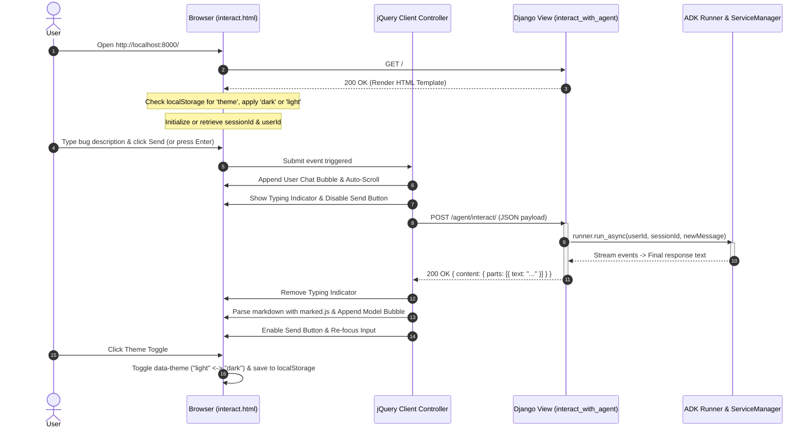

# Feature Implementation Plan: ui-implementation

## 📋 Todo Checklist
- [x] Complete the responsive HTML & CSS template with modern design, glassmorphic header, and dark mode support in `adk_bug_ticket_agent/templates/adk_agent/interact.html`
- [x] Implement robust jQuery client-side controller in `adk_bug_ticket_agent/templates/adk_agent/interact.html` adhering to the backend chat API contract (`appName`, `userId`, `sessionId`, `newMessage`)
- [x] Add dark mode toggle with `localStorage` persistence and zero-flicker pre-render theme application
- [x] Implement dynamic chat rendering with Marked.js for markdown output, syntax code formatting, copy-to-clipboard, auto-scroll, and typing indicator
- [x] Ensure Django MVC view (`interact_with_agent` in `adk_bug_ticket_agent/views.py`) and URL routing (`adk_bug_ticket_agent/urls.py` and `web/urls.py`) serve the template seamlessly for GET requests
- [x] Create automated Django test suite `tests/test_ui_views.py` testing GET template rendering, 405 methods, and POST chat interaction contracts
- [x] Execute curl sanity checks across all existing and new URIs (`/`, `/agent/`, `/agent/interact/`, `/agent/chat/`) and run `uv run pytest tests/test_ui_views.py`

---

## 🔍 Analysis & Investigation

### Codebase Structure
| File / Path | Responsibility | Current Status |
| :--- | :--- | :--- |
| `adk_bug_ticket_agent/templates/adk_agent/interact.html` | Front-end chat UI template served to end users. | Truncated at line 42 (commit `133b757`). Contains initial `<head>` and partial `<header>` tag without main chat layout, message history container, input form, styling, or JavaScript logic. |
| `adk_bug_ticket_agent/views.py` | Django view controller handling `interact_with_agent`. | Handles `GET` (renders `adk_agent/interact.html`) and `POST` (parses ADK JSON request payload, runs `Runner.run_async()`, returns ADK JSON response). Uses `@csrf_exempt`. |
| `adk_bug_ticket_agent/urls.py` | App-level URL dispatcher. | Maps `""` (name: `interact_root`), `"interact/"` (name: `interact_with_agent`), and `"chat/"` (name: `chat`) to `views.interact_with_agent`. |
| `web/urls.py` | Project-level URL dispatcher. | Maps `""` (root) directly to `agent_views.interact_with_agent`, and `"agent/"` to include `adk_bug_ticket_agent.urls`. |
| `tests/test_ui_views.py` | Test suite for UI views and API endpoints. | Does not exist yet. Needs to be created to automate verification of the MVC endpoints. |

### Current Architecture
1. **Django MVT/MVC Lifecycle**:
   - The user visits the root URL `/` or `/agent/interact/` via HTTP `GET`.
   - `web/urls.py` and `adk_bug_ticket_agent/urls.py` route the request to `adk_bug_ticket_agent.views.interact_with_agent`.
   - `interact_with_agent` checks `request.method == 'GET'` and renders `adk_agent/interact.html`.
2. **API Interaction Contract**:
   - The client UI initiates an asynchronous `POST` request to `/agent/interact/` (or `/agent/chat/` or relative `/interact/`).
   - Request JSON Payload:
     ```json
     {
       "appName": "bug_ticket_assistant",
       "userId": "user_<uuid>",
       "sessionId": "session_<uuid>",
       "newMessage": {
         "parts": [
           { "text": "<user query string>" }
         ]
       }
     }
     ```
   - Successful Response JSON (`200 OK`):
     ```json
     {
       "content": {
         "parts": [
           { "text": "<agent response in markdown/plain text>" }
         ],
         "role": "model"
       },
       "timestamp": 1726290000.123
     }
     ```
   - Error Responses (`400 Bad Request` or `500 Internal Server Error`):
     ```json
     { "error": "<error message>", "traceback": "..." }
     ```

### Dependencies & Integration Points
- **jQuery 3.7.1**: Included via CDN (`https://code.jquery.com/jquery-3.7.1.min.js`) for DOM manipulation, event handling, AJAX requests, and clean animation handling.
- **Marked.js**: Included via CDN (`https://cdn.jsdelivr.net/npm/marked/marked.min.js`) for rendering formatted markdown (lists, bold/italic, code blocks, tables) emitted by Gemini/ADK.
- **Google Fonts (Inter)**: Included via CDN for typography.
- **Django Template Engine**: Django's built-in template loader finds `interact.html` inside `adk_bug_ticket_agent/templates/adk_agent/interact.html`.

### Considerations & Challenges
1. **FOUC (Flash of Unstyled Content / Theme Flicker)**:
   - When users toggle dark mode, their preference should persist in `localStorage`.
   - The theme attribute (`data-theme="dark"` or `"light"`) must be evaluated synchronously inside the `<head>` prior to rendering CSS to prevent a visible white flash upon reload.
2. **Session Persistence**:
   - Client needs a persistent `userId` and `sessionId` stored in `localStorage` or `sessionStorage` so that multi-turn triage conversations maintain conversational context with the ADK agent.
   - A "New Chat" / "Reset Session" button must be provided to regenerate the `sessionId` without losing user identity.
3. **Auto-resizing Input & Accessibility**:
   - The chat textarea should support auto-expanding height up to a max-height (e.g. 150px) when typing multi-line bug reports or logs.
   - Enter sends the message; Shift+Enter creates a new line.
4. **Security & Sanitization**:
   - While `marked.js` converts markdown to HTML, user input text must be safely escaped before rendering in the chat bubble to prevent XSS. For assistant messages, markdown elements are styled cleanly.
5. **Robust Error Handling**:
   - Network dropouts, 500 server errors, or 400 validation failures must render a visually distinct error banner/bubble with retry guidance instead of failing silently.

---

## 📐 Technical Specification & Design

### Component Architecture
```
+---------------------------------------------------------------------------------------+
|                                    Client Browser                                     |
|                                                                                       |
|  +---------------------------------------------------------------------------------+  |
|  | Header: Brand Logo, Status Pill (Online), Theme Switcher (Light/Dark), Reset Btn|  |
|  +---------------------------------------------------------------------------------+  |
|  | Messages Container:                                                             |  |
|  |   - Welcome Greeting / Quick Suggestion Chips                                   |  |
|  |   - User Chat Bubble (Avatar, Text, Timestamp)                                  |  |
|  |   - Agent Chat Bubble (Avatar, Formatted Markdown, Code Blocks, Copy Button)    |  |
|  |   - Typing Indicator / Loading Skeleton                                         |  |
|  +---------------------------------------------------------------------------------+  |
|  | Input Footer:                                                                   |  |
|  |   - Auto-expanding Textarea (Placeholder: "Describe your bug or ticket issue...")|  |
|  |   - Send Button (SVG Icon, disabled during generation)                          |  |
|  +---------------------------------------------------------------------------------+  |
|                                        |                                              |
|                           jQuery AJAX (POST JSON)                                     |
+----------------------------------------|----------------------------------------------+
                                         |
                                         v
+---------------------------------------------------------------------------------------+
|                                Django Web Application                                 |
|                                                                                       |
|  urls.py (/, /agent/, /agent/interact/, /agent/chat/)                                 |
|                           |                                                           |
|                           v                                                           |
|  views.py: interact_with_agent(request)                                               |
|      - GET  --> render(request, 'adk_agent/interact.html')                            |
|      - POST --> Parse JSON -> ServiceManager -> ADK Runner.run_async() -> Return JSON |
+---------------------------------------------------------------------------------------+
```

### Mermaid Diagram: UI Interaction Flow


### CSS Design System & Variables

The template will define a dual-theme CSS variable system on `[data-theme="light"]` and `[data-theme="dark"]`:

```css
:root, [data-theme="light"] {
  --bg-primary: #f8fafc;
  --bg-surface: #ffffff;
  --bg-surface-elevated: #f1f5f9;
  --border-color: #e2e8f0;
  --border-subtle: #f1f5f9;
  --text-primary: #0f172a;
  --text-secondary: #475569;
  --text-muted: #94a3b8;
  --primary-color: #2563eb;
  --primary-hover: #1d4ed8;
  --primary-contrast: #ffffff;
  --user-bubble-bg: #2563eb;
  --user-bubble-text: #ffffff;
  --agent-bubble-bg: #ffffff;
  --agent-bubble-text: #0f172a;
  --agent-bubble-border: #e2e8f0;
  --code-bg: #1e293b;
  --code-text: #f8fafc;
  --scrollbar-thumb: #cbd5e1;
  --shadow-sm: 0 1px 2px 0 rgb(0 0 0 / 0.05);
  --shadow-md: 0 4px 6px -1px rgb(0 0 0 / 0.1), 0 2px 4px -2px rgb(0 0 0 / 0.1);
  --shadow-lg: 0 10px 15px -3px rgb(0 0 0 / 0.1), 0 4px 6px -4px rgb(0 0 0 / 0.1);
}

[data-theme="dark"] {
  --bg-primary: #090d16;
  --bg-surface: #111827;
  --bg-surface-elevated: #1f2937;
  --border-color: #374151;
  --border-subtle: #1f2937;
  --text-primary: #f9fafb;
  --text-secondary: #d1d5db;
  --text-muted: #6b7280;
  --primary-color: #3b82f6;
  --primary-hover: #60a5fa;
  --primary-contrast: #ffffff;
  --user-bubble-bg: #2563eb;
  --user-bubble-text: #ffffff;
  --agent-bubble-bg: #1f2937;
  --agent-bubble-text: #f9fafb;
  --agent-bubble-border: #374151;
  --code-bg: #030712;
  --code-text: #e5e7eb;
  --scrollbar-thumb: #4b5563;
  --shadow-sm: 0 1px 2px 0 rgb(0 0 0 / 0.5);
  --shadow-md: 0 4px 6px -1px rgb(0 0 0 / 0.4), 0 2px 4px -2px rgb(0 0 0 / 0.4);
  --shadow-lg: 0 10px 15px -3px rgb(0 0 0 / 0.5), 0 4px 6px -4px rgb(0 0 0 / 0.5);
}
```

### API & Code Signatures

#### Frontend JavaScript Interface (jQuery)
```javascript
// State Management
const ChatApp = {
  appName: 'bug_ticket_assistant',
  userId: getOrCreateUserId(),
  sessionId: getOrCreateSessionId(),
  init: function() { ... },
  setupEvents: function() { ... },
  toggleTheme: function() { ... },
  resetSession: function() { ... },
  sendMessage: function() { ... },
  appendMessage: function(role, content) { ... },
  showTypingIndicator: function() { ... },
  hideTypingIndicator: function() { ... },
  scrollToBottom: function() { ... }
};
```

#### Backend View Signature (Django)
```python
# adk_bug_ticket_agent/views.py
@csrf_exempt
async def interact_with_agent(request: HttpRequest) -> HttpResponse:
    """
    Handles GET requests by rendering 'adk_agent/interact.html'.
    Handles POST requests by parsing JSON payload, invoking ADK Runner, and returning JsonResponse.
    """
    ...
```

---

## 📝 Step-by-Step Implementation Steps

### Step 1: Complete the HTML & CSS in `adk_bug_ticket_agent/templates/adk_agent/interact.html`
- **Files to modify/create**: `adk_bug_ticket_agent/templates/adk_agent/interact.html`
- **Changes needed**:
  - Add FOUC prevention inline script in `<head>` reading `localStorage.getItem('theme')` and setting `document.documentElement.setAttribute('data-theme', theme)`.
  - Embed comprehensive CSS styling utilizing modern layout techniques (CSS custom properties, responsive breakpoints, styled scrollbars, Markdown table and code block styling).
  - Structure body elements:
    - Top navigation bar: Brand icon, title, status pill, "New Conversation" button, Dark/Light Mode toggle button.
    - Chat container: `#chat-messages` scrollable viewport with an introductory welcome card and sample query chips (e.g. "Check open high-priority bugs", "File a new login defect", "Search knowledge base").
    - Chat bottom input bar: Form containing `#user-input` auto-resizing textarea, character counter / keyboard hints ("Press Enter to send, Shift+Enter for new line"), and `#send-btn` with SVG arrow icon.
- **Status**: `- [x]`

### Step 2: Implement jQuery Chat Controller & Markdown Renderer
- **Files to modify/create**: `adk_bug_ticket_agent/templates/adk_agent/interact.html`
- **Changes needed**:
  - Include `<script>` at bottom initializing the chat client using jQuery `$(document).ready()`.
  - Implement session identity management:
    - `getOrCreateUserId()`: Checks `localStorage.getItem('adk_user_id')`, if missing generates `user_` + random string, stores and returns it.
    - `getOrCreateSessionId()`: Checks `sessionStorage.getItem('adk_session_id')`, if missing generates `session_` + random string, stores and returns it.
  - Implement Dark Mode toggle:
    - Click on `#theme-toggle` updates `data-theme` attribute on `<html>`, toggles icon between sun and moon SVG, and updates `localStorage.setItem('theme', theme)`.
  - Implement Suggestion Chips click handler:
    - Populates the textarea and triggers `sendMessage()`.
  - Implement `sendMessage()`:
    - Reads and trims text from `#user-input`.
    - Appends user chat bubble immediately to `#chat-messages`.
    - Clears `#user-input` and resets its height.
    - Appends animated 3-dot typing indicator.
    - Sends `$.ajax()` POST request with `contentType: 'application/json'`, `dataType: 'json'`, and body matching the backend schema:
      ```json
      {
        "appName": "bug_ticket_assistant",
        "userId": ChatApp.userId,
        "sessionId": ChatApp.sessionId,
        "newMessage": { "parts": [{ "text": text }] }
      }
      ```
    - On success: Removes typing indicator, renders model response via `marked.parse(response.content.parts[0].text)`, appends code block copy buttons, and scrolls to bottom.
    - On error: Removes typing indicator, displays error bubble with a retry button or helpful message.
- **Status**: `- [x]`

### Step 3: Validate Django URL Dispatcher & View Handlers
- **Files to modify/create**: `adk_bug_ticket_agent/urls.py`, `web/urls.py`, `adk_bug_ticket_agent/views.py`
- **Changes needed**:
  - Verify that `web/urls.py` and `adk_bug_ticket_agent/urls.py` properly resolve:
    - `/` -> renders `interact.html`
    - `/agent/` -> renders `interact.html`
    - `/agent/interact/` -> renders `interact.html` (GET) and processes chat (POST)
    - `/agent/chat/` -> renders `interact.html` (GET) and processes chat (POST)
  - Ensure `interact_with_agent` in `views.py` returns `status=405` for unsupported HTTP methods (e.g. `PUT`, `DELETE`).
- **Status**: `- [x]`

### Step 4: Add Automated Unit/Integration Tests
- **Files to modify/create**: `tests/test_ui_views.py`
- **Changes needed**:
  - Write test class `TestAgentUIView(TestCase)` using Django's test client:
    - `test_get_root_url_renders_interact_template`: Verify `GET /` returns status 200 and uses `adk_agent/interact.html`.
    - `test_get_agent_urls_render_interact_template`: Verify `GET /agent/`, `/agent/interact/`, and `/agent/chat/` return status 200.
    - `test_post_invalid_json_payload`: Verify `POST /agent/interact/` with malformed JSON returns 400.
    - `test_post_missing_fields_payload`: Verify `POST /agent/interact/` with missing `appName` or `newMessage` returns 400.
    - `test_unsupported_methods`: Verify `PUT` or `DELETE` returns 405.
- **Status**: `- [x]`

### Step 5: Sanity Testing with Curl Commands
- **Files to modify/create**: Execution via shell / testing documentation
- **Changes needed**:
  - Execute curl commands to verify HTTP response codes and headers across all endpoints.
- **Status**: `- [x]`

---

## 🧪 Verification & Testing Strategy

### Unit/Integration Tests
Create `tests/test_ui_views.py` with pytest/Django TestCase:
```python
from django.test import TestCase, Client
from django.urls import reverse
import json

class TestUIViews(TestCase):
    def setUp(self):
        self.client = Client()

    def test_get_endpoints_render_template(self):
        for path in ["/", "/agent/", "/agent/interact/", "/agent/chat/"]:
            response = self.client.get(path)
            self.assertEqual(response.status_code, 200)
            self.assertTemplateUsed(response, "adk_agent/interact.html")
            self.assertContains(response, "IT Bug Assistant")
            self.assertContains(response, "jquery-3.7.1.min.js")
            self.assertContains(response, "marked.min.js")

    def test_post_bad_request_structure(self):
        response = self.client.post(
            "/agent/interact/",
            data=json.dumps({"appName": "test"}),
            content_type="application/json"
        )
        self.assertEqual(response.status_code, 400)

    def test_unsupported_method(self):
        response = self.client.delete("/agent/interact/")
        self.assertEqual(response.status_code, 405)
```

### Verification Commands
```bash
# 1. Run unit test suite
uv run pytest tests/test_ui_views.py

# 2. Sanity Curl Tests (Server running on localhost:8000)
# Test GET endpoints
curl -I http://localhost:8000/
curl -I http://localhost:8000/agent/
curl -I http://localhost:8000/agent/interact/
curl -I http://localhost:8000/agent/chat/

# Test POST API validation with empty body
curl -X POST http://localhost:8000/agent/interact/ \
  -H "Content-Type: application/json" \
  -d '{"invalid": "payload"}'

# Test Unsupported Method
curl -I -X DELETE http://localhost:8000/agent/interact/
```

### Expected Results
- All `GET` requests return `HTTP/1.1 200 OK` with HTML content containing UI components (dark mode toggle, jQuery, Marked.js, chat box).
- `POST` with invalid payload returns `HTTP/1.1 400 Bad Request`.
- Unsupported HTTP methods return `HTTP/1.1 405 Method Not Allowed`.
- Pytest runs and passes 100%.

---

## 🎯 Success Criteria
1. **Complete Modern UI**: `adk_agent/interact.html` is fully implemented (no truncated HTML/scripts) featuring a responsive layout, dark/light theme toggle with persistent state, and markdown parsing for agent responses.
2. **jQuery Chat Controller**: Client asynchronous interactions seamlessly send the expected JSON payload (`appName`, `userId`, `sessionId`, `newMessage`) to the Django endpoint and properly render responses.
3. **Django MVC Delivery**: Django properly routes and serves the template across all configured URIs (`/`, `/agent/`, `/agent/interact/`, `/agent/chat/`).
4. **Automated Verification**: Automated tests in `tests/test_ui_views.py` and curl sanity checks pass cleanly without regressions.
